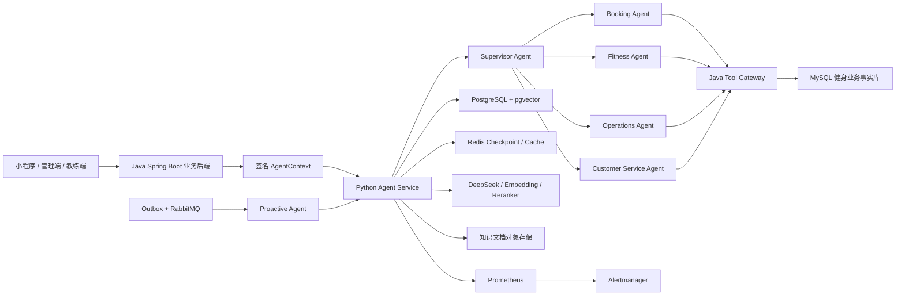

# AI 健身多 Agent 平台交付报告

## 1. 交付结论

本项目已经完成面向健身业务的本地企业化验收闭环：Java 健身核心 Gateway、Python Agent 编排、RAG、Memory、训练计划、预约、客服工单、主动提醒、权限、确认机制、幂等、审计、消息可靠性和可观测性均已具备可运行实现。

本报告描述的是当前仓库已经实现并在本地验证过的能力，不把尚未接入的生产认证服务、企业值班系统或生产集群演练写成已经上线的能力。

赛事、作品、活动运营等历史遗留模块不属于本项目范围，也不纳入功能描述和验收结论。

## 2. 企业级整体架构



核心边界是：模型负责理解、规划和生成草案；Java Gateway 负责权限、业务事实、幂等和写入审计；业务数据库是最终事实来源；Agent 数据和知识索引由 PostgreSQL 管理；LangGraph 会话状态由 PostgreSQL Checkpoint 和 Redis 协同保存。

## 3. 角色与业务

| 角色 | 主要业务 | 权限边界 |
| --- | --- | --- |
| 管理员 | 知识库上传/审核/发布、知识版本管理、经营指标查询、指标目录获取、通知模板与投递结果查看 | 只能访问签名 AgentContext 所属机构；平台级能力由更高权限控制 |
| 教练 | 查看名下学员、生成训练计划草案、提交训练计划审核、审核并发布计划 | 不能越权查看其他机构或无归属学员；Agent 不能代替教练自动发布 |
| 学员 | 查询本人预约和已发布训练计划、执行已发布计划、提交执行结果或反馈 | 不能修改原始计划，不能查看他人数据，不能执行草案或未发布版本 |

客服工单、预约、训练计划等写操作均经过 Java Gateway 的角色校验、资源归属校验、确认凭证、请求幂等和不可变审计。

## 4. Agent 能力

### 4.1 Supervisor Agent

- 识别用户意图并路由到 Booking、Fitness、Operations 或 Customer Service Agent；
- 限制工具数量、工具输入 Schema 和业务范围；
- 将真实工具结果回填给模型，禁止模型自行编造业务事实；
- 对不支持的问题返回受控结果，不调用无关旧赛事业务。

### 4.2 Fitness Agent

- 根据学员上下文、目标、可用器械和知识库生成结构化训练计划草案；
- 训练计划以版本化结构保存，不是只生成一段文本；
- 教练审核后才能发布；
- 学员只能执行已发布版本；
- 计划创建、审核、发布和执行均保留状态变化与审计记录。

### 4.3 Booking Agent

- 查询学员、教练、课程、合同、课时和预约事实；
- 创建、改约、取消预约；
- 写入前生成确认摘要并通过 LangGraph `interrupt()` 暂停；
- 使用确认凭证、JTI 一次性消费、幂等键和 Gateway 资源校验；
- 预约事件通过 Outbox 发布，供主动提醒链路消费。

### 4.4 Operations Agent

- 仅面向机构管理员；
- 使用固定指标目录，不允许模型自由编写 SQL；
- 支持预约量、完课量、新客数、净营收等固定指标；
- 支持日/周/月时间桶及受约束的环比、同比；
- 对缺失数据、除零、指标口径漂移和越权机构范围进行 fail-closed 处理；
- 返回聚合结果、指标口径和审计信息，不返回 SQL、Prompt 或业务明细。

### 4.5 Customer Service Agent

- 查询和创建健身平台客服工单；
- 根据工单类型、优先级和上下文生成处理草案；
- 创建工单需要确认和幂等；
- 工单创建、状态变化和处理结果保留审计；
- 当前不包含人工转接、短信和 Push。

### 4.6 Proactive Agent

- 消费预约创建、训练计划发布等 Outbox 事件；
- 生成站内主动提醒；
- RabbitMQ 消费使用 Inbox 去重和通知 Outbox；
- Worker 支持失败重试、死信边界、重启恢复和连接中断重连；
- 当前主要实现站内通知，不发送短信、Push 或外部消息。

## 5. RAG、Memory 与文档能力

- 支持 Markdown、TXT、PDF、DOCX、XLSX 的统一索引入口；
- 使用 PostgreSQL + pgvector，并结合全文检索和 `pg_trgm` 做混合召回；
- 检索顺序为权限过滤 → 向量/关键词召回 → RRF 融合 → Reranker → 带来源证据的上下文；
- 子节点参与召回，父节点补充章节或表格上下文；
- 知识文档经过上传、审核、排队、索引、发布状态流转；
- Memory 由模型提出候选，用户确认后才成为有效 Memory；
- Memory、会话摘要和通知任务均有保留、过期、失败和审计边界。

当前 PDF 深度解析优化（目录过滤、页眉页脚去重、表格识别、断词修复、图片密集页动作标注）按计划放在最后阶段，不影响当前 Agent 业务闭环。

## 6. 安全与可靠性

- AgentContext 使用签名上下文传递机构、用户和角色；
- Gateway 不信任模型产生的身份字段；
- Agent 不能直接写 MySQL 业务事实库；
- 训练、预约、客服等写操作必须经过确认凭证；
- LangGraph `interrupt()` 保存待确认状态，批准后通过 `Command(resume=...)` 恢复；
- 请求幂等键和参数摘要防止重复执行或同键参数篡改；
- PostgreSQL 迁移、备份恢复、锁等待和已有数据兼容性均有验收脚本；
- RabbitMQ 具备 Inbox/Outbox、重试、死信和网络中断恢复能力；
- Prometheus + Alertmanager 已完成告警触发、恢复和同服务抑制验收；
- ClamAV、文件结构检查和 OCR 服务边界默认 fail-closed；
- 敏感配置只通过环境变量或 Secret Manager 注入，不写入代码、镜像或发布清单。

## 7. 本地验收结果

截至 2026-08-30，最近一次最终质量门禁结果：

- Agent：`442 passed, 8 skipped`；跳过项是明确依赖外部生产环境或真实业务写入的检查，不代表测试失败；
- OCR、Gateway、Training、Booking、Customer Service：构建和测试通过；
- RAG、Operations、会话摘要评测：全部达到阈值；
- ClamAV：正常文件通过，EICAR 测试串拒绝；
- PostgreSQL 迁移、备份恢复、RabbitMQ 恢复和容量基线：通过；
- Prometheus：7 条告警规则加载成功；
- Alertmanager：配置检查、`firing`、`resolved` 和 critical 抑制 warning 通过；
- OCR 契约检查：版本、媒体类型、页码、置信度、区域坐标和 fail-closed 规则通过；
- 生产 staging 清单：使用当前 Git 提交和镜像摘要完成结构校验；
- `make release-check`：通过。

需要特别区分两类结果：当前已完成的是 OCR 服务契约、解析结果安全校验、OCR 联调检查器和本地可用的解析链路；由于本机没有 Linux amd64/GPU 推理环境，真实 PaddleOCR/PP-StructureV3 生产推理尚未完成。图片密集页在没有可信 OCR 结果时会被安全地阻断或转入审核边界，不会把低质量识别结果直接写入知识库。

本次发布收口后，项目状态为“本地企业化验收完成、具备进入预发布准备条件”，不等同于已经完成生产上线。

## 8. 本地运行入口

在仓库根目录执行：

```bash
make infra-up-security
make infra-up-messaging
make agent-sync
make agent-migrate
make agent-run
make gateway-run
make observability-up
```

主要检查命令：

```bash
make agent-check
make observability-live-check
make observability-e2e-check
make release-check
```

真实业务写入验收仍必须使用对应的显式授权命令，并使用本地测试机构、用户和可清理数据；不能把离线质量门禁当成真实业务写入。

## 9. 生产环境差距

以下项目是生产部署准备，不影响当前本地项目交付结论：

1. 接入真实认证服务 JWKS、密钥轮换和认证服务故障演练；
2. 将 Alertmanager webhook 替换为企业内网 HTTPS 值班系统，并配置认证、升级、抑制和收件人路由；
3. 使用不可变镜像、镜像签名、SBOM、漏洞扫描和部署平台 Secret；
4. 配置 S3 兼容对象存储、加密备份、WAL/PITR、跨可用区副本和正式 RTO/RPO；
5. 在独立预发布环境完成包含 LLM、RAG、数据库和 Gateway 的容量压测及灰度回滚；
6. 在 Linux amd64/GPU 或独立推理节点完成 OCR 服务生产部署；
7. 最后再升级 PDF 深度解析和图片动作结构化能力。

其中第 6 项是当前明确的环境阻塞项：需要在 Linux amd64/GPU 或独立推理节点部署并验收真实 OCR 服务；在该环境具备前，只能完成契约级和 Mock/替身链路验收，不能宣称已完成真实 OCR 生产验收。

## 10. 简历表述边界

可以描述为“完成企业化本地验收的 AI 健身多 Agent 平台”，重点介绍 Agent 编排、RAG、Memory、结构化训练计划、Tool Gateway、权限、确认机制、幂等、Outbox/Inbox 和可观测性。

如果描述“已生产上线”，必须同时具备真实认证服务、生产部署、监控值班、对象存储、灾备和压测证据；当前仓库不应对这些尚未接入的环境能力做虚假表述。
