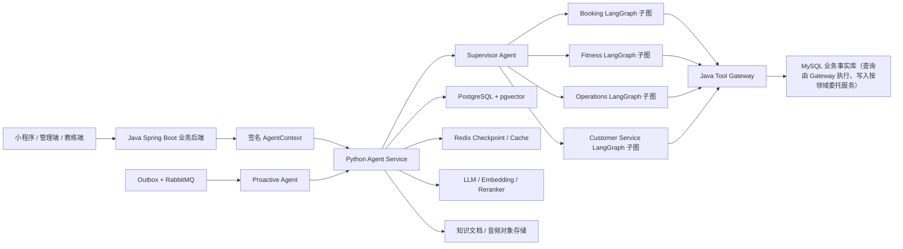

# AI 健身多 Agent 平台开发路线与项目规则

> 文档状态：开发基准（Living Document）
>
> 当前基线日期：2026-08-12
>
> 适用仓库：`ai-fitness-platform`
>
> 核心原则：基于现有健身业务系统改造，直接面向企业级最终形态建设，不以 Demo 作为生产架构基础。

## 1. 文档用途

本文档统一记录本项目后续开发必须遵循的产品范围、架构边界、Agent 设计、数据规划、实施步骤、验收标准和协作规则。

后续每个功能开始前，应先确认它属于本文档定义的健身业务范围；完成后，应同步更新本文档中的实施状态。规划中的能力不能标记为已完成，只有代码、测试、配置、审计和验证证据齐全后才能标记完成。

## 2. 项目目标

将现有 Java Spring Boot 健身管理系统改造为可实际部署的 AI 健身多 Agent 平台，并保留现有系统作为健身业务事实源。

最终系统需要同时服务三类业务身份：

- 管理员：经营分析、门店管理、教练管理、会员运营、合同与课时、异常处理。
- 教练：学员管理、训练计划、训练记录、课程安排、跟进提醒、专业知识辅助。
- 学员：预约课程、查看合同和剩余课时、执行训练计划、记录训练、进度分析、健身问答和主动提醒。

项目最终需要体现以下企业级 AI 能力：

- 多 Agent 编排和明确的 Agent 职责边界。
- 真实 LLM、Embedding 和 Reranker 服务接入。
- RAG 健身知识库及可追溯引用。
- 长短期 Memory 和用户可管理的记忆。
- 基于受控 Tool Calling 的真实业务操作。
- 管理员经营分析与受限 Text-to-SQL。
- 事件驱动的主动提醒和任务调度。
- 权限、租户隔离、审计、幂等、可观测性和评测体系。

## 3. 明确排除的业务范围

现有代码由其他项目改造而来，仍残留赛事、活动运营及相关通用代码。以下内容默认不属于本项目，不参与 Agent、RAG、Memory、工具、数据库视图和简历功能设计：

- 赛事、比赛、赛程、报名、作品征集和评选。
- 活动发布、活动运营、活动营销和活动数据分析。
- 与赛事或活动关联的文章、订单、支付、视频作品和回调流程。
- 无法证明属于健身核心业务的遗留模块。

如果某个遗留模块同时可能服务健身业务，例如订单、支付、消息或文件上传，必须先确认其真实业务用途，再决定保留、改造或隔离；不能仅根据类名直接接入 Agent。

## 4. 现有健身业务基线

### 4.1 当前身份模型

现有系统已经存在以下权限身份：

- `ADMIN`
- `ADMIN_ORGANIZATION`
- `SUPER_ADMIN_ORGANIZATION`
- `COACH`

当前“学员”不是独立的 `Authority`，而是普通 `LoginUser`，通过 `UserAndCoach` 与教练和组织建立关系。后续可以在业务语义层使用 `MEMBER` 或“学员”称呼，但不能在未修改权限模型前假设数据库中已经存在 `STUDENT` 权限。

### 4.2 可复用的健身业务

现有 Java 后端可作为以下业务的基础：

- 组织、门店、管理员、教练和学员关系管理。
- 健身课程管理。
- 合同、合同状态和剩余课时管理。
- 预约、改约、取消、完成课程。
- 教练请假、营业日和可预约时间约束。
- 上课记录、课时统计和教练业绩统计。
- 营收、新客、完课量、课时等门店经营数据。
- 系统消息、通知和部分主动触达基础能力。

### 4.3 必须补齐的健身领域

现有项目缺少完整的训练业务模型。本项目采用聚焦的业务范围，不建设健身 SaaS 的所有可能功能。
后续需要新增或完善：

- 基础动作知识和动作标准；第一阶段由经过治理的 RAG 知识库提供，不提前建设复杂动作主数据平台。
- 生成计划所需的最小学员输入：训练目标、经验、可训练时间、器械条件、偏好和用户主动提供的限制。
- 训练计划、训练日和训练动作明细。
- 训练日级执行结果：完成或跳过、完成时间和可选简短备注。

明确不在当前项目范围内：身体测量、围度/体脂趋势、逐组实际重量和次数、疼痛/疲劳量表、复杂训练
反馈、教练阶段调整、自动调整训练负荷，以及由此衍生的健康画像。需要这些能力时必须重新进行业务和
隐私评审，不能在后续开发中顺手加入。

建议的核心业务表包括：

- `training_plan`
- `training_plan_day`
- `training_plan_item`
- `training_session`

其中 `training_session` 只记录训练日级完成事实，不设计逐组明细表；生成计划需要的输入优先通过受控
请求和后续 Memory 保存，不在当前阶段拆出复杂的训练档案、目标和限制表。

这些结构化业务数据属于业务事实，应进入 Java 后端管理的 MySQL，而不是由 Agent 直接保存到自己的数据库。

## 5. 最终多 Agent 形态

当前最终形态明确为“一个 Supervisor + 多个 LangGraph 领域子图”，而不是多个彼此独立、
各自重复实现会话和权限逻辑的 Agent 服务：

```text
Supervisor Router
├── Fitness LangGraph 领域子图
├── Booking LangGraph 领域子图
├── Operations LangGraph 领域子图
└── Customer Service LangGraph 领域子图
```

Supervisor 负责统一身份上下文校验、意图路由、会话恢复和子图调度；每个领域子图负责
自己的 Prompt、工具白名单、领域流程和确认节点。四个子图共享父图的 PostgreSQL Checkpoint
和安全基础设施，但不共享彼此的模型可见工具。Proactive Agent 是由 Outbox/RabbitMQ
或定时任务触发的旁路 Worker，不属于一次同步对话中的领域子图。

### 5.1 Supervisor Agent

统一接收用户请求，识别当前用户身份、组织范围、意图和风险等级，决定调用哪个专业 Agent。它负责流程编排，不直接绕过专业 Agent 执行业务写操作。

主要能力：

- 多轮意图识别和任务拆解。
- 身份、角色、组织和上下文注入。
- Agent 路由、结果聚合和失败恢复；只有确有依赖关系且权限边界一致时才允许并行查询。
- 写操作确认和 Checkpoint 恢复；本项目不建设人工转接流程。

### 5.2 Booking LangGraph 领域子图

服务管理员、教练和学员的课程预约场景。

主要能力：

- 查询合同、剩余课时、课程和教练。
- 查询教练可预约时间、请假和营业日。
- 创建预约、改约、取消预约和查看预约记录。
- 在操作前解释冲突原因、费用或课时影响。
- 所有写操作必须确认、幂等并由 Java 后端事务执行。

### 5.3 Fitness LangGraph 领域子图

负责训练专业业务，是项目区别于普通预约系统的核心 Agent。

主要能力：

- 收集训练目标、经验、时间、器械、偏好和限制。
- 结合用户本次输入、已确认 Memory、教练要求和知识库生成结构化训练计划。
- 由教练审核、驳回和发布训练计划；计划内容需要修改时生成新版本重新审核，不建设复杂阶段调节引擎。
- 记录训练日是否完成或跳过，以及一条可选的非医疗简短备注。
- 提供动作规范、常见错误、热身、拉伸和恢复知识。
- 识别高风险健康表述并停止给出越界建议，提示咨询专业人员。

目标组数、目标次数、目标重量和目标 RPE 属于计划处方字段，可以继续保留；本项目不要求学员逐组填报
实际重量、次数、RPE、疼痛或疲劳。执行备注只用于普通完成情况说明，不能被 Agent 解析成诊断或自动
调参依据。

### 5.4 Operations LangGraph 领域子图

只面向具备组织经营权限的管理员，不向普通教练和学员开放经营数据。

主要能力：

- 营收、新客、完课、课时、课程利用率和教练表现分析。
- 会员活跃度、流失风险和续费机会分析。
- 生成日报、周报、月报和异常解释。
- 使用固定指标目录和受控聚合查询，不让模型生成或执行自由 SQL。

### 5.5 Customer Service LangGraph 领域子图

负责健身规则、合同规则、预约规则、常见问题和结构化客服工单。

主要能力：

- 基于 RAG 回答平台和门店规则问题。
- 查询用户自己的合同、预约和课时事实。
- 收集问题描述、问题分类和必要的业务关联信息，形成客服工单。
- 无法可靠回答或涉及退款、医疗、争议时明确说明当前不支持自动处理，不自动承诺、
  不自动修改业务事实，也不建设自动人工转接流程。

### 5.6 Proactive Agent

该 Agent 由事件和定时任务触发，不依赖用户主动发起对话。

主要能力：

- 预约前提醒、预约变更和取消通知。
- 训练计划待执行、连续未训练和阶段复盘提醒。
- 合同课时不足、合同临期和续费跟进提醒。
- 教练待审核计划、待跟进学员和异常任务提醒。
- 管理员经营日报和关键指标异常提醒。

主动提醒必须遵守用户授权、安静时间、频率限制、模板审核、幂等和退订规则。

## 6. 企业级总体架构



### 6.1 Java Spring Boot 的职责

- 登录认证、会话和 RBAC。
- 组织/门店租户隔离和数据范围计算。
- 健身业务实体、事务和状态机。
- Agent Tool Gateway。
- 写操作幂等、确认、审计和风控。
- Outbox 业务事件发布。
- 业务数据只读视图和 SQL 执行网关。

### 6.2 Python Agent Service 的职责

- 对话 API、流式响应和会话编排。
- Supervisor 和专业 Agent 图编排。
- Prompt、模型网关和结构化输出。
- RAG 检索、Embedding、Reranker 和引用生成。
- Memory 提取、使用、过期和删除。
- Text-to-SQL 生成、语法解析和结果解释。
- Tool Calling 参数组织，但不决定最终业务权限。
- Agent 评测、Tracing 和 Token/成本统计。

### 6.3 数据库边界

- MySQL：用户、组织、教练、学员、合同、课程、预约、训练计划和训练日完成记录等业务事实。
- PostgreSQL + pgvector：Agent 会话、Checkpoint、Memory、知识文档、切片、向量和评测记录。
- Redis：短期状态、缓存、限流、分布式锁和任务幂等辅助数据。
- Agent 禁止直接写 MySQL；业务修改只能调用 Java Tool Gateway。
- Tool Gateway 的只读查询可以访问受控 MySQL 视图；预约、训练等写操作由对应领域写服务在事务内执行，
  Gateway 不直接持有写连接。当前已落地 `fitness-booking-service`，后续领域服务沿用同一边界。
- Operations Agent 禁止连接 MySQL 基础表，只能调用 Java 提供的受控查询工具或只读视图执行器。

## 7. 安全上下文与 Tool Calling 规则

### 7.1 AgentContext

AgentContext 必须由 Java 后端根据已认证用户生成并签名，至少包含：

- `requestId`
- `traceId`
- `userId`
- `organizationId`
- 当前权限和业务身份
- 教练或学员数据范围
- 渠道、语言和时区
- 签发时间、过期时间和签名

模型输出、前端参数和自然语言中的用户 ID、组织 ID、教练 ID都不可信。工具执行时必须从已验证的 AgentContext 获取主体和租户范围。

当前仓库尚未接入独立认证服务，因此本地真实联调增加了受保护的开发签发器：必须显式开启
`FITNESS_DEV_CONTEXT_ISSUER=1`，固定签发 `ORGANIZATION_ADMIN`，有效期最多 5 分钟，使用真实
机构 ID，并从本地环境读取与 Gateway 共享的 Context 签名密钥。该签发器只输出一次性测试 Token，
不提供生产 HTTP 接口，也不能替代正式认证服务；生产环境必须由认证服务根据登录会话和权限事实源签发。

### 7.2 Tool Gateway

Java 后端统一提供 `/internal/agent-tools/**` 内部接口，并采用服务间认证。工具分为：

- 只读工具：查询课程、预约、合同、课时、教练时间、训练计划和经营指标。
- 写工具：预约、改约、取消、发布计划、记录训练、创建跟进任务等。
- 高风险工具：涉及合同状态、费用、批量通知或管理配置的操作。

每个工具必须定义：

- 可调用角色和组织数据范围。
- 请求和响应 Schema。
- 超时、重试和熔断策略。
- 是否需要用户二次确认。
- 幂等键规则。
- 审计字段和敏感字段脱敏规则。
- 错误码和可恢复方式。

### 7.3 写操作流程

所有写操作遵循固定流程：

1. Agent 查询真实业务状态。
2. Agent 生成待执行动作摘要。
3. Java 后端重新校验身份、数据范围和业务前置条件。
4. 用户确认后生成短时有效的确认凭证。
5. Agent 携带确认凭证和幂等键调用写工具。
6. Java 后端在事务内执行并记录审计日志。
7. Agent 根据工具真实返回值向用户反馈，不得自行宣称成功。

### 7.4 LangGraph 人机确认与恢复协议

当前实现边界（2026-08-14）：训练计划写工具已经具备 `requires_confirmation` 元数据、Python
前置拒绝、Java Gateway v1 完整确认声明验签、训练服务 JTI 一次性消费、请求 ID 幂等、事务和审计；Agent 已接入确认单持久化、
AES-GCM 参数保护、LangGraph `interrupt()` 暂停、确认详情查询、批准/拒绝和服务端恢复执行。
批准接口会先持久化决定，再用同一 `thread_id` 执行 `Command(resume=...)`；确认参数只在服务端
内存中解密，Token 只注入工具上下文。当前 HMAC v1 已用于内部联调，一次性 JTI 在 Agent 确认单
中领取和审计；Gateway 已校验完整声明并将脱离 Token 的声明交给训练服务，训练服务在业务事务中
消费 JTI。当前 HMAC 仍是 v1 过渡算法，RS256 和密钥轮换兼容已完成；后续仍需真实认证服务配置和完整故障演练。

该缺口属于所有写 Agent 的公共安全基础，必须在训练执行记录和 Booking Agent 写操作继续扩展前完成。
最终链路固定为：

1. 模型只能提出已注册写工具及其严格 Schema 参数，不能生成确认凭证或自行宣称用户同意。
2. Agent 使用通过 Schema 校验的参数构造规范化动作信封，包含版本化 `tool_id`、动作、资源、组织、
   业务请求 ID 和规范化参数摘要；展示内容由确定性模板生成，不能只采用模型自由文本。
3. 对规范化参数计算稳定的 `payload_hash`。任何参数修改都必须废弃旧确认单并创建新确认单，不能在
   用户确认后静默修改动作、目标学员、计划内容或资源 ID。
4. Agent 服务中的确定性确认授权模块在 PostgreSQL 持久化 `PENDING` 确认单，并返回不含密钥的
   `confirmation_id`。确认单至少绑定主体、机构、thread、工具版本、动作、资源、`payload_hash`、
   请求 ID、创建时间和过期时间。该模块不暴露为模型工具，也不能接收模型生成的主体或权限。
5. LangGraph 进入独立等待节点并调用 `interrupt()`，Checkpoint 保存暂停位置和脱敏待确认动作；前端
   展示确认卡片，允许确认或拒绝。修改操作等价于拒绝旧确认单并根据新参数重新发起，第一版不允许
   在同一个已确认动作上原地编辑。
6. 用户通过版本化确认 API 提交决定。接口每次都重新验证最新签名 AgentContext；不能只相信
   `conversation_id`、浏览器参数、自然语言“我同意”或 `Command(resume=...)` 中的布尔值。
7. 确认授权模块在同一主体、机构、线程、动作摘要和有效期全部匹配后记录不可变决定。批准后由 Agent
   服务在后端签发短时、窄范围的确认凭证，浏览器和模型都不能接触该 Token。当前 v1 签发器已绑定
   `sub/action/resource/request_id/exp`，并额外携带 v2 预留的确认 ID、工具、组织、参数哈希和 JTI；签发器只接受数据库中
   已批准且未消费的确认事实，不能接受“approved=true”之类的客户端直接声明。
8. Agent 使用相同 `thread_id` 通过 `Command(resume=...)` 恢复，重新读取确认事实并把确认凭证作为
   本次运行的临时上下文注入 Tool Registry；确认凭证不得写入 LangGraph State、Checkpoint、消息、
   Prompt、日志或 Trace。
9. Gateway 当前验证凭证签名及 `sub`、`confirmation_id`、`tool_id/action`、机构、资源、
   `payload_hash`、`request_id`、`exp` 和唯一凭证 ID，再把脱离原始 Token 的声明转发给训练服务；
   业务服务在自己的事务中消费 JTI，并重新执行角色、资源、状态机和并发校验。
10. 业务服务在事务内执行并写入请求 ID/确认 ID/操作者审计。HTTP 超时后的重试必须继续使用同一个
    请求 ID；同一批准决定不得生成第二个不同业务动作。
11. 拒绝、过期、身份变化、组织范围变化、资源状态变化或参数摘要不匹配时一律 fail-closed；图恢复后
    向用户说明未执行原因，不调用写工具。

LangGraph Checkpoint 和业务确认单职责不同：Checkpoint 只负责保存“图停在哪里”，Agent PostgreSQL
中的确认表负责保存“谁在何时确认了哪个不可变动作”。二者都需要持久化，不能只依赖 Redis、进程内
对象或前端页面状态。确认记录属于 Agent 执行授权事实，不写入旧 Java 只读 Gateway 数据源；真正的
训练计划、审核与发布事实仍由 Java/MySQL 管理。教练对训练计划的业务审核继续通过 `DRAFT ->
PENDING_REVIEW -> APPROVED/REJECTED ->
PUBLISHED` 状态机长期保存，不使用一个可能等待数天的 LangGraph interrupt 代替业务审批流。

已完成的前置改造：`SupervisorState` 不再保存 `SupervisorRequest`、签名 AgentContext 或请求级 Token；
State 只保存可恢复的业务状态和消息，Gateway 上下文通过 LangGraph 运行期 `context` 注入。恢复前会
先检查原始 Checkpoint，发现旧版 `request` 敏感字段就 fail-closed，不让 LangGraph 静默丢弃后继续执行；
这类历史会话必须重新发起。后续确认单和 interrupt 恢复仍需沿用这一安全边界。

确认交互 API 采用可恢复协议，而不是在原 `/chat` 请求中阻塞等待：

- `/api/v1/agent/chat` 返回 `COMPLETED` 或 `CONFIRMATION_REQUIRED` 判别状态；后者只暴露确认 ID、
  可展示摘要、过期时间和允许的决定，不返回 Token、签名上下文或完整敏感参数。
- 确认决定与图恢复由一个幂等的服务端编排接口完成：先持久化决定，再恢复对应 thread；如果决定已
  成功而恢复过程暂时失败，客户端使用同一请求 ID 重试即可继续，不能重复签发不同动作。
- 提供确认状态查询能力用于页面刷新、断线重连和服务重启恢复；SSE 只用于改善实时体验，不能成为
  唯一恢复通道。
- 同一 thread 的确认/恢复继续使用 Redis 会话锁；锁只控制并发，不保存最终决定。
- 当前 `/chat` 接受浏览器直接传入 `X-Confirmation-Token` 只作为过渡接口；最终闭环完成后，正常产品
  流程必须改为服务端根据已批准确认单注入 Token，并移除或关闭外部 Header 通道，防止前端承担凭证
  生命周期和误入浏览器日志。仅内部自动化测试可通过受控夹具构造测试凭证。

确认领域必须区分“用户授权状态”和“业务执行状态”，不能用一个 `status` 同时表达两类事实：

- 授权状态：`PENDING -> APPROVED | REJECTED | EXPIRED | CANCELLED`，批准或拒绝后不可反向修改。
- 执行状态：`NOT_STARTED -> RUNNING -> SUCCEEDED | FAILED_RETRYABLE | FAILED_FINAL`；批准只表示允许
  尝试执行，不等于业务已经成功。最终成功必须来自 Gateway/业务服务的真实返回。
- 重试恢复只改变执行状态，不修改原始授权决定；参数或资源版本改变时，旧确认单转为不可执行并创建
  新确认单。

PostgreSQL 迁移至少建立以下逻辑结构，具体字段名在实现时固定为版本化契约：

- `agent_action_confirmations`：确认 ID、协议版本、匿名 thread ID、主体 ID、单一组织 ID、工具 ID、
  风险级别、动作、资源类型/ID/期望版本、业务请求 ID、规范化参数 hash、脱敏展示 JSON、受控保存的
  精确执行参数、授权/执行状态、版本号、创建/过期/开始/完成时间和错误码。
- `agent_action_confirmation_events`：仅追加事件，记录创建、批准、拒绝、过期、取消、签发、消费、
  执行成功或失败；保存操作者、决定请求 ID、trace ID、角色/组织授权快照和时间，不保存 Token。
- 唯一约束至少覆盖同一主体下的业务请求 ID、决定请求 ID和一次性凭证 ID；并发更新使用版本号或
  `SELECT ... FOR UPDATE`，保证两个确认请求和两个恢复请求只有一个获得执行权。

精确执行参数可能包含训练目标、备注和用户标识，不能进入普通日志或 LangGraph 消息。生产环境应使用
数据库加密和最小权限账号，并为确认表设置短期参数保留策略：审计元数据长期保留，成功/拒绝/过期后
按合规期限清除或不可逆脱敏精确 Payload。若采用应用层加密，应通过版本化密钥/KMS 边界实现，不能在
代码或 `.env.example` 中放置真实加密密钥。

第一版 API 契约按以下资源设计：

- `POST /api/v1/agent/chat`：可能返回 `COMPLETED` 或 `CONFIRMATION_REQUIRED`；待确认响应包含确认 ID、
  风险、确定性摘要、完整详情查询地址和过期时间。
- `GET /api/v1/agent/confirmations/{confirmation_id}`：页面刷新后读取当前授权和执行状态；仅同一主体及
  组织范围可见。
- `POST /api/v1/agent/confirmations/{confirmation_id}/decisions`：提交 `APPROVE` 或 `REJECT` 与独立的
  `decision_request_id`，幂等记录决定并编排恢复；重复相同决定返回相同事实，冲突决定返回 409。
- 恢复失败时由状态查询和同一决定请求重试继续，不要求浏览器持有 `Command`、thread ID 或确认 Token。
  `Command(resume=...)` 只存在于 Agent 服务内部。

当前仓库没有正式 Web/移动客户端，因此“后端能返回 interrupt”不等于交互已经落地。服务端完成后必须
发布版本化 OpenAPI/JSON 示例和契约测试；实际客户端需要展示可展开的确定性确认卡片，支持批准、拒绝、
过期、执行中、成功、失败和页面重连。客户端不能自行拼接摘要、不能直接提交修改后的执行 Payload，
也不能读取确认 Token。若前端仍位于其他仓库，至少使用该契约完成一次真实端到端联调并保留验收证据。

一个模型回合中的多工具策略必须确定化：只读工具可以按现有顺序执行；遇到第一个写工具立即创建确认
并暂停，后续写工具不预执行。第一版每张确认单只授权一个工具调用；模型提出多个写操作时逐个恢复和
确认。只有未来显式注册的复合业务工具，且 Java 端具备单一事务、统一幂等键和完整摘要时，才允许一张
确认单覆盖多个底层写动作。

训练计划确认摘要不能只显示“是否创建/发布计划”，至少展示并绑定：

- 创建草案：机构、学员、负责教练、目标、计划标题、训练日期，以及全部训练日和动作处方；页面可折叠
  但不能隐藏影响执行的字段。
- 提交审核：计划 ID、标题、当前版本、当前状态、负责教练和提交后的目标状态。
- 审核：计划 ID/版本、批准或驳回决定、驳回理由及目标状态。
- 发布：计划 ID/版本、目标学员、计划周期、当前审核结果和发布后学员可见的范围。

确认凭证和最终数据库更新都绑定计划 `expected_version`。等待确认期间计划、教练关系、机构权限或业务
状态发生变化时，即使用户已经批准，业务服务也必须返回冲突或越权；Agent 不自动套用旧确认，而是重新
读取事实、生成新摘要并要求再次确认。

确认策略按业务风险分级，避免把“所有写操作”机械理解为每个细粒度动作都弹窗：

| 风险级别 | 典型操作 | 确认策略 |
| --- | --- | --- |
| 明确业务变更 | 创建训练计划草案、提交审核、审核、发布、预约、改约、取消 | 每次展示确定性摘要并通过 interrupt 明确确认 |
| 高频可撤销记录 | 训练日完成状态、草稿自动保存 | 采用页面显式提交或短会话范围授权，最终提交时确认；仍需幂等和审计 |
| 高风险或批量操作 | 医疗风险计划发布、批量通知、合同/费用相关动作 | 强确认、缩短有效期，必要时增加管理员或专业人员复核 |

第一批实现范围只覆盖当前四个训练计划写工具：创建草案、提交审核、审核和发布；确认框架必须保持
领域无关，后续 Booking、Memory 写入和其他写 Agent 通过同一协议注册策略，不能复制各自的 Token
和恢复逻辑。

实施拆分必须按以下顺序完成，每一步都独立迁移、测试和提交：

1. **状态与密钥边界改造**：从持久化 `SupervisorState` 删除 `SupervisorRequest`、签名上下文和未来
   Token；定义只含 JSON 安全字段的运行状态与非持久化调用上下文；对旧 Checkpoint 做版本标记，无法
   安全读取的旧状态明确失效并要求用户重新发起，不能尝试反序列化未知敏感对象。
2. **确认领域模型（已完成）**：通过 Alembic 新增 `agent_action_confirmations` 和不可变决定/消费审计；
   授权状态为 `PENDING/APPROVED/REJECTED/EXPIRED/CANCELLED`，执行状态为
   `NOT_STARTED/RUNNING/SUCCEEDED/FAILED_RETRYABLE/FAILED_FINAL`，并增加唯一业务请求、决定请求、
   一次性 JTI、并发版本、TTL、`payload_hash`、加密参数密文和必要索引。可重试失败只重置执行状态并
   清空旧 JTI，不改变原始批准事实；过期只改变授权状态，不删除审计事实。领域模型和 PostgreSQL
   仓储已通过状态、幂等、过期和重试单元测试；下一步是规范化动作和摘要。
3. **规范化动作与摘要（已完成基础实现）**：四个训练计划写工具已注册资源要求、风险级别、目标状态
   和确定性展示模板；`ToolRegistry.normalize_confirmation` 会先严格校验输入，再使用稳定 JSON
   canonicalization 计算 SHA-256，并验证展示字段与实际执行字段一致。资源型动作必须使用可信 Gateway
   快照绑定组织、计划 ID、当前版本、状态和允许展示的计划字段；当前训练 Gateway 尚未把期望版本作为
   写请求参数传入，因此本步骤只把版本固化在确认哈希和领域动作中，下一步创建确认单前必须先读取快照。
   模型生成的解释只能作为辅助说明，不能参与授权范围计算；当前已由确认应用服务持久化确认单，
   参数使用 AES-GCM 加密并以 `payload_hash` 作为关联数据，Checkpoint 不保存原始写入参数。
4. **LangGraph 等待节点（已完成基础实现）**：模型提出写工具后先校验参数、创建或幂等复用确认单，
   再进入独立确认节点并调用 `interrupt()`；只读工具继续直接执行。暂停响应只暴露确认 ID、确定性摘要、
   工具/风险信息和过期时间，Checkpoint 只保留确认 ID和空参数占位。当前项目使用的 LangGraph 0.6.x，
   已在现有锁定版本上增加 AES-GCM、暂停结果和不执行 Gateway 的兼容测试；批准/拒绝 API 和服务端
   恢复已在第 5 步完成，本步骤只负责图的安全暂停边界，不能把“待确认”伪装成业务已执行。
5. **确认与恢复 API（已完成 v1）**：确认详情查询、批准、拒绝和决定幂等已接入；批准会每次用最新
   AgentContext 重新认证，使用同一 thread 会话锁通过 `Command(resume=...)` 恢复，并从加密确认单
   恢复原始工具参数后调用 Gateway。API 返回授权/执行双状态，前端可以稳定渲染完成、待确认、拒绝、
   过期、执行中和执行失败；服务端不会把 thread、参数或 Token 交给前端。
6. **凭证 v2 与消费闭环（字段、JTI 消费、RS256 验签和撤销语义已完成）**：确认凭证已新增并校验
  `confirmation_id/tool_id/organization_id/payload_hash/jti`，Gateway 将已验签声明透传到训练服务，
   训练计划写入与 JTI 消费在同一事务内完成。当前支持 Agent 使用 RS256 私钥签发、Gateway
   按 `kid` 使用静态公钥或 JWKS 公钥验证；HMAC v1 仍作为本地兼容过渡实现，生产切换后应按
   配置关闭 v1，不能永久兼容弱范围凭证。确认单已支持独立撤销幂等键、撤销时间、撤销 API 和执行前清空未消费
   JTI；真实认证服务配置和生产故障演练仍未完成。
7. **训练计划四工具联调**：覆盖创建草案、提交审核、批准/驳回和发布的摘要、角色、资源状态及幂等；
   教练业务审核页面和 Agent 即时确认分别保留，不合并成一个状态。
8. **可观测性与清理**：增加待确认数、确认延迟、拒绝率、过期率、恢复失败和重复消费指标；日志只记
   confirmation ID、tool ID、状态和 trace ID。完成后移除外部 `X-Confirmation-Token` 产品入口，更新
   API 契约、README、运行手册和故障恢复说明。

确认闭环的最低自动化测试矩阵包括：

- 只读工具不暂停；所有声明需要确认的写工具在执行前必定 interrupt，模型不能绕过 Registry。
- 批准、拒绝、过期、撤销、身份/机构变化和业务资源状态变化路径。
- 用户 A 不能恢复用户 B 的确认；跨组织、伪造确认 ID、篡改 tool/resource/payload hash/request ID
  和重放过期凭证全部失败。
- interrupt 前后服务重启、PostgreSQL Checkpoint 恢复、页面刷新、SSE 断线、Redis 锁超时和重复恢复。
- `interrupt()` 所在节点重放时不产生重复外部副作用；创建确认单和最终写操作都有稳定幂等键。
- 两个并发确认、确认成功后工具超时、数据库已经成功但 HTTP 响应丢失等场景只产生一份业务事实。
- Checkpoint、数据库审计、结构化日志和 Trace 中不存在签名上下文、确认 Token 和完整敏感 Payload。
- 前端展示摘要与最终规范化执行参数逐字段一致；任何编辑都会生成新的确认 ID 和 payload hash。

完成标准：用户可以从对话中看到真实待执行动作并确认或拒绝；服务重启和断线后可以恢复；未经确认、
确认过期、身份变化、参数被修改或凭证重放时业务数据均不改变；训练服务仍是最终权限、状态机、事务
和审计边界，LangGraph interrupt 不能被当作后端授权替代品。

## 8. RAG 规则

知识库优先覆盖：

- 动作标准、目标肌群、常见错误和替代动作。
- 增肌、减脂、体能和基础训练方法。
- 热身、拉伸、恢复和基础营养知识。
- 课程、预约、合同、课时和门店规则。
- 健身安全边界和风险提示。

RAG 流程应采用：文档解析 → 清洗 → 语义切片 → 元数据 → Embedding → 混合召回 → Reranker → 引用生成。

每个知识切片至少记录：

- 文档 ID、版本和来源。
- 文档类型和适用角色。
- 组织范围或全局范围。
- 生效时间和失效时间。
- 切片位置和可展示引用。

规则要求：

- 不允许只有向量召回而没有权限和元数据过滤。
- Reranker 不可用时不能在生产环境中静默切换成假实现。
- 涉及合同、预约、余额等动态事实时必须调用业务工具，不能以 RAG 内容作为事实。
- 回答专业知识时尽可能返回来源；证据不足时明确说明不确定。

## 9. Memory 规则

Memory 用于保存跨会话仍有价值的稳定信息，例如：

- 训练目标和计划周期。
- 常用训练时间和器械条件。
- 动作偏好和不喜欢的训练方式。
- 用户主动提供并同意保存的身体限制。
- 提醒偏好、语言和沟通风格。

以下内容不能作为长期 Memory：

- 当前合同余额、预约状态和课时数量等动态业务事实。
- 密码、Token、AccessKey 和支付凭证。
- 未经用户确认的模型推断。
- 无法说明来源、时间和适用范围的信息。

每条 Memory 应具备用户、组织、类型、来源、置信度、创建时间、更新时间、过期策略和同意状态。用户必须能够查看、纠正和删除自己的 Memory。

## 10. Text-to-SQL 规则

Text-to-SQL 只属于 Operations Agent，只向具备组织经营权限的管理员开放。

允许查询的只读视图建议包括：

- `v_daily_revenue`
- `v_coach_daily_performance`
- `v_booking_statistics`
- `v_course_utilization`
- `v_member_course_balance`
- `v_member_activity`

执行链路必须包含：

1. 用户权限和组织范围验证。
2. 问题改写和 Schema 检索。
3. SQL 生成。
4. AST 解析和白名单校验。
5. 禁止 DDL、DML、多语句、注释绕过和非白名单对象。
6. 强制注入组织范围。
7. 强制行数、执行时间和资源限制。
8. 只读账号执行。
9. SQL、参数、耗时、行数和调用人完整审计。
10. Agent 仅解释真实查询结果。

## 11. 主动提醒与事件规则

Java 业务事务通过 Outbox Pattern 写入事件表，再由消息系统发布给 Proactive Agent。建议使用 RabbitMQ，并配置重试队列和死信队列。

关键事件包括：

- 预约创建、改约、取消和即将开始。
- 课程完成和训练日完成状态提交。
- 训练计划发布、待审核和阶段到期。
- 连续未训练或活跃度下降。
- 合同临期和剩余课时不足。
- 客服工单创建和状态变化（仅在客服工单功能明确纳入当前版本后接入）。

消费者必须具备幂等键、重试上限、死信处理、可追踪状态和人工补偿入口。模型可以生成表达，但不能自行决定绕过发送频率、用户授权或组织策略。

## 12. 分阶段开发路线

### 阶段 0：现有系统审计与项目基线

状态：已完成主要业务盘点，后续持续补充。

工作内容：

- 识别管理员、教练和学员模型。
- 盘点课程、合同、预约、课时和经营数据。
- 标记赛事与活动运营遗留代码。
- 建立 Git 仓库、远程仓库、忽略规则和安全配置模板。
- 移除 Git 历史中的硬编码凭证。

完成标准：仓库可安全推送，现有健身业务范围和遗留范围有明确清单。

### 阶段 1：Agent 工程与基础设施

状态：阶段 1 核心工程化基线已完成；健身核心 Java 适配层、基础告警和业务测试随阶段 2 建设。

已经完成：

- 新建 `fitness-agent-service`。
- 建立 FastAPI 生命周期和健康检查。
- 建立 PostgreSQL/pgvector、Redis 配置与连接适配器。
- 建立真实 LLM、Embedding、Reranker 网关。
- 建立 Alembic 迁移入口和本地 Docker Compose。
- 使用 `.python-version` 与 `uv.lock` 固定 Python 3.11 和完整依赖图。
- 建立统一 Makefile，覆盖基础设施、依赖同步、格式化、质量检查和服务启动。
- 建立 Python 严格类型检查、Ruff 检查和自动化测试质量门禁。
- 识别历史 Java 源码依赖本地 `target/classes` 残留产物的假编译问题，并用 `clean compile` 在本地与 CI 复现。
- 明确历史 Java 项目是不完整源码快照，不恢复赛事、作品、活动等缺失类型，也不把它纳入 Agent CI 门禁。
- 建立 GitHub Actions，执行 Python 检查、Agent 生产镜像构建和 Git 历史密钥扫描。
- 建立 Dependabot，对 Python、Maven 和 GitHub Actions 依赖执行定期检查。
- 接入 JSON 结构化日志、Request ID、Trace ID、安全校验和跨服务响应头。
- 记录无法从公共制品仓库解析且引用缺失服务的旧阿里云视频上传代码；保留源码供审计，但不进入健身核心适配层。
- 使用 Apache Maven Wrapper `only-script` 模式固定 Maven 3.8.8，供遗留问题诊断和后续适配层使用，避免提交 Wrapper 二进制 JAR。
- 建立 local、test、staging、production 环境配置、Secret 分级和不可变镜像提升规则。
- 接入低基数 Prometheus Metrics，覆盖请求量、耗时、并发数和构建信息。
- 接入可配置 OpenTelemetry SDK、FastAPI/HTTPX 自动埋点和 OTLP/HTTP 批量导出。
- 建立本地 OpenTelemetry Collector 配置，默认仅输出调试 Trace，不连接外部平台。
- 建立锁定依赖、非 root、多阶段 Agent 生产镜像，并把镜像构建加入 CI。
- 完成容器冒烟验证：以 UID/GID `10001:10001` 启动，存活与 Metrics 接口正常。

待完成：

- 随阶段 2 的真实 Tool Gateway 指标建立 Prometheus 告警规则，避免对尚不存在的业务指标伪造告警。

完成标准：开发者可以按文档启动依赖和服务；CI 对每次提交自动执行；服务不依赖本地隐式配置。

### 阶段 2：AgentContext、权限和 Java Tool Gateway

状态：阶段 2 已完成独立 Gateway、签名上下文、首批只读工具、训练计划四个写工具、预约可用性预检、
创建预约写工具和 Python Tool Registry 的基础实现；训练写工具与创建预约均已有凭证验签、幂等和审计，
预约真实 MySQL 集成测试入口已建立，待配置专用测试库执行。

工作内容：

- 已建立独立、可复现构建的 `fitness-core-gateway`，仅纳入用户、机构、教练、学员、课程、合同、课时和预约能力。
- 已实现双层认证：内部服务 Token 与签名 `AgentContext`；上下文包含用户主体、机构范围、角色、
  有效期和 nonce，并兼容可选的窄范围业务能力和已核验专业资质 claim；缺省 claim 不授予权限。
- 已实现首批只读工具：当前用户、机构、课程、合同、预约查询和预约可用性预检；所有查询都经过组织范围和用户/教练关系校验。
- 已实现 Python `GatewayClient`：复用异步连接池，透传签名上下文，统一 400/401/403/404/5xx 错误，并对暂时性 GET 失败做有限重试。
- 已建立 v1 接口契约文档，固定 Header、Tool 路径、字段视图、列表上限和错误处理语义。
- 已建立 Python 版本化 Tool Registry：固定工具 ID、输入 Schema、角色元数据、只读/确认标记、未知工具拒绝和安全最小审计事件。
- 已将首批健身只读工具装配到 Agent 服务生命周期；后续 Supervisor 只能从 Registry 获取工具 Schema，不得直接使用 HTTP 客户端或数据库连接。
- 后续继续补充真实数据库集成测试，并将新增写工具纳入 CI 自动测试和安全门禁。
- 将历史 Java Controller、Service 和表结构作为业务规则参考，不恢复赛事、作品、活动代码，也不直接依赖缺失类型。
- 审计健身相关 Controller 和 Service 的资源级权限。
- 修复仅检查 `isAuthenticated()`、但接受任意用户/组织/教练 ID 的接口。
- 建立签名 AgentContext 和服务间认证。
- 建立 Tool 注册表、Schema、统一错误码、超时和审计。
- 首批只读工具：当前用户、组织、课程、合同、剩余课时、教练、预约和可预约时间。当前可预约时间先以只读预检落地，
  检查教练归属、时间合法性、已有预约冲突、教练请假和非营业日；营业时间细粒度时段和教练排班仍需按真实数据结构补齐。
- 已落地训练计划创建草案、提交审核、审核和发布写工具；创建预约已接入独立预约写服务，改约和取消预约仍待接入。
- 已实现训练计划过渡版确认凭证和请求幂等；确认单、参数加密、interrupt 基础暂停、确认查询/决定、
  服务端 Command 恢复和真实 Gateway 执行已接入，按 7.4 节继续完成凭证 v2 和一次性消费闭环。

完成标准：越权、跨组织、伪造 ID、重复提交和过期确认凭证均有自动化测试；Agent 无法绕过 Java 权限直接操作业务库。

### 阶段 3：Agent Runtime 与 Supervisor

状态：已完成统一非流式对话接口、顶层 Supervisor Router 与四个 LangGraph 领域子图、模型 Tool Calling 协议、工具步数预算、
旧业务范围护栏、PostgreSQL/Redis 会话持久化基础和训练计划写操作的服务端确认恢复；写工具已经具备
确认单、`interrupt()` 暂停、确认查询/决定、`Command(resume=...)` 恢复、短时凭证注入和真实 Gateway
执行。SSE 流式响应、断线/重启故障演练、角色意图评测和 Prompt 版本管理待继续建设。

工作内容：

- 已建立统一非流式对话 API 和会话请求协议，要求透传已签名 AgentContext。
- 已使用 LangGraph 构建顶层 Supervisor Router，并挂载 Fitness、Booking、Operations、Customer Service
  四个独立编译的领域子图；每个子图包含 enter、model、tools、confirmation 节点和独立工具白名单。
- 顶层只负责路由，不执行领域工具；模型输出跨领域工具时在模型回合后和执行前双重 fail-closed。
- 父图和子图共享 PostgreSQL Checkpointer；写操作在子图内 `interrupt()`，仍由父图
  `Command(resume=...)` 恢复。新状态使用 `graph_version=2`，旧节点暂时保留用于恢复升级前已暂停确认。
- 同一会话切换领域时保留 user/assistant/tool 历史，但每轮重建 system、RAG 和 Memory 候选上下文，
  防止旧领域提示和临时证据串入新子图。
- 已建立 DeepSeek OpenAI-compatible Tool Calling 响应规范化、工具步数预算和未配置模型的明确失败语义；配置沿用 `learning-langchain-CN` 的 `DEEPSEEK_*` 变量。
- 已增加赛事、作品和活动运营范围护栏；这些遗留业务不进入当前健身 Agent 路由。
- 已接入 PostgreSQL LangGraph Checkpoint、启动期官方表迁移、Redis 会话锁和按签名身份隔离的匿名 thread_id。
- 已实现同一会话后续请求读取最新 Checkpoint 并恢复历史消息；会话锁包围“读取历史→执行图→写入新 Checkpoint”完整临界区。
- 已增加会话并发冲突返回 409 的协议；SSE 流式响应和断线恢复 API 待基于 Checkpoint 契约接入。
- 已完成 Checkpoint 敏感上下文剥离和旧状态 fail-closed、持久化确认单、LangGraph interrupt 暂停、
  确认查询/决定 API、服务端确认凭证换取、Command 恢复和训练计划写工具执行；仍需完成凭证 v2、
  Gateway 一次性消费、断线/重启故障演练及完整安全测试后，再增加新的业务写工具。
- 建立角色路由、意图分类、任务状态和失败恢复。
- 接入 PostgreSQL/Redis Checkpoint。
- 统一模型超时、重试、限流、Token 预算和结构化输出。
- 建立 Prompt 版本管理和基础 Agent 评测集。

完成标准：管理员、教练和学员请求能稳定路由；会话可恢复且旧敏感状态 fail-closed；凭证和签名上下文
不进入 Checkpoint；待确认动作、确认决定和恢复能力完成后，工具失败或确认拒绝不会被描述成成功；
模型请求和确认决定可追踪。

领域子图的拓扑、工具矩阵、Checkpoint namespace 和扩展规则统一见
[`docs/supervisor-domain-subgraph-architecture.md`](supervisor-domain-subgraph-architecture.md)。

### 阶段 4：企业级 RAG

状态：RAG 基础数据模型、pgvector 权限过滤召回、真实 Embedding/Reranker 编排、统一多格式解析、
Markdown/DOCX/PDF/XLSX 清洗切片、checksum 增量索引、父子节点扩展、混合检索、完整引用 API、
OCR 适配器、独立 OCR 服务骨架、离线评测门禁和真实 ClamAV 联调已完成可验证切片；PaddleOCR
模型在 Linux CPU/GPU 节点上的真实文档集压测与评测数据扩充待继续。

工作内容：

- 建立知识文档、版本、切片、向量和权限数据表。
- 已建立 Alembic 迁移：知识文档、版本状态、切片、组织/角色/用户范围、生效时间和 pgvector HNSW 索引。
- 已实现 RAG 领域接口：Embedding 批处理、服务端权限过滤、候选召回、真实 Reranker 和来源证据渲染。
- 已把 Fitness 路由的检索证据接入 Supervisor；Reranker 未配置时不允许静默降级。
- 已实现 Markdown 文档清洗、标题/段落切片、稳定文档/切片 ID、checksum 去重和旧版本归档。
- 已增加 `knowledge_parents` 和 `parent_id`：子节点负责召回，父节点负责补充章节/表格上下文；表格子节点重复表头并记录行范围。
- 已完成本地 PostgreSQL/pgvector 真实集成验证：写入一条临时知识切片后，组织/角色权限过滤通过并清理测试数据。
- 已接入统一文档解析、清洗和增量索引流程：支持 Markdown/TXT、PDF、DOCX、XLSX；解析器保留
  标题层级、PDF 页码、XLSX 工作表、表格序号和行范围；扫描型和混合型 PDF 的缺失页可进入
  HTTP OCR 服务。
- 已将多格式解析结果接入父子节点切片，来源坐标写入结构化引用元数据；增加真实 DOCX/XLSX
  样例、扫描 PDF、大小限制和表格边界测试。
- 已建立管理员知识库闭环：上传暂存、签名管理员校验、组织范围校验、审核/拒绝、数据库原子
  Claim、索引成功/失败状态和有限次数人工重试；任务失败不会伪装成知识发布成功。
- 已建立对象存储适配边界：本地目录与 S3-compatible/MinIO 实现可配置切换；上传前增加文件
  签名、UTF-8、Office ZIP 路径/宏/加密/解压大小和 SHA-256 安全检查；增加有界 Worker 轮询
  入口和超过重试上限后的 FAILED 死信语义；已增加 ClamAV `INSTREAM` 外部杀毒适配器和独立
  malware verdict 审计字段，外部服务不可用时 fail-closed。
- 已增加关键词与向量混合召回：PostgreSQL `tsvector`/`pg_trgm` 与 pgvector 并行执行权限过滤，
  服务层使用 RRF 融合后再调用真实 Reranker；新增带页码、工作表、行范围的引用 API，以及
  Recall@K/MRR 离线评测骨架和健身检索样例。
- 已完成多角色知识审核后端闭环：解析报告推导文档级/精确页级范围；上传者不得自审；教练审核
  需要签名 `KNOWLEDGE_REVIEW_FITNESS`，全局知识另需 `KNOWLEDGE_REVIEW_GLOBAL`；医疗领域同时
  需要 `KNOWLEDGE_REVIEW_CLINICAL` 和 `VERIFIED_HEALTH_PROFESSIONAL`。审核决定保存页码、可选
  归一化区域、结论编码、审核说明和签名身份快照；同一报告领域采用终局决定，拒绝后需修订重传。
- 已完成发布凭证：全部必需领域通过后在同一 PostgreSQL 事务内签发，与任务、报告版本、原文件
  SHA-256、解析/策略版本和决定 ID 绑定；管理员与 Worker 双重校验。凭证只允许解除已审核的纯
  视觉页面，不能绕过 OCR；索引重建也快照原发布视觉页，避免重建丢失审核依据。
- 已提供专业审核案件、不可变原件读取和决定提交 API；审核角色、能力与资质不接受请求体自报。
- **待接入外部认证事实源**：在 Java 用户/人员体系建立知识审核员配置、专业资质核验、有效期与
  撤销事件，再据此签发 AgentContext 能力/资质。当前不会给任何角色默认授权，未接入时安全地
  拒绝专业审核，不能在简历或部署说明中声称资质核验后台已经落地。
- 实现关键词与向量混合召回、元数据过滤和 Reranker。
- 建立引用、知识过期、重建索引和质量评测。
- 导入首批健身专业知识和业务规则文档。

完成标准：不同组织和角色无法检索越权文档；答案可引用；检索和重排有离线评测；文档更新可追踪。

#### 阶段 4.1：复杂 PDF 解析质量专项

状态：真实 RAG 基线验证、基础 PDF 清洗、页面画像、质量门禁和前后版本比较器已完成并记录在
`docs/pdf-parser-quality-20260812.md`。复杂 PDF 的进一步优化、OCR/视觉内容、复杂表格和知识库
重建统一延期到项目收尾阶段，当前不作为 Booking Agent、Operations Agent、Memory 和主动提醒的前置条件。
现有 fail-closed 阻断逻辑继续保留，未通过资料不能进入索引。

进入条件：

- 已使用真实 PostgreSQL、pgvector、本地 BGE-M3 和 BGE-Reranker 跑通 RAG 检索接口。
- 已使用“高温天气怎么运动”“如何提高肌肉耐力”“运动前需要热身吗”记录优化前基线。
- 已记录候选召回、Reranker 排序、引用来源/页码、签名校验和权限分布结果。
- 已确认网页导航、字体映射异常字符、页脚模板和父节点过长等可复现问题；完整结果见
  `docs/rag-baseline-20260812.md`。

工作内容：

本节中所有“待补齐”能力均登记为阶段 12.1 的收尾工作；当前只保留已完成的基础清洗、页面画像、质量
门禁、审核版本失效和 fail-closed 阻断，不继续扩展实现。

- 已完成第一轮 PDF 解析器改造和真实资料回归；本轮不触发数据库重建。
- 已完成第二轮确定性 PDF 噪声修复：对部分演示文稿 PDF 的整词重复字形（例如
  `IInnffoorrmmaattiioonn`）和同一异常行中的重复标点做保守修复；过滤 `pdfplumber` 将多栏文本框
  误识别成“一列多行表格”的情况，并对真正表格单元格统一清洗。`Physical_Activity_Guidelines_2nd_edition_Presentation.pdf`
  与 WHO 指南样本已完成回归验证，修复发生在父子切片、质量门禁和 Embedding 之前；本轮仍不修改已发布
  知识版本，也不声称 OCR 或视觉语义已完成。
- 已增加解析质量报告前后比较器：报告绑定原始来源 SHA-256，新增重复字形残留指标；比较器按指标
  的正确方向计算改善/回归，并在来源变化、指标回归或状态降级时返回非零。`REFERENCE_ONLY` 资料
  也生成解析指标用于评估，但不会进入索引。
- 已提升解析管线版本至 `2026.08.15.1`；解析器或质量指标变化会使历史审核报告和发布凭证失效，
  必须重新解析并完成相应审核，不能复用旧版本证据。
- 已增加离线解析质量门禁：复用解析器和父子切分，检查噪声率、碎片率、重复率、父节点完整性、
  表格完整性和 PDF 缺失页；首次运行结果及阻断原因记录在 `docs/pdf-parser-quality-20260812.md`。
- 后续复杂 PDF 优化统一延期至阶段 12.1；当前只维护已有质量门禁、版本失效和 fail-closed 安全边界，
  不继续扩展解析器功能，也不因局部解析改善触发知识库重建。
- **已完成第一阶段图片密集型 PDF 识别**：逐页统计图片矩形并集面积占比、原生文字字符数、文字块
  面积、表格数和图注数，输出四种组合路由并进入离线报告；纯图片页在没有 OCR 时也保留可审计画像，
  不能因为“存在少量文字”或“暂时没有内容块”就直接判定页面完整或丢失审核证据。
- **待补齐图文内容路由**：普通文字页走 PDF 文本解析，扫描/混合页走 OCR；图片承载动作要领、姿态
  或步骤时，进入视觉描述/动作结构化标注流程，并要求人工审核后才允许用于训练建议。纯 OCR 只能
  识别图片中的文字，不能替代动作视觉理解。
- **待补齐图文关系和区域引用**：保留图片、图注、编号、箭头说明和相邻正文的关联，记录页面区域
  坐标或稳定区域标识；不能把“动作图片”和“动作注意事项”拆成互相无法解释的孤立块。
- **待补齐复杂版式检测**：检测双栏/多栏阅读顺序、跨栏标题、页眉页脚、浮动图注、跨页表格、
  流程图、信息图和图表；无法稳定恢复顺序时阻断自动发布并转人工复核。
- **待补齐 OCR/视觉置信度门禁**：保存页级和块级置信度、引擎版本、模型版本和处理时间；低于
  阈值、关键数字/单位识别不稳定或医学术语疑似错误时，不得静默进入 Embedding。
- **待补齐图片安全和合规检查**：检查图片中的人脸、个人信息、二维码、第三方水印和版权来源；
  原始图片与衍生描述都要继承文档的组织、角色、有效期和审核状态，不能因为图片单独存储而绕过权限。
- **待补齐健身领域人工标注规范**：动作名称、目标肌群、步骤、禁忌、风险提示和适用人群需要结构化；
  视觉模型只能提供候选描述，不能自动下结论“动作标准/存在伤病”或替代教练、医生审核。
- **待补齐派生内容去重和版本追踪**：OCR 文本、原生文本、图片描述和动作标注可能重复；需要记录
  `derived_from`、处理器/模型版本和内容哈希，避免同一知识以多个来源重复召回，也支持模型升级后的
  增量重算和回滚。
- **待补齐图片质量和方向检查**：检测低分辨率、旋转、裁切、模糊、透明背景和异常图片尺寸；低质量
  图片不应被视觉模型强行解释，应进入人工补录或重新获取原文件流程。
- **待补齐 OCR 与原生文本合并规则**：混合型 PDF 不能简单拼接两套结果，需要按页面/区域去重，保留
  原生文本优先级、OCR 补充区域和冲突记录，避免同一句话被 Embedding 两次。
- **待补齐多模态能力边界**：第一阶段以“图片转经审核的结构化文字”接入现有文本 RAG，不直接引入
  多模态向量库；只有当图片本身是检索主体且文字描述不足时，再评估图片 Embedding/多模态检索，
  并同步设计权限过滤、索引成本和删除回收流程。
- **待补齐引用可解释性**：回答涉及图片动作时，引用必须返回原始文件、页码、图表/图片编号和必要
  的区域信息；不能只引用模型生成的描述而让用户无法回看原图。
- **待补齐异步任务和成本控制**：OCR、视觉描述和人工标注应使用独立任务状态、幂等键、重试上限、
  死信和模型调用预算；不能在用户请求链路中同步处理整份图片密集型 PDF。
- **待补齐格式范围一致性**：相同规则需要覆盖 PDF 内嵌图片、DOCX 图片、PPTX 页面和扫描件，不能
  只在 PDF 解析器里实现一套不可复用的特殊逻辑。

#### 图文混合资料的最终实施时点（延期至阶段 12.1）

这部分不作为当前业务 Agent 开发的前置工作，统一放到项目收尾、正式知识库重建和上线前完成。
当前仅保留页面画像、组合路由和发布前阻断，执行顺序固定为：

1. **先做页面级识别**：在解析质量门禁中加入图片面积、文字密度、文字块面积、图注数量和版式顺序
   统计，产出 `IMAGE_HEAVY`、`OCR_REQUIRED`、`VISUAL_REVIEW_REQUIRED` 等路由结果。
2. **项目中后期再做内容路由**：普通文字页进入文本/表格解析；扫描页或图片内有文字时进入 OCR；图片
   承载动作知识时进入视觉描述和动作结构化标注，并生成待人工审核任务。
3. **项目收尾再做质量与权限校验**：校验 OCR/视觉置信度、图文关系、关键数字和单位、动作风险、引用区域、
   权限继承、版本号和内容去重；不合格内容不得生成可发布的 Embedding。
4. **上线前最后才重建知识库**：完成上述门禁、人工审核和真实 PDF/DOCX/PPTX 回归后，才执行父子节点、
   Embedding 和 pgvector 重建；后续文档增量接入也必须复用同一流程。

因此，当前阶段只保留已经完成的“识别和阻断”；真实 OCR/视觉服务、图片描述入 RAG、多模态向量检索
和最终知识库重建全部延期。这样不影响继续建设健身业务 Agent，同时避免用未完成的文档能力支撑生产答案。

#### 无 Linux/OCR 环境下的当前实施切片

本地没有可用 Linux OCR 节点不阻塞质量治理，但必须区分“能识别问题”和“能完成内容识别”。当前按
以下企业级、健身业务安全顺序推进：

1. **页面画像和组合路由（本轮）**：基于 PDF 原生对象逐页计算图片矩形并集占比、原生文字字符数、
   文字块面积、表格数和图注数；路由结果包括 `NORMAL`、`OCR_REQUIRED`、
   `VISUAL_REVIEW_REQUIRED` 和 `OCR_AND_VISUAL_REVIEW_REQUIRED`。OCR 与视觉审核可以同时需要，
   OCR 完成不能自动解除动作图片的专业审核。
2. **发布前 fail-closed 门禁（本轮）**：路由证据进入统一 `ParsedDocument` 和离线质量报告；待 OCR、
   待视觉审核页面在没有不可变审核凭证前不得生成 Embedding。阈值由服务部署配置统一管理，上传者、
   普通业务接口和 LLM 无权覆盖。
3. **审核报告持久化与 API（已完成）**：上传后、批准前生成不可变审核报告，绑定任务、原始文件
   SHA-256、解析器/管线/审核策略版本，保存页面画像、质量指标、阻断结论、来源风险等级、审核领域、
   建议角色和专业资质要求；管理员可通过独立 API 查看证据。报告为 `BLOCKED` 或
   `REVIEW_REQUIRED` 时审批接口 fail-closed，不提供 force 参数；0011 迁移前没有报告的历史任务也
   必须重新解析；审批与 Worker 执行时复核文件哈希和解析/策略版本，避免用旧报告发布新解析结果。
   现有 Java/Gateway 只有管理员、教练和学员角色，因此临床审核先记录
   `VERIFIED_HEALTH_PROFESSIONAL` 资质缺口，不能伪造一个已落地的医生角色。
4. **多角色按页审核决策（延期至阶段 12.1）**：新增追加式审核决定和资质快照；教练审核动作、姿态和一般
   训练安全，具备已验证资质的人员审核疾病、营养和高风险运动建议。决定必须绑定报告版本、审核领域、
   页码/区域、结论、备注和审核人身份；所有必需领域完成后才生成可供索引 Worker 验证的发布凭证。
5. **原生 PDF 复杂版式专项（延期至阶段 12.1）**：在 macOS 可完成多栏顺序、页眉页脚、目录、跨页表格、断词、图注关联
   和区域引用优化，并使用真实健身资料建立解析黄金集与误报/漏报指标。
6. **Linux OCR 联调（延期至阶段 12.1，环境具备后）**：接入 PaddleOCR，验证组合路由状态只解除 OCR 部分；评测中文、
   数值、单位、表格、页码、吞吐和资源占用。OCR 无法判断动作标准性，也不能替代教练或医疗审核。
7. **审核通过后重建知识库（延期至阶段 12.1）**：只有页面路由、质量阈值、权限继承和审核凭证全部满足时，才重建父子
   节点、Embedding 和 pgvector，并执行 Recall@K、MRR、引用准确性和越权零容忍回归。

本阶段不直接接入 RAGFlow、MinerU、Docling 等外部平台；只借鉴其解析与审核分层思想。是否采用外部
解析器必须基于同一批健身资料的离线评测、部署成本、安全边界和可维护性做正式选型，不能因为项目知名
或用户临时建议就改变架构。

本轮完成证据：页面坐标按矩形并集计算，避免重叠 PDF 对象使图片占比超过 100%；纯扫描页优先进入
`OCR_REQUIRED`，不会仅因整页扫描底图被误判为动作图；少量原生图注与大图并存时保留组合路由。
发布服务在任何 Embedding 调用前 fail-closed。真实 21 份资料回归结果仍为 9 份通过、4 份需人工审核、
3 份仅供参考、5 份阻断；新增路由没有放行原有缺页资料，详细证据见 `docs/pdf-parser-quality-20260812.md`。

以下内容统一延期至阶段 12.1，不作为当前业务 Agent 开发的前置条件：

- 对真实 PDF 资料建立更完整的页级解析基线，记录文本层质量、空白页、断词、目录和页眉页脚重复率。
- 增加复杂目录/索引页、跨页页眉页脚、跨页表格、图注区域和多栏顺序处理。
- 对字符间异常空格、断词和连字符执行更深的保守修复，并验证数值、单位、医学术语和原始引用不被修改。
- 增加父节点上下文、表格行、引用页码和页面区域准确性的最终质量门禁。
- 只有阶段 12.1 通过离线评测的文档才重新进入审核和索引；不合格 PDF 继续保留为人工参考资料。

阶段 12.1 的完成标准：复杂 PDF 不再产生目录/页码噪声，正文断词率和表格断行率达到评测阈值，检索引用能准确回到
原始页码和必要的页面区域；图片密集型页面不会因存在少量描述文字而被误判为完整，图文关系、OCR/
视觉置信度、权限和审核状态可追踪；解析失败时宁可进入人工审核，也不能静默发布低质量 chunk。

### 阶段 5：Booking Agent

当前状态（2026-08-15）：预约可用性只读预检、创建预约、改约和取消预约写链路已完成。创建预约、改约与取消已接入独立
`fitness-booking-service`，支持确认凭证、请求幂等、教练日期并发锁、合同/课程/排班最终校验、审计、Outbox
和 RabbitMQ publisher confirm 发布器（默认关闭）；发布器只负责预约跨服务事件，不负责短信、Push 或站内通知渠道。
改约 v1 只调整教练和时间，不更换合同/课程、不重复扣课时，并通过 `expectedStartTime` 防止确认后的并发覆盖；取消 v1 沿用
`appointment.deleted = 1`，只允许未开始预约并原子退回 1 个课时；营业时间/排班细粒度查询尚未开放。
真实 MySQL 集成测试已扩展为创建、改约、取消、课时恢复、后续 `amount` 快照、重复取消和 JTI 回滚场景；
当前本机没有 MySQL，仍待连接专用测试库执行。

工作内容：

- 接入阶段 2 的预约工具和独立预约写服务。
- 处理无合同、合同冻结、课时不足、教练不属于组织、请假、非营业日和时间冲突。
- 实现预约、改约和取消的多轮确认；改约限定为调整教练/时间，取消限定为未开始预约并恢复原课时，跨合同换课留到后续业务评审。
- 建立并发预约、重复请求和失败补偿测试。

完成标准：Booking Agent 与现有 Java 预约规则一致；预约创建、改约和取消均具备确认、幂等、审计及并发保护；并发场景不产生重复预约、重复退课时或错误覆盖。

### 阶段 6：训练领域与 Fitness Agent

当前状态（2026-08-15）：训练计划第一闭环已完成。复杂 PDF 解析和 OCR 不阻塞训练业务建模；现有
目录过滤、页眉页脚去重、表格识别、断词修复和页面阻断逻辑保留，进一步优化、OCR 和人工标注统一延期
到阶段 12.1，不在本阶段继续扩展。

已完成第一切片：

- 新增独立 `fitness-training-service`，避免依赖不完整的历史 Java 赛事源码，也不污染只读 Gateway。
- 新增训练计划、训练日、动作明细和状态转换审计表，使用版本号防止并发审核覆盖。
- Agent 只能创建 `DRAFT`；计划必须经历提交审核、教练/机构管理员审核、发布后，学员才可读取。
- 写入口要求内部服务 Token、已认证业务主体、机构范围和请求 ID；同一请求 ID 重试保持幂等。
- 已通过 `fitness-core-gateway` 和 Python Tool Registry 暴露查询、创建草案、提交审核、审核、发布、训练日执行查询和记录；
  写工具没有把确认凭证放进模型 Schema，缺少上游确认时不会发出 HTTP 请求。

已完成训练日级完成/跳过记录：学员只能对本人已发布计划提交 `COMPLETED` 或 `SKIPPED`，保存服务端执行日期、
可选简短备注、版本和不可变审计；执行写入复用确认凭证、JTI、请求幂等和 Gateway 资源校验。当前仍未完成基于
RAG、用户本次输入和已确认 Memory 的 Python 结构化计划生成流程，这些不能用 Prompt 中的一段自由文本或进程内对象替代。

工作内容：

- 在 Java/MySQL 中完善训练计划，并建立最小训练日执行记录；不新增测量、逐组反馈和阶段调整模型。
- 建立训练业务 Service、权限、状态机、迁移和 API。
- 建立训练相关 Tool Gateway。
- 实现计划生成、教练审核/驳回/发布，以及学员按训练日标记完成或跳过。
- 将专业知识 RAG 与结构化训练数据结合。
- 增加安全边界和人工教练介入机制。

完成标准：训练计划不是纯文本，能够结构化保存、审核、发布并记录训练日完成状态；学员只能执行自己的
已发布计划，教练与学员的数据范围严格隔离；系统不采集当前范围外的身体测量和健康反馈数据。

### 阶段 7：Operations Agent 与 Text-to-SQL

工作内容：

- 建立经营只读视图和数据字典。
- 建立 SQL 白名单、AST 校验、组织范围注入和只读执行器。
- 实现营收、完课、课时、新客、课程利用率、教练表现、活跃度和续费分析。
- 建立报表导出和结果解释。

完成标准：只读账号无法修改数据；无法访问基础表和非授权组织；所有查询可审计并受资源限制。

### 阶段 8：Memory

工作内容：

- 建立短期会话 Memory 和长期用户 Memory。
- 实现候选记忆提取、去重、确认、更新、过期和删除。
- 区分用户偏好、训练目标、限制和沟通风格。
- 提供用户查看、纠正和删除入口。

当前已完成的第一切片：

- 通过 `0015` 迁移建立 `agent_memories`，保存机构、主体、类型、稳定键、结构化内容、来源、置信度、
  生命周期状态、版本、过期时间和确认执行请求 ID。
- 当前只允许用户明确提供的训练目标、训练偏好、器械条件、训练时间和沟通偏好；不保存诊断、疾病、药物、
  支付、合同、预约或其他动态业务事实。
- `fitness.memory.list.v1` 只能读取签名主体本人、指定机构、状态为 `ACTIVE` 且未过期的记录。
- `fitness.memory.save.v1` 和 `fitness.memory.revoke.v1` 都是需要确认的写工具，保存同一稳定键表示纠正旧值并
  递增版本，撤销使用期望版本防止确认等待期间误操作。
- 训练计划生成会把已确认 Memory 作为受控辅助上下文注入 Prompt；本次请求的明确输入优先，Memory 不能扩展成
  新的健康事实，也不会绕过 RAG、教练审核或训练计划写入确认。
- 已增加候选提取第一切片：仅对“请记住、我通常、我喜欢、我只有”等长期表达触发 DeepSeek JSON 提取；候选经过
  类型白名单、键名、长度、重复和健康敏感内容过滤，只作为当前回合的未确认上下文提供给 Supervisor。
- 已增加候选跨请求持久化：`0017` 新增 `agent_memory_candidates`，候选正文使用 AES-GCM 加密保存，明文只保留
  权限过滤和状态机需要的最小元数据；同一主体/机构/类型/键/正文摘要的 `PENDING` 候选使用部分唯一索引去重，
  默认 24 小时后失效。
- 已增加候选管理 API：用户只能查询本人机构范围内的待确认候选，并通过决定请求 ID 执行批准或拒绝；批准先按候选
  稳定 ID 幂等创建 `ACTIVE` Memory，再把候选置为 `APPROVED`，拒绝不会创建 Memory。候选管理接口中的“批准”本身
  就是用户确认，因此不再额外触发一次 `interrupt()`；对话中模型主动调用 `fitness.memory.save.v1` 时仍必须通过
  原有的 `interrupt()` 确认卡，二者都不能由模型隐式授权。
- 已增加独立候选过期 Worker：按批次执行 `PENDING → EXPIRED`，使用数据库 `FOR UPDATE SKIP LOCKED` 支持多实例
  并行，记录低基数 Prometheus 指标和结构化日志；Worker 不读取候选正文，也不会创建或修改正式 Memory。
- 已增加候选生命周期审计：`0018` 新增不可变事件表，创建、批准、拒绝和过期事件与候选状态变更在同一事务内
  写入；新增本人事件摘要查询接口，隐藏候选正文、密文、正文摘要和内部请求标识。候选提取、过滤、持久化失败及
  生命周期事件均有固定枚举 Prometheus 指标，未把用户 ID 或候选 ID 放入标签。
- 已增加正式 Memory 管理闭环：`0019` 新增不可变 `agent_memory_events`，保存、撤销和自动过期与正式 Memory
  状态变更在同一事务内写入；保存和撤销使用操作幂等键，网络重试不会重复递增版本或重复写入审计。新增
  `GET /api/v1/agent/memories`、`PUT /api/v1/agent/memories/{memory_id}`、
  `POST /api/v1/agent/memories/{memory_id}/revocations` 和 `/events` 接口，管理接口从签名主体反查机构并只允许
  本人访问。纠正只能更新值、单位和过期策略，并使用 `memory_id + expected_version` 防止旧页面覆盖新版本；页面纠正/撤销
  本身就是显式确认，对话式写入仍使用 `interrupt()`。
- 已增加候选通知事务性 Outbox：`0020` 新增 `agent_notification_outbox`，候选 `PENDING`、候选创建审计和通知任务
  在同一事务内提交；通知只保存候选 ID，使用唯一去重键、`SKIP LOCKED` 抢占、有限重试和死信状态。当前只完成可靠出站
  基础，不把未选型的短信、Push 或 RabbitMQ 供应商发送结果伪装为已送达。
- 已增加站内通知第一渠道：`0021` 新增 `agent_in_app_notifications`，独立 Outbox Worker 原子发布候选待确认通知；
  新增本人通知查询和已读接口，用户只能访问签名主体覆盖的机构。已读不是健身业务事实写入，不触发 `interrupt()`；
  外部短信/Push/RabbitMQ 渠道和模板审核仍需单独建设。
- 已增加通知策略：`0022` 新增按用户/机构/通知类型隔离的授权开关、IANA 时区安静时间和同类通知最小间隔；
  Worker 在收件箱发布事务内执行策略，安静时间进入 `DEFERRED`，用户关闭或频率限制进入 `SUPPRESSED`，避免把
  正常策略结果误记为系统失败。未配置偏好默认允许；设置页面是用户明确操作，不触发 Agent `interrupt()`。
- 已增加 Memory 数据治理：`0023` 为正式 Memory 和候选增加终态正文保留期限、脱敏标记和 `REDACTED` 审计事件；
  默认分别保留 90 天和 30 天，历史终态数据在迁移时补齐截止时间。独立 `MemoryRetentionWorker` 到期后将正式
  Memory 内容替换为脱敏标记、清空候选密文，但保留类型、状态、主体范围、哈希和不可变生命周期审计；脱敏内容
  不会再进入 Prompt，也不能继续批准候选。

已完成短期会话摘要第一版：`0024` 新增 `agent_session_summaries`，摘要正文使用 AES-GCM 加密，查询和写入同时校验
`thread_id + subject_user_id`，不同主体不能读取或覆盖同一个会话。摘要默认在当前会话累计 12 条有效消息后生成，
只保留摘要和最近 6 条用户/助手消息，并通过 LangGraph `aupdate_state` 压缩 Checkpoint 历史；摘要不是长期 Memory、
权限依据或最新业务事实，动态课程、预约和训练计划数据仍必须重新调用工具。确认 `interrupt()` 尚未完成前，
不会为待确认写操作生成摘要；确认执行完成后才允许进入摘要流程。

已增加独立 `SessionSummaryCleanupWorker`，默认 7 天删除过期摘要，使用 PostgreSQL `FOR UPDATE SKIP LOCKED` 支持多实例
并行清理。该 Worker 不读取或解密正文。已增加候选审批收件箱 BFF 接口，将本人范围内的待确认候选与站内通知状态聚合返回；
打开收件箱不会自动批准、拒绝或标记已读，真正决定仍走幂等决定接口。当前仓库没有独立前端工程，因此这里只完成后端页面契约，
通知模板控制面已增加：`0025` 按模板键、渠道和版本保存模板，使用 `DRAFT → APPROVED → PUBLISHED → RETIRED`
状态流转；Outbox Worker 只读取已发布的 `IN_APP` 模板，并把标题、正文和模板版本保存为收件箱渲染快照。
`0026` 已增加模板生命周期不可变审计和 `operation_id` 幂等；创建、审核、发布重试不会重复生成版本或事件，审计不保存模板正文。
`0027` 已增加渠道适配器边界和投递尝试表；当前 `IN_APP` 渠道记录 `STARTED`、`SUCCEEDED`、`RETRYABLE_FAILED`、
`FINAL_FAILED` 及渠道消息 ID，Outbox 的业务状态和渠道尝试状态分开保存。当前 Memory 业务只使用站内通知，
不接入短信（包括模拟短信）和 Push；RabbitMQ 作为预约主动提醒的跨服务事件输入单独建设，不改变 Memory
通知渠道边界。当前仍需补齐实际候选审批页面、外部通知渠道适配，以及带人工标注的短期摘要
语义正确性评测。已增加管理员通知投递摘要查询接口和低基数 Prometheus 投递结果指标；运维接口不返回用户主体 ID、
业务聚合 ID、标题或正文。
PDF 解析质量专项已补充全词重复字形修复：针对部分演示文稿 PDF 将 `Information` 提取为
`IInnffoorrmmaattiioonn` 的确定性噪声，只折叠“整词每个字形都重复”的情况，避免误伤正常的 `coffee`、
`letter` 等英文单词；该修复会在父子切分和质量评测前生效，并有回归测试。
短期摘要已增加低基数 Prometheus 指标：触发、跳过、生成、脱敏、空结果、保存失败，输入/输出字符数以及
DeepSeek 返回的输入/输出 Token；Token 只用于成本看板，不把用户 ID、thread ID 或摘要正文放入标签。
当前版本仍采用“候选不等于事实、只有显式批准才保存”作为安全基线，不从每轮聊天自动猜测并写入正式长期 Memory。

完成标准：动态业务事实不进入长期 Memory；敏感信息不被记忆；用户可控制自己的记忆；自动提取产生的候选必须
经过明确确认后才成为 `ACTIVE`。

### 阶段 9：Proactive Agent

工作内容：

- 在 Java 后端实现 Outbox Pattern。
- 接入 RabbitMQ、重试、死信队列和幂等消费者。
- 实现预约、训练、合同、续费和经营提醒。
- 建立安静时间、发送频率、模板、退订和人工任务规则。

完成标准：消息不重复、不越权、不在禁止时间发送；失败消息可追踪、重试和人工补偿。

### 阶段 10：Customer Service 与结构化工单

工作内容：

- 建立健身规则问答、问题分类和结构化客服工单。
- 暂不建设教练评价、投诉回访和自动人工转接流程；后续如确有业务需求再单独立项。
- 根据权限查询真实合同、预约和课时。
- 对争议、退款、医疗和高风险内容不自动处理，返回明确的范围提示和安全建议。

完成标准：客服答案可追溯；必要问题形成结构化工单；模型不能擅自承诺退款、赔付、
合同变更或医疗结论。

### 阶段 11：语音与多端交互

工作内容：

- 接入真实 STT 和可选 TTS。
- 建立音频上传、对象存储、格式校验和生命周期管理。
- 语音识别结果进入与文本一致的权限和确认流程。
- 完成学员端、教练端和管理端 Agent 交互页面。

完成标准：语音不绕过文本安全规则；音频访问受控并可删除；多端会话状态一致。

### 阶段 12：评测、可观测性与上线

工作内容：

- 建立单元、集成、契约、权限、端到端和并发测试。
- 建立 Agent 路由、工具选择、RAG、SQL、Memory 和安全评测集。
- 接入日志、Trace、Metrics、告警、Token 和成本看板。
- 完成压测、故障注入、备份恢复、灰度、回滚和应急手册。
- 对关键 Prompt、模型和知识库版本进行发布管理。
- TruLens OTEL 追踪使用真实 `app_name/app_id/app_version/span_type/record_id` 标识，并可通过官方
  exporter 写入独立评测库；真实 Trace 可转换为评测 Record。
- 评测门禁对缺失指标、空分数和异常分数 fail-closed；四领域样例覆盖权限拒绝、确认边界、RAG
  越权、工具误选恢复和模型失败。
- Trace 关联代码提交、Prompt、模型、图编排和知识库版本；评测库使用 HMAC 关联 ID、保留期限清理、
  独立账号和仅回环地址 Dashboard。

完成标准：权限和租户隔离测试全部通过；核心写流程可审计和回滚；关键指标有告警；上线和恢复步骤经过演练。

#### 阶段 12.1：项目收尾的知识文档优化与最终重建

该阶段是复杂 PDF、OCR、图文资料和知识库重建的最终处理阶段，必须在核心 Agent 业务、权限、写操作、
Memory、主动提醒、客服、多端交互和上线演练完成后执行。此前只维护已有解析安全边界，不继续增加解析
能力，也不因为局部质量改善而恢复美国指南等 `REFERENCE_ONLY` 资料的索引。

收尾工作包括：

- 分析质量比较器发现的短碎片率回归，确定是合理结构变化还是解析缺陷。
- 完成多栏顺序、目录、页眉页脚、断词、跨页表格、图注和页面区域引用的最终优化。
- 在 Linux CPU/GPU 环境联调真实 OCR，处理扫描页、混合页、表格、数字、单位和置信度门禁。
- 完成图片动作描述、动作结构化标注、教练/专业人员审核和图文关系引用。
- 完成 OCR/原生文本去重、派生内容版本、权限继承、对象存储生命周期和异步任务治理。
- 重新生成质量报告，完成解析前后对比、Recall@K、MRR、引用准确性和越权零容忍评测。
- 只有全部门禁和审核通过后，才重建父子节点、Embedding 和 pgvector；失败资料继续保持阻断或仅供参考。

完成标准：复杂资料可追踪、可审核、可回滚；图片、OCR、表格和父子节点引用完整；知识库重建不绕过
权限、审核、版本和质量门禁；最终评测与上线版本绑定。

## 13. 测试与验收规则

每个阶段至少包含与风险相匹配的测试：

- Java 单元测试和 Service 集成测试。
- Python 单元测试和 Agent 图测试。
- Java Tool Gateway 与 Python Tool Client 契约测试。
- MySQL、PostgreSQL、Redis 和消息队列集成测试。
- 角色、资源所有权和跨组织访问安全测试。
- Prompt、路由、RAG、Text-to-SQL 和 Memory 离线评测。
- 预约并发、幂等、超时、重试和故障恢复测试。
- 关键用户流程端到端测试。

一个功能的 Definition of Done：

- 业务规则和权限边界明确。
- 数据库迁移可执行且可回滚。
- 接口 Schema、错误码和审计字段完整。
- 正常、异常、越权和并发测试通过。
- 日志、Trace 和 Metrics 可定位问题。
- 配置、部署和使用文档已更新。
- 核心类、关键业务分支和安全控制具备解释“为什么这样设计”的详细注释。
- 不包含真实密钥、个人敏感数据和本地环境文件。
- 已完成详细 Git 提交并推送到远端。

## 14. 模型与第三方依赖规则

- 开发对应能力时直接接入真实 LLM、Embedding、Reranker、数据库、缓存或消息系统。
- Mock、Fake 和内存实现仅允许在自动化测试中使用，不能成为生产默认实现。
- 不允许因为外部服务未配置而返回伪造成功结果。
- 所有模型和第三方服务必须通过适配层调用，业务 Agent 不直接散落 SDK 客户端。
- 必须配置超时、有限重试、限流、熔断、日志脱敏和成本统计。
- API Key、数据库密码和服务 Token 只能通过环境变量或 Secret Manager 注入。
- 模型名称、服务地址和 Prompt 版本必须可配置、可审计、可回滚。

## 15. Git、提交和配置规则

### 15.1 提交规则

- 每次提交聚焦一个完整、可验证的阶段或功能，不混入无关改动。
- Commit 标题使用明确的中文动宾结构，说明本次完成的核心功能。
- Commit 正文需要说明背景、实现内容、影响范围、配置或迁移变化，以及验证方式。
- 提交前检查工作区，保留用户已有和无关修改。
- 提交前执行适用的测试、静态检查、`git diff --check` 和密钥扫描。
- 当前单人开发阶段可在验证后推送 `main`；CI 和分支保护建立后，功能开发改用功能分支和 Pull Request。
- 禁止未经明确授权使用 force push、重写已共享历史或删除远端分支。

建议的 Commit 格式：

```text
建立预约 Agent 的受控写工具

本次提交实现……
权限与数据范围……
数据库与配置变化……
验证方式……
```

### 15.2 配置和密钥规则

- `.env`、`application-dev.yml`、`application-local.yml` 和真实生产配置不提交 Git。
- 仓库只提交 `.env.example` 和 `application-*.example.yml`。
- 示例配置不得包含真实凭证。
- 发现硬编码密钥时先移除并轮换密钥，再推送代码；不使用 GitHub 放行链接绕过 Push Protection。
- 日志、异常和 Agent Trace 中不得记录密码、Token、AccessKey、完整手机号或其他敏感数据。

## 16. 开发协作规则

- 新生成或修改的核心代码必须提供详细注释，包括 JavaDoc、Python Docstring 和必要的行内注释。
- 注释重点解释业务意图、数据来源、权限边界、状态变化、异常处理、幂等、事务和设计取舍，不能只把代码逐行翻译成中文。
- 所有业务状态、枚举、`Literal` 和数据库 `CHECK` 值必须在代码附近注明中文含义；状态字段必须说明进入条件、
  可流转关系、终态和失败边界。完整字典维护在 `docs/status-dictionary.md`，新增状态不得只提交英文值。
- 授权状态、业务状态、执行状态、任务状态、审核状态和路由状态必须分层命名；禁止用一个通用 `status` 混合表达
  “用户是否批准”“任务是否完成”和“业务资源当前状态”。
- Agent 路由、Tool Calling、写操作确认、RAG 检索、Memory、Text-to-SQL、并发控制、事件消费和权限校验属于必须详细注释的核心区域。
- 公共类、公共方法、重要 DTO/Schema 和复杂配置项应说明参数、返回值、失败方式及调用约束。
- 修改核心逻辑时必须同步修改注释；已经失效或与实现不一致的注释按缺陷处理。
- 简单赋值、明显的 getter/setter 和一眼可理解的样板代码不强制堆砌注释，避免注释噪声掩盖真正重要的约束。
- 所有设计和实现基于现有健身项目，不重新复制一套脱离现有业务的后端。
- Java 后端建议使用 IntelliJ IDEA；Python Agent 服务可使用 VS Code，也可以继续在 IDEA 中管理。两者共享同一个 Git 仓库。
- 开发任何 Agent 前先定义业务工具、权限和数据来源，再编写 Prompt 和编排。
- 不以“模型能回答”代替业务功能完成；业务事实必须来自数据库或可信知识来源。
- 不以自然语言约束代替代码权限、SQL 校验、幂等和审计。
- 新增表必须使用迁移脚本；禁止依赖生产环境自动建表。
- 新增接口必须考虑角色、组织、资源所有权、错误码、审计和兼容性。
- 对规划、开发中、已完成三个状态进行明确区分。项目介绍和简历描述应与已实现、已验证的能力一致。
- 每完成一个阶段，更新本文档状态、相关 README、测试证据和部署说明。

## 17. 当前实施状态与下一步

截至 2026-08-26，已经完成：

- 现有健身业务和角色初步盘点。
- Git 初始化、GitHub 绑定、敏感配置忽略和硬编码阿里云密钥移除。
- `fitness-agent-service` 企业级基础骨架。
- FastAPI、PostgreSQL/pgvector、Redis、LLM、Embedding、Reranker 和 Alembic 基础适配。
- Agent 基础设施 Docker Compose 和健康检查。
- Python 3.11 依赖锁、统一 Makefile 和本地质量门禁。
- GitHub Actions 的 Python 检查、Agent 生产镜像构建和密钥扫描。
- JSON 结构化日志以及 Request ID、Trace ID 请求链路。
- 历史 Java 不完整源码与 `target/classes` 假编译问题的边界记录。
- Maven Wrapper 3.8.8，为遗留诊断和阶段 2 健身核心适配层固定构建工具版本。
- local、test、staging、production 配置约定与 Secret 分级规则。
- Prometheus Metrics、OpenTelemetry OTLP Trace 导出和本地 Collector。
- 非 root 多阶段 Agent 生产镜像及容器存活、Metrics 冒烟验证。
- 阶段 4 RAG 首个可验证切片：知识文档/切片/权限元数据迁移、1536 维 pgvector HNSW
  索引、服务端权限过滤、Embedding 批处理、真实 Reranker、来源证据注入 Supervisor，
  以及 Markdown 清洗、切片和 checksum 增量索引。
- 阶段 4 多格式知识索引：统一解析器注册表、PDF/DOCX/XLSX/TXT 支持、表格表头保留、
  页码/工作表/行范围元数据和父子节点切片已接入；扫描型/混合型 PDF 的缺失页进入 HTTP OCR，OCR
  服务失败时不会把空内容写入知识库。
- 索引重建任务：支持按文档、组织或平台范围快照已审核源文件，后台复用完整解析和 Embedding
  流程，记录文档级成功/跳过/失败状态并支持有限重试。
- RAG 评测门禁：增加黄金结果回归集、Recall@K/MRR 最低阈值和越权 ID 零容忍检查，已接入本地
  Make 命令与 GitHub Actions。
- 文件安全与 OCR：增加 ClamAV `INSTREAM`、HTTP OCR、扫描型/混合型 PDF 缺失页处理，以及
  独立 malware verdict 审计字段；已落地独立 `fitness-ocr-service`，默认接入 PaddleOCR
  PP-StructureV3，保留厂商可替换的 `/v1/parse` 契约。
- 知识源治理：已将美国《Physical Activity Guidelines for Americans, 2nd edition》完整版和演示版
  PDF 标记为 `REFERENCE_ONLY`；原始文件继续保留，已从 PostgreSQL 删除完整版的 127 个父节点和
  499 个检索子节点，避免目录、断词、页眉页脚和表格版式噪声进入 RAG。
- 复杂 PDF 基础解析专项已纳入阶段 4.1；剩余复杂版式、OCR、视觉标注和知识库重建已延期到阶段 12.1，
  不再作为 Booking Agent 或其他业务 Agent 开发前置条件。现有文档继续保持 `REFERENCE_ONLY` 或
  `BLOCKED`，不因路线延期而放宽发布门禁。
- 审核报告持久化与查询 API：0011 迁移新增不可变审核报告；上传时保存文件哈希、解析/策略版本、
  质量指标、页级画像、来源风险和专业审核要求，审批对 `BLOCKED`、`REVIEW_REQUIRED` 及缺失报告
  的历史任务全部 fail-closed；正式 Gateway 管理员角色已与兼容别名统一识别。
- Agent 写操作确认基础：完成 0013 确认单与不可变事件迁移、确认授权/执行双状态领域模型、数据库
  幂等创建、决定幂等、行锁并发控制、一次性 JTI 领取边界和可重试失败重新签发 JTI；已完成确认动作
  规范化、AES-GCM 参数加密、LangGraph `interrupt()` 暂停、Checkpoint 脱敏、确认 API、服务端恢复
  和真实 Gateway 执行；已完成 Gateway 完整字段校验和训练服务 JTI 一次性消费。AgentContext 已增加
  版本化 `alg`/`kid`、RS256 公钥环验签、确认凭证 RS256 签发/验签和确认凭证 JWKS 公钥缓存已完成，
  尚未完成真实认证服务配置和生产故障演练。
- 训练计划结构化生成第一切片：增加只读 `fitness.training.plan.generate_draft.v1` 工具，按已验证
  AgentContext 检索已发布知识，调用统一 DeepSeek 模型网关的 JSON Object 输出，使用 Pydantic 和
  业务规则校验训练日/动作顺序、数量和目标一致性，并返回来源引用。生成结果仅为 `DRAFT_PREVIEW`，
  不直接写入 MySQL；后续创建草案仍必须触发 `interrupt()`、确认凭证和教练审核。
- 生成到确认创建联调：补充 Supervisor 集成测试，验证生成预览可以进入现有
  `create_draft` 写工具，但确认前不会调用 Gateway；确认卡绑定最终结构化 Payload，后续恢复仍复用
  一次性凭证和训练服务的真实写入链路。
- Memory 第一切片：新增 `agent_memories` 迁移、结构化 Memory Service、主体/机构隔离、过期过滤、版本化覆盖和
  撤销；新增 `fitness.memory.list/save/revoke.v1`，其中保存和撤销均复用 `interrupt()`、确认单、加密参数和
  幂等请求 ID；训练计划生成只读取已确认且未过期的 Memory。新增候选提取、`agent_memory_candidates` 加密持久化、
  跨请求待确认查询、批准/拒绝 API、候选生命周期审计和候选到 ACTIVE Memory 的幂等晋级；0019 增加正式 Memory
  生命周期审计、用户查看/撤销 API 和撤销重试幂等；短期会话 Memory、纠正页面和候选前端交互尚未完成，到期
  Worker 已独立部署入口。
- Booking Agent 真实数据库联调：复用 Docker 中已有的 `fitness-mysql`（MySQL 8，宿主机 `3307`），补齐预约、改约、取消
  的真实 MySQL 集成测试夹具，覆盖旧业务外键、中文数据写入、合同课时扣减/恢复、后续预约金额快照、幂等、审计、
  Outbox 和确认 JTI 冲突回滚。修复 MySQL 8 不支持 `ADD COLUMN IF NOT EXISTS` 的迁移兼容问题，改为元数据检查后逐列
  幂等补齐，并统一 SQL 脚本 UTF-8 编码；真实测试通过且随机测试数据清理为 0。
- Operations Agent 第一切片：Java Gateway 增加管理员专用的固定经营指标目录，支持预约总量、预约状态分布、课程预约量、
  教练预约量和剩余课时；查询强制绑定签名机构范围、管理员角色、92 天时间窗口和 100 行上限。Python Tool Registry
  已增加 `fitness.operations.metric.query.v1`，只传递指标 ID，不接受 SQL、表名或任意字段名；真实 MySQL 查询集成测试
  和非管理员拒绝测试已补齐。第二切片增加中文经营问题的固定指标/日期提示、歧义澄清和元数据审计日志（不记录 SQL 或明细），
  第三切片增加程序计算的报表摘要、状态分布占比、空结果和高集中度提示，并明确当前聚合结果不支持趋势判断；
  第四切片增加预约总量使用的 DAY/WEEK 时间桶固定查询和有条件的趋势摘要；第七切片扩展课程预约量、教练预约量的
  DAY/WEEK 固定查询，只统计相应业务关系存在的预约；第五切片补齐无记录时间桶为 0，
  避免缺失日期影响趋势解释；第六切片增加预约总量上一等长周期的受控环比和除零边界；第七切片增加 PostgreSQL
  持久化查询审计和管理员分页查询接口，组织管理员只能读取签名机构范围，查询成功但审计写入失败时 fail-closed。
   后续继续建设更复杂指标的时间桶、自然语言 Text-to-SQL 的正式指标映射和趋势解释。

认证契约升级第一切片：AgentContext 载荷支持显式 `alg`/`kid`，Java Gateway 和 Python Agent
同时拒绝未知算法、未知密钥 ID 和主密钥回退；Gateway/Agent 支持轮换期间读取旧 HMAC 密钥或
RS256 公钥，并已实现标准 JWKS 公钥解析、按 `kid` 缓存和缓存过期后的 fail-closed 刷新策略；
确认凭证也已支持 RS256 私钥签发和 Gateway 公钥/JWKS 验签。历史缺少这两个字段的短时 HMAC v1
Token 仍兼容验证。未知 `kid` 会触发带 30 秒冷却的受控刷新。确认单主动撤销已支持独立幂等键、执行前清空未消费 JTI 和不可变事件；当前尚未配置真实认证服务
JWKS 地址，也不代表已经完成生产故障演练。生产环境配置门禁和只读 JWKS 验收脚本已完成：生产启动
会强制 RS256、AgentContext 公钥来源和确认凭证 RSA 私钥，真实验收可通过根目录
`make agent-jwks-check` 执行，但仍需填入认证服务提供的实际 `JWKS_URL` 和当前 `JWKS_KID`。

路线调整后的下一步按顺序执行：

1. **训练领域第一切片（已完成）**：通过 `fitness-core-gateway` 增加训练计划查询、提交审核、
   审核和发布写工具；后端已具备确认凭证验签、幂等、资源级权限和 Agent 契约测试。这里的“确认凭证”
   只代表安全执行边界已经完成，不能等同于前端可交互的人机确认闭环。
2. **通用写操作 Human-in-the-loop 闭环（训练计划 v1 已完成）**：确认单、参数加密、Checkpoint 脱敏、
   `interrupt()` 暂停、确认详情/决定、`Command(resume=...)` 恢复和真实 Gateway 执行已完成，第一批覆盖
   训练计划四个写工具；Gateway 完整字段校验和训练服务 JTI 消费已完成，完成非对称密钥轮换、断线/重启
   故障演练后，再供 Booking、Memory 等复用。
   Java Gateway 继续负责独立验签和最终业务权限复核。
3. **最小训练执行闭环（已完成）**：增加训练日级完成或跳过、服务端执行日期和可选简短备注；不建设逐组实绩、身体
   测量、疼痛/疲劳量表、阶段调整和自动调参。最终提交保持权限、幂等和审计。
4. **训练计划结构化生成与 RAG/Memory 组合（生成与确认创建联调、Memory 受控读取已完成）**：已在已验证
   身份和已发布知识引用基础上生成结构化草案预览；模型输出、字段数量、训练日连续性和动作顺序均经过
   程序校验，失败最多有限修复一次；当用户明确要求创建训练计划时，运行时会将已校验 Payload 确定性
   交给 `create_draft` 的确认边界，不再依赖模型第二次调用是否继续选写工具；集成测试和本地 dry-run
   已验证预览进入 `interrupt()`、确认单拒绝和自动清理，确认前不写库。
   当前 Memory v1 支持显式确认后的结构化读取、覆盖和撤销，并已接入候选跨请求持久化和用户候选管理；任何训练
   计划结果仍必须进入教练审核，不能直接发布。候选到期清理 Worker、候选/正式 Memory 生命周期审计和基础指标已完成，
   已增加候选审批收件箱聚合接口、版本化站内通知模板、模板生命周期审计和渠道投递尝试记录；实际前端页面仍需在独立前端工程实现。
当前 Memory 业务不接入短信（包括模拟短信）、Push 或 RabbitMQ；预约领域的 RabbitMQ 仅用于跨服务事件，
不改变 Memory 站内通知的渠道边界。后续只有主动提醒或明确的外部通知需求出现时，才单独扩展这些能力，并继续补齐
Memory 脱敏评测。
   短期会话摘要已接入 Token、字符数和质量事件指标，并增加确定性的脱敏、必需上下文和禁止越权表达离线门禁；
   后续继续建设带人工标注的语义正确性评测，避免把关键词门禁误认为完整语义理解。
5. **Booking Agent（已完成）**：实现预约、改约、取消预约，复用阶段 2 的 interrupt/确认凭证协议，并完成幂等、
   事务、审计、Outbox、真实 MySQL 集成测试和管理员/教练/学员权限边界。当前验证复用本地 `fitness-mysql`，生产仍需
   独立测试库、迁移 Job 和部署级故障演练。
6. **Operations Agent 与受控 Text-to-SQL（第一阶段已完成，后续扩展）**：已完成固定指标目录、管理员权限边界、常见中文问题的指标/日期提示、
   歧义澄清、不含明细的查询元数据审计、基于真实聚合结果的报表摘要和异常提示，以及预约总量的 DAY/WEEK 时间桶查询；
   当前周期、环比上一周期和同比上一自然年同期已分别持久化到 PostgreSQL `agent_operations_query_audits`，只保存主体/角色快照、机构、固定指标、
   时间范围、聚合行数、状态和请求链路，不保存 SQL、Prompt、明细或模型输出；生产工具在审计写入失败时 fail-closed；
   已完成管理员审计查询接口和课程/教练预约量的 DAY/WEEK 固定趋势查询；已增加 Operations 趋势摘要离线评测与 CI
   质量门禁，覆盖缺失时间桶补 0、首桶为 0 不伪造百分比、空结果/单桶不判断趋势、跨月周边界以及课程/教练指标回归；
   已增加环比摘要离线评测，覆盖增/降/平、上一周期为 0、两周期为 0、当前周期为 0、跨月跨年边界以及课程/教练预约量。
   已增加查询前策略校验和离线门禁，模型工具参数必须与用户问题的固定指标、日期、时间桶、环比口径及签名组织范围
   一致；指标漂移、日期扩大、未声明的同比口径和组织越权在 Java Gateway 前 fail-closed。同比已固定为上一自然年同一月日
   区间，2 月 29 日在非闰年映射到 2 月 28 日，对比周期为 0 时不生成百分比。
   已集中维护固定指标目录，报表返回指标的业务口径、维度含义、支持时间桶、环比和同比能力；歧义经营问题会列出可选指标并要求
   明确口径。新增指标必须同步补充 Gateway 固定 SQL、权限、审计和评测；管理员指标目录接口已增加由目录内容计算的版本、
   ETag 和私有缓存语义，指标口径变化会自动使客户端缓存失效。新增指标必须同步补充 Gateway 固定 SQL、权限、审计和评测。
   已增加查询资源保护：单次查询最多 92 天、最多返回 100 行；带环比或同比时最多调用 Gateway 两次，每次调用使用独立超时；
   生产运行按机构使用 Redis 固定窗口限流，限流依赖异常时 fail-closed，避免模型参数、并发请求或 Redis 故障放大业务库压力；
   已增加低基数 Prometheus 事件指标记录成功、限流、限流依赖不可用、Gateway 超时、调用预算超限、Gateway 失败和审计失败，且不写入机构 ID、请求 ID 或业务参数。
   已新增 `COMPLETED_CLASS_COUNT` 完课量指标，固定口径为机构内 `deleted = 0` 且预约状态为 6（已完成/核销成功）的课程次数，
   支持汇总、DAY/WEEK 时间桶、环比和同比，并同步补齐 Gateway 固定 SQL、Python 目录、审计约束、管理员筛选和离线评测。
   已新增 `NEW_CUSTOMER_COUNT` 新客量指标，固定口径为机构内有效合同中 `new_customer = 1` 的去重学员数，按合同创建时间统计，
   支持汇总、DAY/WEEK 时间桶、环比和同比，并同步补齐 Gateway 固定 SQL、Python 目录、审计约束、管理员筛选、迁移和离线评测。
   已新增 `REVENUE_AMOUNT` 营收金额指标，固定口径为机构内有效合同 `total_amount` 扣除 `refund_amount` 后的净营收，按合同创建时间统计，
   支持汇总、DAY/WEEK 时间桶、环比和同比，并明确该口径不等同于按退款发生日统计的现金流；同时补齐 Gateway 固定 SQL、Python 目录、审计约束、管理员筛选、迁移和离线评测。
   已完成 Operations Agent 的 Supervisor 端到端联调：经营自然语言请求会先命中 `OPERATIONS` 路由提示，模型只能选择固定指标工具，
   再经过 Tool Registry 的角色与参数校验、查询前策略校验后调用 Java Gateway；真实聚合结果写入不含 SQL、Prompt 和明细的审计元数据，
   最终由模型生成结果摘要。集成测试已覆盖管理员成功查询、指标/日期/时间桶传递、审计字段完整性，以及学员在到达 Gateway 前被拒绝的越权场景。
   已增加显式提供签名组织管理员 AgentContext 才能执行的真实 HTTP 冒烟联调脚本，验证 Agent API、DeepSeek、PostgreSQL/Redis 会话运行时、
   Java Gateway 和业务数据库的真实连接；脚本不伪造身份、不直连业务库、不输出 Token 或完整响应，失败时只输出 request_id 供结构化日志定位。
   已增加联调前置检查，先验证 Agent/Gateway 存活探针、Agent readiness 和管理员上下文存在性；前置条件不满足时不会调用 DeepSeek 或经营指标接口，
   将环境问题与业务查询失败分离。
   已增加 Python→Java Gateway 的 Operations HTTP 契约回归，校验双层认证 Header、固定指标查询参数和版本化 Tool View 响应；缺少必需字段时
   在进入结果解释前 fail-closed，避免模型基于不完整业务事实生成报表。
   已增加路由级模型工具白名单：Operations 只暴露固定经营指标工具，避免模型误调用当前用户、预约或健身资料工具；内部版本化工具 ID
   继续保留点号，供权限、确认和审计使用，发送给 OpenAI-compatible 模型时通过合法别名转换为仅含字母、数字、下划线和连字符的名称，
   工具执行后再映射回内部 ID。Gateway 客户端异常统一进入 Agent 稳定错误边界，避免业务资源不存在直接泄漏为未处理 HTTP 500。
   已把 Operations 模型侧工具参数收敛为空对象：模型只选择是否调用固定经营工具，organization_id、指标、日期、时间桶和对比口径
   由服务端根据用户原问题与已验证 AgentContext 确定性生成；单一签名机构自动作为当前机构，多机构上下文未完成上游机构切换时
   fail-closed，不让模型猜测内部机构 ID。执行前仍复用原有参数 Schema、用户问题一致性校验、Agent 角色校验和 Java Gateway 最终授权。
   Operations 第一阶段的固定指标和核心权限闭环已完成，后续继续建设更多指标的受控时间桶、
   组织范围和资源限制基础上的自然语言指标解析、
   SQL 生成前校验和趋势结果解释，
   继续忽略赛事、作品和活动运营遗留模块。
7. **Memory 与主动提醒**：Memory 候选审批、通知模板和站内通知基础已完成；预约主动提醒已接入
   RabbitMQ 事件 Inbox、幂等消费和站内通知 Outbox；训练服务也已把计划待审核/已发布状态变化接入事务内
   Outbox，并复用共享领域事件 Exchange。下一步是分别对 Booking 和 Training 的真实事件闭环做验收；
   已补充 `make gateway-training-proactive-preflight` 只读检查依赖，并补充 `make gateway-training-proactive-live-check`，
   后者复用训练计划角色工作流并在精确清理前等待两类训练事件
   完成 Inbox、通知 Outbox 和站内收件箱链路；真实写操作仍需显式授权。短信、Push 和 Memory 模拟短信继续不接入。

   预约主动提醒真实验收不能只观察 Booking 写接口返回成功，还需要验证真实跨服务闭环：

   ```text
   Booking 事务
     -> MySQL agent_booking_outbox
     -> RabbitMQ fitness.domain.events
     -> Agent agent_proactive_event_inbox
     -> agent_notification_outbox
     -> agent_in_app_notifications
   ```

   项目提供 `make agent-proactive-live-check` 验收脚本。默认模式只做配置和进程前置检查，不写预约；确认使用本地测试数据后，
   显式追加 `ARGS=--execute` 才会批准一次真实预约；真实模式还必须配置 Booking MySQL 容器和账号，脚本只读核对
   `agent_booking_operation` 与 `agent_booking_outbox` 已发布，再轮询上述三张 Agent 表，并按同一 `event_id` 重投一次消息验证
   幂等。脚本不会直接删除 MySQL 业务数据，验收完成后必须使用已有的取消预约确认流程清理测试预约。训练事件由
   `agent_training_outbox` 产生，发布后复用同一
   `agent_proactive_event_inbox -> agent_notification_outbox -> agent_in_app_notifications` 链路；验收输出只打印
   脱敏后的事件 ID、聚合 ID 和各层状态计数，不打印 AgentContext、确认参数或通知正文。
   训练主动提醒验收还会验证：待审核事件只通知负责教练，已发布事件只通知对应学员；两类事件均必须达到
   `PROCESSED`，各自产生一条 `PUBLISHED` 通知和一条站内收件箱记录，随后才执行本轮训练 Outbox 精确清理。
   Agent 站内收件箱已补充 `20260824_0035` 数据库迁移，允许两类训练通知类型；训练工作流验收脚本现在会同时
   精确清理 Training MySQL 和 Agent PostgreSQL 的事件 Inbox、通知 Outbox、投递尝试及站内收件箱，避免测试通知残留。
8. **Customer Service、评价投诉、语音和多端交互**：复用现有权限、审计、确认和数据生命周期边界，
   完成多端业务闭环。
9. **最终知识文档优化与重建（阶段 12.1）**：恢复多角色按页审核、复杂 PDF 版式、Linux OCR、图文
   关系、专业标注、短碎片率回归处理和引用区域评测；全部门禁通过后才重建父子节点、Embedding 和 pgvector。
10. **最终全链路验收与上线**：完成权限、RAG、SQL、Memory、通知、写操作、知识重建、可观测性、压测、
    故障恢复和灰度发布演练。

上述顺序是当前项目的唯一执行顺序。执行过程中发现的新问题，按以下规则处理：

- 属于当前阶段完成标准的问题，必须在当前阶段解决，不能留下脏数据后直接进入下一阶段。
- 不属于当前阶段且不阻塞验收的问题，记录到对应后续阶段，不临时改变当前开发目标。
- 只有安全、权限、数据不可恢复或架构方向错误等阻塞问题，才允许暂停当前步骤；暂停原因和路线调整
  必须先写入本文档。
- 同一时间只允许一个步骤标记为“当前进行中”；每完成一步，更新状态、README、测试证据和提交记录，
  再开始下一步。
- 每次提交聚焦一个完整、可验证的功能，提交说明必须写明实现内容、数据变化、测试结果和剩余风险。
- 始终忽略赛事、作品和活动运营遗留模块；核心 Agent、权限、RAG、Memory、SQL 和写工具代码使用
  详细中文注释。

后续开发不得跳过 Tool Gateway 和权限层，直接从对话 Prompt 开始拼装业务 Agent；RAG
内容也不能替代预约、合同、课时和训练日完成状态等 Java 业务事实。

### 17.1 2026-08-22 状态校正与当前执行步骤

本节用于覆盖前文已经过时的“进行中”描述，作为当前开发顺序的唯一依据：

- Operations Agent 第一阶段已经完成真实联调，验证了 DeepSeek、Agent Runtime、PostgreSQL/Redis、
  Tool Registry、Java Gateway、MySQL 和审计链路；后续指标扩展不作为当前开发前置条件。
- 训练计划生成代码已经实际组合已发布 RAG 与已确认 Memory，并返回结构化 `DRAFT_PREVIEW`；目前缺少的
  不是生成代码，而是使用真实 AgentContext 对 Booking、Fitness 和 Memory 进行可重复的 HTTP 全链路验收。
- 已新增 `scripts/business_live_check_support.py`、`scripts/booking_live_check.py` 和
  `scripts/fitness_live_check.py`。脚本默认只检查路由、写操作确认单和状态边界，不执行真实写入；只有显式
  `--execute` 或 `AGENT_LIVE_EXECUTE_WRITES=1` 才批准并执行，避免联调误创建预约或训练计划。
- 当前唯一进行中的步骤是“核心业务真实联调验收”：先验证 Booking 的预约/改约/取消确认闭环，再验证
  Fitness 的 RAG/Memory→训练计划草案→确认→训练服务写入闭环；每一步都要保留 request_id、确认单状态、
  Gateway 结果和数据库事实作为验收证据。
- 2026-08-22 首次使用本地 `fitness-mysql` 的真实机构/学员/合同/课程/教练关系执行 Booking dry-run；Agent、
  PostgreSQL、Redis、模型配置和 Gateway 存活/就绪检查均通过，但业务请求返回 HTTP 503，未创建预约、未扣课时。
  已在 Supervisor 统一 503 边界增加脱敏 `error_type` 结构化日志，并覆盖通用运行时护栏和确认恢复路径。
- 进一步排查确认：Gateway 的预约写操作通过 `fitness-booking-service` 的 `8083` 端口转发，之前本地确实漏启了该写服务；
  这属于部署缺口，但不是 dry-run 在确认单生成前返回 503 的最终根因。启动 Booking 服务后使用可捕获日志的临时 Agent
  重放请求，确认 DeepSeek 已成功选择 `fitness.user.get_current.v1`，随后 Gateway `/internal/agent-tools/v1/me` 返回 404：
  本地签发器默认 `sub=local-operations-admin` 只适合不读取用户资料的 Operations 联调，该主体在 MySQL `login_user` 中不存在。
- 2026-08-23 已修复本地身份联调边界：开发签发器允许显式传入真实 `DEV_AGENT_SUBJECT` 和受控
  `DEV_AGENT_ROLE`，角色仅限 `ORGANIZATION_ADMIN`、`COACH`、`STUDENT`，禁止签发 `SYSTEM_ADMIN`；
  `agent-business-live-preflight` 新增 Gateway `/me` 身份探针，在调用 DeepSeek 前验证签名主体能够映射到真实业务用户，
  且不输出用户资料、内部 Token 或 AgentContext。已使用本地有效合同学员完成 Agent、Gateway、Booking 和业务身份六项前置验证。
- 2026-08-23 已完成获得明确授权后的 Booking dry-run：向 DeepSeek 发送本地测试学员、合同、课程和教练标识，
  验证了自然语言请求进入 BOOKING 路由、强制选择创建预约工具、签名机构/学员主体绑定、Asia/Shanghai 本地时间转
  Java `Instant` 所需的 UTC RFC3339、确认单生成、`PENDING` 查询和正式 `REJECT` 清理。结果为 Agent/Gateway/Booking
  全链路 HTTP 200，确认单进入 `REJECTED`，没有执行预约写入、扣减课时或留下 `PENDING` 数据。
- 2026-08-23 已完成获得明确授权后的 Fitness dry-run：使用本地真实教练上下文、测试学员标识和健身训练请求，验证
  本地 BGE-M3 Embedding、PostgreSQL 权限过滤、RAG 证据、DeepSeek 结构化训练计划生成、计划 Schema/业务规则校验、
  创建草案确认单、`PENDING` 查询和自动 `REJECT` 清理。结果为生成工具和确认链路均成功，未创建训练计划、未发布、未
  修改 MySQL 业务数据。
- 本次联调暴露并修复了两个企业集成问题：DeepSeek 可能先调用只读工具后结束，现对高置信度创建/改约/取消请求使用
  Supervisor 级强制工具选择，但仍必须经过 Tool Registry、确认单和 `interrupt()`；Booking 确认服务原先把未要求
  Gateway 快照的预约动作错误标记为“从 Gateway 解析组织”，现统一使用已绑定的签名组织 ID。相关参数绑定、时间转换、
  模型工具选择和确认规范化均有单元测试覆盖。
- Fitness 联调另外暴露了结构化输出预算不足：默认 1200 tokens 会截断多日训练计划 JSON，后续创建草案 Tool Calling
  参数也会因复用普通预算而截断。现增加 `AGENT_TRAINING_PLAN_MAX_OUTPUT_TOKENS`，默认 3000，并同时用于训练计划
  生成和创建草案工具调用；生成失败只记录脱敏校验原因，不记录 Prompt、模型原文或用户资料。
- 已补齐 Fitness Agent 层的三角色工具矩阵：管理员/教练可以生成和创建训练计划草案，管理员/教练可以提交审核、审核和发布，
  学员不能进入计划编排或审核发布工具，只能读取自身授权范围内的计划并提交训练日执行记录；执行记录仍必须经过确认凭证。
  角色矩阵测试覆盖 Agent 层提前拒绝和写操作确认边界，Java Gateway/训练服务仍负责最终资源关系和发布状态校验。
- 已继续收紧 Java `fitness-training-service` 的最终业务权限：修复“学员可以为本人创建草案”的下游放行路径，
  现在训练服务也只允许机构管理员或负责教练创建草案；学员只能读取本人 `PUBLISHED` 计划并提交本人训练日执行记录。
  新增 Java 服务层越权回归测试，避免未来绕过 Python Agent 的调用方重新打开学员创建入口。
- 已新增无写入的 `training-role-live-check`：启动本地训练服务后检查 `/health` 返回 `UP`，并用学员上下文
  真实请求创建草案接口，要求服务返回 `403 FORBIDDEN`；同时提供 `training-role-visibility-live-check`，
  接收一条 `DRAFT` 和一条 `PUBLISHED` 的明确本地夹具，真实验证管理员/负责教练可读两种状态、对应学员只能读取
  `PUBLISHED`。本次夹具通过真实 API 创建并走完 `DRAFT -> PENDING_REVIEW -> APPROVED -> PUBLISHED`，验收结束后
  仅按本轮生成的明确计划 ID 清理，不把夹具或测试身份写入生产配置。
- 已新增无写入的 `gateway-training-role-live-check`：使用本地开发签发器生成短时管理员、教练和学员
  `AgentContext`，通过 Java Gateway 训练 Tool 读取接口复验上述角色边界，并验证缺少 Agent→Gateway 内部 Token
  时在 Gateway 入口返回 `401`。该检查不创建训练计划、不携带确认凭证、不消费 JTI；下一步再验证通过 Gateway
  的确认写入链路和 Agent→Gateway→Training Service 的完整训练计划闭环。
- 已新增显式开关保护的 `gateway-training-write-live-check`：仅在 `GATEWAY_LIVE_EXECUTE_WRITES=1` 时，
  使用固定测试夹具通过 Gateway 创建 `DRAFT`，验证相同请求 ID 幂等返回同一计划，以及相同 JTI 换请求 ID
  重放被训练服务返回 `409 CONFLICT`。该脚本使用本地密钥模拟已批准确认凭证，目的是验证 Gateway→Training
  Service 的确认声明透传和 JTI 事务消费，不替代 Agent 的 LangGraph `interrupt()` 流程；写入结果必须按明确
  计划 ID 清理，不能保留到业务库。
- 2026-08-23 已收紧训练计划状态转换的幂等重试边界：`submit-review`、`review`、`publish` 即使命中已处理的
  `request_id`，也必须先验证匹配的确认凭证，幂等只负责避免重复写入，不能成为绕过确认的旁路；同时补齐训练服务
  层管理员、负责教练、无关教练、学员的角色回归测试、驳回原因校验、发布前置状态和 `REJECTED` 重新提交状态矩阵。
  这一步是完整 Gateway/训练服务真实角色验收的安全前置，不等同于已完成真实审核和发布写入验收。
- Gateway 角色验收脚本继续补充无写入探针：验证管理员、负责教练和学员可以读取已发布计划的执行记录，学员不能读取
  草案执行记录，并验证教练在缺少确认凭证时调用 `submit-review` 会在 Gateway 入口被拒绝，不进入训练服务事务。
- 已新增显式开关保护的 `gateway-training-workflow-live-check`，将 Gateway→训练服务的创建草案、提交审核、审核通过、
  发布和三角色可见性串成一条可重复验收流程；脚本强制配置 MySQL 清理账号，并在 `finally` 中只按本轮明确生成的计划 ID、
  请求 ID 和确认消费记录清理，清理失败即失败退出。该脚本已开发并完成协议测试，但尚未执行真实审核/发布写入。
- Gateway 质量门禁同时发现预约可用性单元测试依赖已经过去的固定日期；已为 `FitnessToolService` 注入生产系统时钟和
  测试固定时钟，保持生产行为不变，避免日期推进后测试误报失败。
- 已为 Booking/Fitness 真实联调脚本补齐离线协议测试：默认流程会生成确认单、读取 `PENDING`、自动提交 `REJECT`
  并确认清理结果；显式 `--execute` 才会提交 `APPROVE`，随后轮询 `execution_status=SUCCEEDED`，不会把仅批准当成业务写入成功。
- 已补充 Booking 下游存活探针和业务联调前置检查：`agent-business-live-preflight` 现在会在调用模型前检查
  `fitness-booking-service:8083/health/live`，避免预约下游未启动时才通过 Agent 暴露 503。
- Booking 服务时间校验已注入 `Clock`：生产继续使用系统 UTC 时钟，单元测试使用固定时钟，避免静态预约夹具随日历推进失效；
  同时显式标注 Spring Boot 2.1 的生产构造函数，修复测试构造函数引入后的启动装配问题。

Booking 和 Fitness 的真实 dry-run、Agent 层角色矩阵、训练服务最终权限修复、学员越权真实拒绝验收，
以及获得明确授权后的训练计划创建→提交审核→管理员/教练审核→发布真实写入验收均已完成；真实验收使用
受控本地测试数据并在结束后清理为 0。学员执行训练的真实写入仍需单独授权，不能把 dry-run 或 Agent 层单测
的通过当成学员执行写入已完成。

完成 Fitness 验收后，按以下顺序继续：

1. JWKS 安全边界已补齐：Agent 与 Java Gateway 都拒绝空文档、重复 `kid`、弱于 2048 位的 RSA
   公钥和不符合 RS256 约定的字段；生产配置还强制认证服务 JWKS 使用 HTTPS，且保留缓存过期
   fail-closed 与未知 `kid` 受控刷新。接下来仍需使用 `make agent-jwks-check` 对接真实认证服务的
   JWKS 地址，验证公钥轮换、缓存失效、认证服务不可用和恢复场景；不能把本地测试 JWKS 当成生产认证服务。
2. Proactive Agent 第一版已完成基础闭环：Booking 预约事件通过 RabbitMQ 标准事件信封进入 Agent
   PostgreSQL Inbox，按 `event_id` 幂等消费后写入现有通知 Outbox，再由 `IN_APP` 渠道投递预约创建、改约和取消提醒；
   训练计划发布/待审核事件也已由 Training Service Outbox 接入共享 Exchange。主动提醒验收脚本现已增加 Booking
   MySQL `agent_booking_operation`/`agent_booking_outbox` 只读核对，并会按同一 `event_id` 重投消息验证重复消费不增加通知。
   暂不接入短信、Push，也不为 Memory 增加模拟短信。
3. 三角色最小前端：学员执行训练和确认 Memory，教练审核发布计划，管理员查看 Operations、知识库和审计。
   已先补齐 Agent 的 `/api/v1/agent/capabilities` 能力目录：目录由 Tool Registry 自动生成，按签名角色过滤，
   返回业务分组、中文能力说明、只读/写入属性和是否需要确认；带角色范围的版本号和私有 ETag，避免前端硬编码
   菜单或复用其他角色的缓存。该接口只提供展示元数据，不替代 Tool Registry、Java Gateway 和确认凭证校验。
   当前仓库没有独立前端源码，本轮已补充 `docs/frontend-integration-contract.md`，明确三种角色的页面、公共
   Agent API、确认卡片、状态映射、RAG 引用展示和联调验收清单；这不把“后端接口已具备”表述成“前端页面已完成”。
4. 精简 Customer Service Agent 第一切片：增加客服路由、健身规则 RAG 问答、预约/课程/合同/课时/训练计划
   的只读业务查询，以及医疗、退款、争议问题的确定性安全边界；工单只允许用户明确请求后经确认创建，
   不建设自动人工转接流程，也不提供 Agent 自动改派/关闭工单。
5. 评测、压测、故障恢复、备份恢复、监控告警、灰度发布和回滚。
6. 最后处理复杂 PDF、OCR、表格、图片动作标注和知识库重建；语音能力作为可选扩展，不阻塞核心项目交付。

生产配置收尾补充：模板门禁通过后，部署平台还必须使用仓库外部的实际配置文件执行
`PRODUCTION_ENV_DIR=/secure/release-config make production-runtime-config-check`。该门禁只输出
配置键名和结果，不输出 Secret，并额外校验生产必填值、固定开关和 Agent/Gateway/Booking/Training/
Customer Service 之间的共享 Token 一致性。真实 JWKS 地址、Secret Manager 注入和生产数据库账号仍属于
外部环境交付，不能用本地占位值代替。

JWKS 验收现在分为单套兼容检查和双套生产检查：`make agent-jwks-check` 保留 AgentContext 的
兼容入口；生产切换使用 `make agent-jwks-dual-check`，同时验证 AgentContext 和确认凭证验证
JWKS 的地址、RSA `kid` 和格式。两套公钥都必须来自真实认证服务，不能把本地测试 JWKS 作为生产验收证据。

本阶段继续遵守以下范围约束：忽略赛事、作品和活动运营遗留模块；不建设身体测量、疼痛/疲劳量表、阶段性
自动调参等暂不需要的复杂训练业务；不把任意 Text-to-SQL、短信、Push 或语音作为当前阶段的完成条件。

### 17.2 2026-08-25 当前执行步骤：Customer Service 工单确认创建

Customer Service 第一切片已经完成路由、健身规则 RAG、动态业务只读查询和高风险安全边界。当前继续做第二切片，
但保持客服范围精简：不建设自动人工转接，不接入短信/Push，不处理医疗诊断、退款赔付或合同争议的自动写入。

本次已完成“工单确认创建的最小企业闭环”:

- 新增独立 `fitness-customer-service` Spring Boot 服务，默认端口 `8084`，不依赖旧 Java 根项目。
- 在现有本地 MySQL `fitness` 数据库新增 `agent_customer_service_ticket` 表和迁移版本表；表、字段、状态和后续幂等字段均有中文数据库注释。
- 工单服务使用独立内部 Token，并重新校验 Gateway 传入的主体、角色、机构范围和请求 ID；学员/教练只能查自己的工单，管理员可查机构工单。
- 查询仍提供 `GET /internal/customer-service/v1/tickets` 和单条详情查询；创建接口只接受受控字段，来源由服务固定为 `AGENT`，
  不允许模型传入状态、创建人或组织范围。
- Java Tool Gateway 新增确认 Token 校验、完整确认声明透传和创建代理；Python Agent 新增
  `fitness.support.ticket.create.v1`，只有用户明确要求提交问题时才会进入写工具。
- 创建前由现有 LangGraph 确认节点执行 `interrupt()`；确认摘要绑定组织、服务对象、分类、标题、描述和关联资源，
  确认后才允许 Gateway 调用客服服务。
- 客服服务在一个事务内完成工单创建、`request_id` 幂等检查、确认 JTI 一次性消费和 `CREATED` 审计；重复请求复用相同工单，
  相同幂等键携带不同参数摘要则返回冲突。
- 工单状态从 `OPEN` 开始；当前只实现创建和查询，不实现 Agent 自动解决、关闭、改派或人工转接。

验证结果：客服服务 Maven 测试此前为 `8` 项通过；Gateway Maven 测试 `35` 项中 `33` 项通过、`2` 项因本地数据库未启用而跳过；
Agent 客服工具、Supervisor 和 Tool Registry 回归通过。当前未执行真实工单创建，后续需要在专用测试数据上补充一次受控写入验收。

下一步固定为“客服工单受控写入验收与查询回归”：使用隔离测试工单验证确认成功、重复 request_id、参数摘要冲突、
确认 JTI 重放、越权主体和中文内容编码；不开放自动关闭、人工转接、短信或 Push。

本轮先补充无写入联调脚本 `make agent-customer-service-live-check`：它会调用真实 Agent/DeepSeek
生成客服工单确认单，校验路由和动作后自动拒绝确认单，不会写入 MySQL。由于当前客服服务还没有安全的测试工单删除接口，
脚本刻意不提供 `--execute`；真实写入验收要等隔离测试数据和清理方案准备好后再单独授权。

在进入真实写入前又补充了客服服务侧的纵深防御：即使请求已经通过 Gateway，客服服务仍会核对确认工具 ID、动作、
机构 ID 和 `organization_id:subject_user_id` 资源标识；不匹配时在事务前返回 `403`，不会消费 JTI 或写入工单。

准备验收时又修正了幂等与一次性凭证的边界：相同 `request_id`、相同参数但携带新的确认 JTI 可以复用已有工单；
如果携带的 JTI 已经消费过，则返回 `409`，不能被幂等查询路径伪装成再次执行成功。

本轮完成了“客服工单受控写入验收脚本”，但没有执行真实写入：

- 新增 `scripts/customer_service_write_live_check.py`，与无写入脚本分离；脚本只有在命令行
  `--execute`、`CUSTOMER_SERVICE_LIVE_ALLOW_WRITE=1` 和 `CUSTOMER_SERVICE_LIVE_CLEANUP=1` 同时满足时才会继续。
- Agent 地址必须是 `127.0.0.1`、`localhost` 或 `::1`；MySQL 必须有显式账号密码，并支持宿主机
  `mysql` 客户端或明确指定的 `fitness-mysql` 容器，避免把测试写入发送到共享或生产环境。
- 每轮生成随机会话、随机 `request_id` 和随机中文测试标识；写入前确认该幂等键不存在，写入后按
  精确 `request_id` 读取工单、确认消费和 `CREATED` 审计，验证工单来源为 `AGENT`、状态为 `OPEN`、
  三类记录各一条，并检查中文测试标识确实以 UTF-8 保存。
- 清理使用事务，顺序为客服审计 → 确认 JTI 消费 → 工单；SQL 不包含机构、状态、时间范围或通配条件，
  清理后再次查询确认工单数量为零。即使 Agent 执行失败，也会在 `finally` 中尝试清理本轮 request_id。
- Makefile 新增 `agent-customer-service-write-live-check`，默认不运行；本轮只完成脚本和自动化门禁测试，
  没有替用户批准真实客服工单，也没有新增自动关闭、人工转接、短信或 Push。

下一步固定为：在用户明确授权且确认 `fitness-mysql` 为本地测试库后，执行一次该受控脚本；随后补充
基于真实数据库事实的幂等重复请求、参数摘要冲突、越权主体和中文编码回归证据。若不执行真实写入，
则继续完善自动化测试，不应伪造“真实验收已通过”。

在等待真实写入授权期间，已先补齐客服查询权限的只读联调：

- 新增 `scripts/gateway_customer_service_role_live_check.py` 和
  `make gateway-customer-service-role-live-check`，不调用 Agent/DeepSeek，也不写入客服数据库。
- 使用本地短时 AgentContext 分别验证组织管理员、教练、学员：学员只能查询自己，教练只能查询自己，
  管理员可以查询机构内其他用户；所有角色访问机构范围之外的组织都必须返回 `403`。
- 联调脚本只允许本机 Gateway，要求显式开启本地开发签发器，并且只输出状态码和探针名称，不输出 Token、
  客服工单正文或响应详情。
- 该只读权限矩阵是客服工单真实写入验收的前置证据，但不能替代后续真实写入、幂等冲突和 JTI 重放验收。

在真实写入前又补充了客服服务仓储的幂等状态边界测试，当前客服服务 Maven 测试为 `11` 项全部通过：

- 相同 `request_id`、相同 `payload_hash`、新的确认 JTI：复用原工单，不重复写入工单或审计。
- 相同 `request_id`、不同 `payload_hash`：在查询确认 JTI 前直接返回 `409`，避免把一个业务请求绑定到两组参数。
- 相同 `request_id` 的并发插入竞争：捕获唯一键冲突后读取已存在工单，不重复消费确认或写入审计。
- 已消费 JTI 即使命中相同 `request_id` 也返回 `409`；这条规则与前述安全复用互斥，防止幂等路径掩盖凭证重放。

本轮继续补齐 Gateway 客服客户端的下游异常契约测试：

- 新增 `fitness-core-gateway/src/test/java/com/shuyiwa/fitness/gateway/config/CustomerServiceClientTest.java`，
  验证客服列表响应能够转换为稳定的 Tool View，并且请求会透传内部 Token、签名主体、角色、机构和 `request_id`。
- 验证下游 `403` 统一映射为 Gateway 权限拒绝、`404` 映射为资源不存在、`5xx` 和网络异常映射为暂时不可用；
  空响应不会被误判为空列表，缺少客服内部 Token 时不会发起下游请求。
- Gateway 客服客户端测试已通过；本轮仍未执行真实客服工单写入，也没有改变客服业务范围。

下一步固定为“客服服务真实受控写入验收前的全链路回归”：先确认本地 `fitness-mysql` 测试库和清理账号，
再由用户明确授权后执行受控脚本，验证 Agent `interrupt()`、Gateway 异常边界、客服服务幂等/JTI/审计和中文编码。
若暂不授权真实写入，则继续补充离线协议测试，不把模拟测试标记为真实验收通过。

本轮在未触碰真实数据库的前提下补齐了受控写入脚本的全链路协议回归：

- `test_customer_service_write_live_check.py` 现在共 `12` 项通过，覆盖成功流程和事实校验失败流程。
- 通过异步协议模拟验证 Agent 返回确认单、批准、执行成功后的 `finally` 清理；即使工单事实校验失败，
  也必须按本轮随机 `request_id` 执行清理。
- 增加清理 SQL 顺序断言，确保先删除客服审计，再删除确认消费，最后删除工单，避免外键或审计依赖导致残留。
- Agent 全量测试结果为 `371 passed, 9 skipped`；本轮没有调用 DeepSeek、没有访问 MySQL，也没有创建客服工单。

下一步仍固定为：在用户明确授权并确认 `fitness-mysql` 是本地测试库后，执行一次真实客服工单受控验收；
否则继续补充离线协议测试，不执行任何客服业务写入。

本轮新增真实客服验收前的只读环境门禁：

- 客服服务新增 `GET /health/live`，只确认 `8084` 进程可以响应，不访问 MySQL，不代表工单业务已经就绪。
- 新增 `make agent-customer-service-preflight`，依次检查 Agent 存活、Agent 就绪、Java Gateway 存活、客服服务存活，
  并确认当前 Shell 提供 `AGENT_LIVE_AGENT_CONTEXT`；该命令不调用 DeepSeek、不访问客服工单接口、不执行写操作。
- 新增 `test_customer_service_live_preflight.py`，覆盖 Agent readiness 异常、客服存活响应、探针顺序和超时门禁。
- 客服服务 Maven 测试当前为 `12` 项全部通过，客服前置检查相关 Agent 测试为 `20` 项全部通过。

下一步仍然是：先运行该只读前置检查，确认本地 Agent、Gateway、客服服务均已启动；只有在用户明确授权并确认
`fitness-mysql` 为本地测试库后，才执行真实工单受控验收。

本轮进一步补齐客服服务的就绪门禁：

- `GET /health/ready` 只读检查 MySQL `SELECT 1`、`V20260824_002` 最新客服结构版本和内部 Token 是否配置，
  返回 `ready/not_ready` 与脱敏的检查状态，不返回异常文本、数据库地址或 Token 内容。
- `agent-customer-service-preflight` 现在除客服服务存活外，还检查客服服务就绪状态；数据库连接、表结构或内部
  Token 任一缺失都会在真实写入前被拦截。
- 客服服务 Maven 测试当前为 `14` 项全部通过，客服前置脚本测试当前为 `10` 项全部通过；这些检查均不创建工单。

下一步仍固定为：运行只读 preflight 确认本地服务和配置，然后在用户明确授权后执行一次真实客服工单受控验收。

本轮修复了客服只读 preflight 的本地代理误报：健康检查客户端现在强制 `trust_env=False`，绕过
`HTTP_PROXY/HTTPS_PROXY`，避免客服服务未启动时把代理返回的 `502` 误判成客服服务自身错误；并新增测试
锁定该行为。真实运行时如果 `8084` 未启动，会准确报告“无法连接服务”，不会再显示代理响应。

### 17.3 2026-08-26 当前执行步骤：客服真实验收完成与统一发布门禁

客服工单真实受控验收已经完成，之前“尚未执行真实工单创建”的历史记录以本节最新状态为准：

- 使用本地 Docker `fitness-mysql` 测试库和真实组织管理员 AgentContext，执行了
  `agent-customer-service-write-live-check`；真实链路经过 Agent、LangGraph `interrupt()`、确认批准、
  Java Gateway、独立客服服务和 MySQL。
- 本次真实验收结果为 `authorization_status=APPROVED`、`execution_status=SUCCEEDED`，验证了
  `AGENT/OPEN` 工单、确认 JTI 一次性消费、`CREATED` 审计、中文 UTF-8 内容和按 `request_id` 精确清理。
- 测试工单和客服业务审计数据已清理；PostgreSQL 确认主表保留成功确认记录，作为不可变操作审计轨迹，
  不属于业务测试数据残留。
- 修复了客服创建 Payload 的 Java/Python 字段协议：Python 内部字段仍可使用 `organization_id`，
  跨服务 JSON 必须输出 Java Gateway 约定的 `organizationId`；同时 Gateway 对外继续返回统一 401，
  服务端按字段记录脱敏鉴权失败原因，便于按 request_id 定位协议漂移。
- 新增根目录 `make release-check` 统一发布质量门禁，串联 Agent 全量测试、RAG 评测、Operations
  趋势/对比/策略评测、会话摘要评测、安全门禁、OCR、Gateway、Training、Booking 和 Customer Service
  的确定性检查。该门禁不调用 DeepSeek、不启动服务、不写入预约/训练计划/客服工单；真实业务验收仍必须
  通过各自显式授权的 live-check 执行。
- 本轮代码提交为 `61c478e`《修复客服工单跨服务确认协议与鉴权诊断》。当前 `.idea` 启动配置含本地敏感变量，
  仍保持未提交。

下一步固定为：运行 `make release-check` 并记录全量质量门禁结果；通过后进入最终可靠性阶段，补齐
可观测性告警、备份/恢复验证、服务重启与消息重复投递故障演练、压测和灰度/回滚检查。继续忽略赛事、作品、
活动运营、短信、Push、人工转接以及暂不需要的复杂训练业务；不再扩展客服自动关闭、自动改派或赔付能力。

本轮已开始最终可靠性阶段的第一项“可观测性与告警基线”：

- 增加 `deployment/observability/prometheus.yml`，采集 Agent API 与独立 Worker 的低基数 Metrics；
  本地 Docker Desktop 通过 `host.docker.internal` 访问宿主机服务，生产环境必须替换为服务发现或内网地址。
- 增加 `deployment/observability/fitness-agent-alerts.yml`，覆盖 Agent 不可用、HTTP 5xx 比例、P95 延迟、
  请求堆积、Operations 审计失败、后台维护失败和站内通知投递失败。
- Docker Compose 新增可选 `agent-prometheus` 和持久化数据卷；`make observability-up` 可以和现有
  OpenTelemetry Collector 一起启动。Prometheus 负责 Metrics/告警，OTel Collector 负责 Trace，两者不互相替代。
- 告警标签不包含机构 ID、用户 ID、工单 ID、确认单 ID 或 request_id；具体问题通过告警时间窗关联结构化日志和 Trace。
- 当前配置只完成本地规则与采集基线，不代表已接入企业 Alertmanager、值班系统或生产监控网络；这些属于后续生产演练。

本轮继续补充最终可靠性阶段的第二项“消息可靠性故障演练基线”：

- 新增 `fitness-agent-service/tests/test_proactive_reliability.py` 和根目录
  `make agent-proactive-reliability-check`，覆盖 RabbitMQ 消息重复投递去重、非法消息进入死信、不确认数据库事务
  失败消息、Worker 处理失败后的可重试状态，以及 Worker 重启后重新领取并完成处理。
- 测试锁定“先写入 Inbox 事务并提交，再 ACK RabbitMQ 消息”的边界，同时验证通知 Outbox 与 Inbox 已处理状态
  位于同一 PostgreSQL 事务边界内，避免 ACK 成功但业务状态丢失或重复产生通知。

本轮修复统一发布门禁的 ClamAV 配置边界：

- `make agent-security-check` 和 `make release-check` 执行的是本地真实 ClamAV INSTREAM 验收，
  现在由 Make 目标显式将扫描后端固定为 `clamav`；扫描地址和端口仍从 Agent 环境配置读取，
  不会把生产地址或密钥写入仓库。
- 这样可以避免本地 `.env` 为了允许结构检查而配置为 `structural` 时，统一发布门禁误判为代码失败；
  如果本地 ClamAV 未启动，门禁会明确在真实连接处失败，而不是静默跳过病毒扫描。
- 本轮是确定性故障边界回归，不连接真实 RabbitMQ、不创建预约/训练计划、不写 MySQL；真实 RabbitMQ 连接断开、
  重复投递和 PostgreSQL 重启后的本地容器演练仍安排在下一步。

本轮进一步提供真实基础设施验收脚本：

- 新增 `scripts/proactive_reliability_live_check.py` 和 `make agent-proactive-reliability-live-check`。默认只读检查；
  显式 `ARGS=--execute` 时，脚本启动唯一临时队列的 Proactive Worker，使用真实 RabbitMQ 重复投递临时预约事件，
  验证 PostgreSQL Inbox 去重、两名接收人的通知 Outbox 生成，以及停止/重启 Worker 后 PENDING 事件的恢复处理。
- 脚本只写入自身生成的临时主动提醒数据，结束时按外键依赖顺序删除通知收件箱、投递尝试、通知 Outbox 和事件 Inbox，
  并删除唯一临时 RabbitMQ 队列；不会触碰 Booking、Training、客服或 MySQL 业务事实。
- RabbitMQ 容器断电、网络隔离和 PostgreSQL 容器重启仍不在脚本中自动执行，后续按人工故障演练步骤完成并检查告警、日志、
  重试和恢复结果。

本轮继续补充最终可靠性阶段的第三项“PostgreSQL 备份恢复验证”：

- 新增 `scripts/postgres_backup_restore_check.py` 和 `make agent-postgres-backup-restore-check`。默认只检查本地
  PostgreSQL 容器和备份工具；显式 `ARGS=--execute` 后生成 Custom Format 逻辑备份，恢复到唯一临时数据库，
  逐表比较 public schema 记录数，并在结束时删除临时数据库。
- 验收不清空、不覆盖源数据库，也不修改 MySQL 业务事实；本轮只证明本地逻辑备份可恢复，生产级对象存储、加密、
  跨可用区副本、WAL/PITR、RTO/RPO 和定期灾备演练仍需后续完成。

本轮继续补充最终可靠性阶段的第四项“服务重启恢复检查与演练手册”：

- 新增 `scripts/service_recovery_check.py` 和 `make agent-recovery-check`，检查 Agent 存活/就绪、Gateway 存活、
  PostgreSQL、LangGraph Checkpoint 表、Redis 临时读写、RabbitMQ Exchange，以及主动提醒 Inbox/通知 Outbox 的超时
  `PROCESSING` 记录。
- 新增 `deployment/operations/recovery-drill.md`，规定本地隔离环境中逐组件重启 Redis、PostgreSQL、RabbitMQ 和
  应用进程的顺序、观察项与通过标准；脚本和手册都不会自动停止用户正在运行的 Agent/Gateway。
- 当前完成的是重启后的依赖恢复检查和 Worker 状态恢复基线；RabbitMQ 网络隔离、PostgreSQL 进程崩溃、Checkpoint
  断点续跑和生产告警联动仍需按手册继续演练，不能仅凭健康探针宣称灾备完成。

本轮完成一次本地逐组件重启演练并优化恢复检查：

- 依次重启 `fitness-agent-redis`、`fitness-agent-postgres` 和 `fitness-agent-rabbitmq`；Redis、RabbitMQ 重启后
  检查立即通过，PostgreSQL 重启后第一次就绪检查短暂返回 `503/AdminShutdown`，等待约 2 秒后自动恢复，Checkpoint
  记录仍为 `173`，Inbox/通知 Outbox 超时记录均为 `0`。
- PostgreSQL 重启恢复后复跑真实主动提醒可靠性验收通过：重复事件 Inbox 为 `1`、通知 Outbox 为 `2`，Worker
  重启恢复事件也为 Inbox `1`、通知 Outbox `2`；本轮进一步在 Worker 停止期间形成队列堆积 `3` 条，重启后 `3` 条
  均恢复处理，临时数据按脚本清理。
- `service_recovery_check.py` 增加 Agent 就绪探针的有界重试窗口，避免把正常连接池重连误报为永久故障；窗口耗尽
  仍会 fail-closed。该优化不放宽线上健康探针，线上流量在未就绪期间仍会被拒绝。

本轮补充最终可靠性阶段的第五项“RabbitMQ 连接中断恢复能力”：

- `ProactiveRabbitConsumer` 增加应用层重连循环。除了 `aio-pika` 已建立连接的自动恢复外，初始连接失败、拓扑声明
  失败、消费循环异常退出时，也会重新创建连接和 Channel，不会因为一次 RabbitMQ 网络故障让消费任务永久退出。
- 重连采用有上限的指数退避，默认从 1 秒开始、最大 30 秒；结构化日志记录固定的 `attempt`、`delay_seconds` 和
  异常类型，不记录机构 ID、用户 ID、Token 或数据库密码。消息仍遵循“Inbox 事务提交后才 ACK”，因此未确认消息
  在恢复后可以重新投递，Inbox 和通知 Outbox 的幂等约束继续生效。
- 新增重连退避的确定性单元测试，并在 `deployment/operations/recovery-drill.md` 增加人工 `docker pause/unpause`
  网络中断演练步骤、观察项和通过标准。由于该命令会影响共享 RabbitMQ 及所有连接，项目不会在自动化脚本中隐式执行。
- Settings 加载阶段现在会拒绝“最大重连退避小于初始退避”的不一致配置，避免 Worker 启动后才暴露恢复参数错误。
- `proactive_reliability_live_check.py` 增加显式 `--network-recovery` 演练模式：仅在同时传入 `--execute` 时暂停
  本地 RabbitMQ 容器约定时长，恢复后通过唯一临时队列验证消费连接和消息处理；默认模式仍不会修改 Docker 状态。

下一步固定为：在本地隔离环境按手册进行一次人工 RabbitMQ 中断/恢复观察；记录重连日志、队列积压、Inbox 去重和
通知 Outbox 结果。观察完成后再进入可靠性阶段的压力/限流与灰度回滚检查。

本轮开始补充最终可靠性阶段的“压力与限流验收基线”：

- 新增 `scripts/rate_limit_load_check.py` 和 `make agent-rate-limit-load-check`。默认只检查 Redis 可用性；显式
  `ARGS=--execute` 时，使用唯一临时 Key 并发执行固定窗口计数，验证允许数严格等于限额、超额请求被拒绝且
  TTL 有效，结束后删除临时 Key。
- 该验收不调用 DeepSeek、Java Gateway、MySQL 或 PostgreSQL 业务接口，不使用真实机构/用户标识；参数有上限，
  防止把本地验收命令误用成无限压力工具。它验证的是 Operations 资源保护层，不等同于生产容量压测。

下一步仍为：在确认没有真实业务消息后执行 RabbitMQ 网络中断恢复演练；随后再基于压测环境补充 Agent API 的
容量基线、限流阈值调优以及灰度发布/回滚检查。

本轮已完成 RabbitMQ 网络中断恢复真实演练：

- 演练前确认 RabbitMQ 队列消息数和消费者数均为 `0`，没有运行中的 Booking、Training 或客服容器；仅在本地
  测试环境暂停 `fitness-agent-rabbitmq` 约 8 秒，避免把真实业务消息混入故障场景。
- 恢复后唯一临时事件被成功消费，Inbox 为 `1` 条、通知 Outbox 为 `2` 条；RabbitMQ 容器最终状态为
  `running=true`、`paused=false`。
- 演练后的严格恢复检查通过：Checkpoint 记录 `173`，Redis/RabbitMQ 正常，超时 Inbox 和通知 Outbox 均为 `0`。
  这证明当前本地实现已完成一次连接中断后的恢复闭环，但不代表生产多节点 Broker、跨可用区或容量目标已经验收。

本轮开始补充最终可靠性阶段的“Agent HTTP 容量基线”：

- 新增 `scripts/agent_capacity_check.py` 和 `make agent-capacity-check`，只允许访问 `/health/live` 或
  `/health/ready`，默认只发送一次只读请求；显式 `ARGS=--execute` 才进行有限并发基线。
- 基线输出 HTTP 状态分布、成功数、P50/P95/最大延迟；请求数和并发数有上限，客户端关闭系统代理环境读取，避免
  本地代理把结果污染成代理延迟或 502。脚本不调用 DeepSeek、RAG、Gateway，也不写任何业务数据。
- 该基线用于验证 HTTP 进程和健康检查路径的基本承载能力，不等同于包含 LLM、RAG、数据库和 Gateway 的生产容量压测；
  生产压测仍需独立环境、固定数据集、成本预算、并发阶梯和回滚窗口。
- 本地实际结果：`/health/live` 以 20 并发发送 100 次请求，全部 HTTP 200，P50 `44.8ms`、P95 `130.2ms`、最大
  `215.6ms`；`/health/ready` 以 10 并发发送 50 次请求，全部 HTTP 200，P50 `11.7ms`、P95 `188.2ms`、最大
  `190.9ms`。该结果仅作为当前开发机基线，不作为生产 SLO 承诺。

本轮补充“灰度发布与回滚验收基线”：

- Agent 新增脱敏 `/health/version`，只返回服务名、版本和环境，不暴露密钥或完整配置；部署平台可以用它确认
  当前实例是否是目标版本。
- 新增 `scripts/release_rollback_check.py` 和 `make agent-release-rollback-check`，只读检查版本、存活和就绪
  状态；传入 `--expected-version` 后，版本不匹配或依赖未就绪会直接失败，避免旧实例在回滚/灰度期间接收流量。
- 该检查不负责切换镜像、修改配置或执行数据库回滚；生产发布系统仍需提供不可变镜像、目标版本切换、旧版本保留、
  数据库向前/向后兼容迁移和自动回滚策略。本地当前只完成“回滚动作后的实例验收”。

本轮完成统一 `release-check` 发布质量门禁：

- Agent 代码质量检查全部通过：Ruff、格式检查和 mypy 均通过；全量测试共 `400` 项，其中 `392 passed`、`8 skipped`、
  无失败。跳过项是未启用真实数据库夹具的 PostgreSQL 集成测试，不代表单元逻辑失败。
- RAG 评测、Operations 趋势/对比/策略评测、会话摘要安全评测全部达到阈值；ClamAV 真实 INSTREAM 验收验证了正常文件
  通过、EICAR 测试签名拒绝。
- OCR 服务检查、Fitness Core Gateway、Training、Booking 和 Customer Service 的构建与测试全部通过；其中 Booking 的
  MySQL 集成测试仍按设计在未显式启用真实业务夹具时跳过，其他 Booking 测试通过。
- 根目录 `make release-check` 最终退出码为 `0`。该门禁只覆盖确定性检查和服务构建，不调用 DeepSeek，不创建预约、训练
  计划或客服工单；真实业务写入仍由各自带确认机制的 live-check 单独授权执行。
- 本轮还修复了 `agent-security-check` 的配置边界：门禁显式选择 ClamAV，扫描地址和端口仍由本地/部署环境提供，避免
  `.env` 中选择 `structural` 时被误判为安全验收通过。

当前最终可靠性阶段的确定性门禁已闭环；后续重点转为发布材料和生产准备，包括不可变镜像/配置清单、数据库迁移兼容性、
备份恢复 RTO/RPO、真实监控告警联动和灰度回滚演练。PDF 目录过滤、页眉页脚去重、表格识别、断词修复以及图片密集页的
OCR/动作标注仍按约定放到项目最后，不影响当前健身 Agent 业务闭环；赛事、作品、活动运营、短信、Push、人工转接和复杂
训练管理继续忽略。

本轮开始补充“生产运行时配置契约”：

- `Settings` 在 `production` 环境启动时拒绝本地数据库、Redis 和 Gateway 地址，避免实例误连开发机默认端口。
- 生产必须显式开启 Metrics 和 OTLP Trace，关闭 API 文档；LLM、Gateway 服务间 Token、确认单加密密钥、S3 对象存储、
  ClamAV 和独立 OCR 服务配置不完整时直接拒绝启动。
- 生产知识原文件必须使用 S3 兼容对象存储，不能使用本地目录；恶意文件扫描必须使用 ClamAV，图片密集页处理必须配置
  HTTP OCR 服务。这些校验只检查是否配置，不会打印或记录密钥内容。
- 更新 `deployment/environments/agent.production.env.example`，补充数据库和 Redis 连接配置占位符，提醒部署平台必须注入
  真实地址与 Secret。开发、测试和本地环境不受该生产契约影响。
- 新增生产配置回归测试；本轮 Agent 完整回归为 `392 passed`、`9 skipped`，无失败。下一步继续补齐不可变镜像清单、迁移
  兼容性检查和生产备份恢复指标。

本轮完成“数据库迁移兼容性基础检查”：

- 新增 `scripts/migration_contract_check.py` 和 `make agent-migration-check`，只通过 AST 读取迁移声明，
  不执行 `upgrade()`，避免发布前检查意外修改数据库。
- 检查 35 个 Alembic 版本的 `revision` 唯一性、`down_revision` 父版本引用、单一 head，以及每个版本是否同时提供
  `upgrade()` 和 `downgrade()`；当前根版本为 `20260812_0001`，head 为 `20260824_0035`，检查通过。
- 已接入根目录 `release-check` 和 GitHub Actions CI。异常场景测试覆盖未知父版本、多 head 和缺少 downgrade，
  防止迁移链断裂进入发布流程。
- 该检查是迁移链和代码入口的基础门禁，不等同于真实 PostgreSQL 空库升级、带数据升级、回滚和锁等待验证；这些需要
  在隔离数据库中执行，并纳入后续 RTO/RPO 与发布演练。

本轮完成 PostgreSQL 空库迁移真实验收：

- 新增 `scripts/migration_live_check.py` 和 `make agent-migration-live-check`。默认只检查 PostgreSQL 容器和 Alembic
  工具；只有显式传入 `ARGS=--execute` 才会创建唯一临时数据库、执行 `upgrade head`、读取版本并执行 `downgrade base`。
- 本地实际升级到 `20260824_0035` 用时约 `1.20s`，回滚到 `base` 用时约 `0.80s`；回滚后 public 业务表为 `0`，临时数据库
  已清理，残留检查结果为 `0`。脚本不会覆盖现有 `fitness_agent` 数据库，也不会修改 MySQL 业务库。
- 修复了 `createdb` 管理库参数的拼接问题，并增加参数注入边界测试。Agent 完整回归为 `398 passed`、`9 skipped`，无失败。
- 当前只完成空库结构升级/回滚；带已有业务数据的兼容性、迁移锁等待、在线迁移耗时和生产 RTO/RPO 仍需在隔离预发布库继续
  验证，不能把本地临时库结果直接当作生产灾备结论。

本轮完成“带已有数据的迁移兼容性”真实验收：

- 临时库先升级到 `20260824_0034`，写入一条旧版 `MEMORY_CANDIDATE_PENDING` 站内通知数据，再升级到
  `20260824_0035`；旧数据仍保留 1 条，并验证新版 `TRAINING_PLAN_PUBLISHED` 通知类型可以正常写入。
- 随后删除本轮数据夹具并回滚到 `base`，迁移临时数据库自动清理，残留数据库数量为 `0`。本次操作未修改现有
  `fitness_agent` 数据库和 MySQL 业务库。
- 实际结果：基线升级 `1.17s`，带数据升级 `0.45s`，回滚 `0.78s`；Agent 完整回归为 `398 passed`、`9 skipped`，无失败。
- 这证明当前 0034→0035 的通知约束扩展不会丢失旧数据；下一步仍需在隔离预发布库验证全量历史数据、锁等待、在线迁移窗口和
  生产 RTO/RPO，不能把本地夹具结果替代正式发布演练。

本轮完成 PostgreSQL 迁移锁等待真实验收：

- 临时库先升级到 `20260824_0034`，启动一个只读长事务，对 `agent_in_app_notifications` 持有 `ACCESS SHARE` 锁约 3 秒，
  再执行 `0034→0035` 的通知约束迁移；脚本轮询 `pg_locks` 确认读锁已生效后才开始迁移，避免测试竞态。
- 迁移实际等待锁释放后完成，版本为 `20260824_0035`；实测基线升级 `1.10s`、锁等待迁移 `3.08s`、持锁 `3.00s`，随后
  回滚到 `base` 并清理临时数据库，残留数据库数量为 `0`。
- 这证明当前 DDL 遇到长事务访问时会等待并在锁释放后恢复，不会绕过锁直接破坏数据；它仍不是完整生产零停机验收，正式发布前
  还需要预发布全量历史数据、锁等待监控、迁移窗口、RTO/RPO 和灰度回滚演练。

本轮完成 Agent 不可变发布产物与配置契约清单：

- 新增 `scripts/release_manifest_check.py` 和 `make agent-release-manifest-check`。清单绑定服务名、环境、40 位 Git Commit SHA、
  服务版本和镜像 digest；预发布/生产拒绝 `latest` 等可变镜像标签，并要求 `service_version == source_commit`。
- 清单只保存环境模板中的配置键名及其 SHA-256 契约摘要，不读取或保存等号右侧的密码、Token、API Key 和私钥；配置模板
  新增 `AGENT_SERVICE_VERSION`，发布时由流水线注入本次构建的 Commit SHA。
- GitHub Actions 在构建 Agent 镜像后读取镜像 ID，生成并校验 staging 发布清单；后续环境应提升同一 digest，不在环境之间重复构建。
- 本地使用当前 Commit 和模拟 digest 生成清单验证通过；Agent 完整回归为 `405 passed`、`9 skipped`，无失败。该清单校验解决
  版本与配置可追溯问题，但不替代镜像仓库签名、SBOM、漏洞扫描、部署平台 Secret 注入和正式灰度切换。

本轮开始补充 PostgreSQL 备份恢复的 RTO/RPO 可量化基线：

- 备份恢复验收脚本新增 `--rto-target-seconds`，执行模式会分别记录逻辑备份一致性时间点、备份耗时、恢复耗时、逐表校验耗时、
  恢复 RTO 和目标门槛；超过门槛直接失败，避免只看“恢复成功”而忽略恢复窗口。
- 校验仍逐表比较 public schema 的记录数，并输出总行数和备份 SHA-256；测试覆盖 RTO 参数边界和行数基线计算。
- 本脚本的 RPO 只能表示逻辑备份的一致性时间点，不能测出 WAL/PITR 的时间点恢复能力；生产仍需对象存储、加密、跨可用区副本、
  WAL/PITR、明确 RTO/RPO 和定期灾备演练。下一步执行本地真实备份恢复，记录当前 PostgreSQL 数据规模与耗时基线。

本轮完成本地 PostgreSQL 备份恢复真实验收：

- 执行 `make agent-postgres-backup-restore-check ARGS="--execute --rto-target-seconds 60"`，从当前
  `fitness-agent-postgres` 生成 Custom Format 逻辑备份，恢复到脚本创建的唯一临时数据库，并在 `finally` 中完成清理。
- 本次基线为 `29` 张 public 表、`1733` 行，备份大小 `2712457` 字节；恢复库与源库逐表记录数一致，备份耗时 `0.44s`、恢复耗时
  `0.90s`、逐表校验耗时 `2.81s`，恢复 RTO `3.71s`，通过 `60s` 门槛。
- 输出了备份 SHA-256 和逻辑备份一致性时间点，便于后续对比；本次没有修改源库，也没有删除任何持久化业务数据。
- 当前仍不能据此宣称生产灾备完成：对象存储加密、跨可用区副本、WAL/PITR、正式 RPO/RTO、预发布全量数据和定期恢复演练仍属于
  外部生产化工作。下一步转向本地隔离依赖恢复与容量/限流验收。

本轮完成本地依赖恢复、限流和 HTTP 基线复核：

- 执行 `make agent-recovery-check`，确认 Agent/Gateway、PostgreSQL、Checkpoint、Redis 和 RabbitMQ 均可用；Checkpoint
  当前为 `173` 行，Inbox 与通知 Outbox 的超时 `PROCESSING` 均为 `0`。Redis 临时键已按 TTL 清理，脚本没有主动重启服务。
- 执行 `make agent-rate-limit-load-check ARGS="--execute --requests 40 --limit 10 --window-seconds 30"`，40 个并发请求中准确放行
  `10` 个、拒绝 `30` 个，TTL 为 `30` 秒，耗时 `25.5ms`；验证 Lua 原子计数没有超发，临时 Key 已清理。
- 执行 `make agent-capacity-check ARGS="--execute --path /health/live --requests 100 --concurrency 20"`，100 次健康请求全部 HTTP 200，
  P50 `24.0ms`、P95 `92.9ms`、最大 `184.3ms`。这只是当前开发机健康接口基线，不是包含 LLM/RAG/数据库/Gateway 的生产压测。
- 本地可执行的恢复、限流和健康接口基线已收口；下一步只剩需要外部环境或发布权限的正式生产化证据，以及最后的文档/清单闭环。

本轮开始补充可观测性规则加载门禁：

- 新增 `scripts/observability_contract_check.py`、`make observability-check` 和 `make observability-live-check`。静态门禁检查
  告警名称集合、PromQL 指标引用、固定低基数标签、告警说明，以及 Prometheus 的 Agent/Worker 抓取任务。
- 运行时模式只读调用 Prometheus API，确认规则已经被加载；不停止服务、不制造故障、不发送短信/Push，也不修改健身业务数据。
- GitHub Actions 已接入静态可观测性门禁。当前只完成 Prometheus 规则加载与配置契约，外部 Alertmanager 收件人路由、故障触发、
  抑制、恢复和升级策略仍需在隔离环境继续演练。

本轮补充 Prometheus 告警表达式触发/恢复规则测试：

- 新增 `deployment/observability/tests/fitness-agent-alerts.test.yml`，使用 `promtool` 合成时间序列验证 Agent 宕机告警的
  `for: 2m` 延迟、恢复后的自动解除，以及 Operations 审计失败告警的 `increase()` 窗口逻辑。
- 新增 `make observability-rule-test` 并接入 GitHub Actions；测试不停止服务、不访问 DeepSeek、不写 PostgreSQL/MySQL/Redis/RabbitMQ。
- 这一步验证的是 PromQL 规则语义，不等同于真实容器故障、Alertmanager 路由、值班升级或告警抑制演练；这些仍保留在隔离环境阶段。

本轮补充 Alertmanager 隔离路由验收基线：

- 新增 `deployment/observability/alertmanager.yml`，定义 critical/warning 路由、同服务 critical 对 warning 的抑制规则，以及
  `send_resolved` 恢复通知；当前接收器是仅用于本地验收的宿主机临时 webhook，不代表已经接入企业值班系统。
- 新增 `scripts/alertmanager_route_check.py` 和 `make observability-alertmanager-check`。脚本启动唯一临时 Alertmanager 容器，
  注入合成告警并验证 `firing`、`resolved` 回调，结束时只清理自己创建的容器和临时 HTTP Server，不停止 Agent、RabbitMQ 或
  Prometheus，也不写业务数据库。
- GitHub Actions 增加 `amtool check-config` 配置语法门禁；真实 Prometheus→Alertmanager 联动、生产 HTTPS/认证、值班升级和
  抑制演练仍需在本地隔离环境继续验证。
- 本地实际结果：`amtool check-config` 通过，隔离路由成功收到 `firing` 和 `resolved` 回调；Agent 全量回归为 `419 passed`、
  `8 skipped`，无失败。

本轮完成 Prometheus→Alertmanager 端到端告警验收：

- Prometheus 配置增加 Alertmanager 下游，Compose 新增可选的 `agent-alertmanager` 服务和持久化数据卷；`make observability-up`
  会同时启动 Prometheus、Alertmanager 和 OTel Collector。
- 新增 `scripts/observability_e2e_check.py` 和 `make observability-e2e-check`。隔离环境中的模拟 Metrics 服务先返回 503，验证
  Prometheus 真实产生 `firing`；切换为 200 后收到 `resolved`；同时注入同服务 critical/warning，确认 warning 被抑制。
- 本地已将现有 Prometheus reload 到 `agent-alertmanager:9093`，运行时 `activeAlertmanagers` 正常；端到端验收、观测规则检查和
  `make release-check` 全部通过。该验收仍使用本地 webhook，不等同于生产值班系统、HTTPS 认证和升级策略。

本轮完成最终项目交付整理：

- 新增 `docs/ai-fitness-agent-delivery-report.md`，汇总健身项目范围、管理员/教练/学员业务、Supervisor 与各业务 Agent 能力、
  RAG/Memory、安全可靠性、可观测性验收结果、本地运行命令和生产差距。
- 根目录 `README.md` 增加交付报告入口，后续交接和面试讲解以该报告和本路线图为准；赛事、作品、活动运营、短信、Push、人工
  转接和复杂训练管理继续不纳入项目范围。
- 当前本地核心验收已闭环，后续只保留真实生产环境准备和约定的 PDF 深度解析优化，不再为了扩展功能引入新的业务风险。

## 最终阶段：PDF 深度解析优化首轮已完成（2026-08-30）

本轮开始执行路线图最后保留的 PDF 深度解析工作，范围只针对健身知识库，不扩展赛事、作品、活动运营等旧模块。
当前已完成页面级版面画像、目录页排除、页眉页脚去重、保守断词修复、图片密集多区域页面的坐标重排、章节级父子
上下文、表格区域隔离和对应质量指标/回归测试。父节点上下文已经进入文档校验和，后续改动不会被错误地当成“无需重建”。

真实 21 份资料复跑结果为：`PASS=9`、`REVIEW_REQUIRED=4`、`REFERENCE_ONLY=3`、`BLOCKED=5`。这组结果说明
解析增强没有绕过 OCR、视觉审核、缺页和参考资料门禁；本轮也没有自动修改已经发布的 PostgreSQL 知识版本。
与深度优化前的同源 SHA-256 报告比较，`4` 份资料指标改善、`0` 份资料回归、`17` 份保持不变；质量门禁脚本因存在
阻断资料仍按设计返回非零。

PDF 深度解析的剩余收尾顺序固定为：

1. 增加跨页表格续接和列数/表头一致性校验；无法确认续接关系时保留为独立表格并标记人工复核，不强行拼接。
2. 对代表性中文文章、正式指南、WHO 指南、演示稿和图片密集页做渲染后的视觉回归，检查阅读顺序、表格、标题和页脚
   是否与抽取文本一致；只看字符串质量不作为最终上线依据。
3. 等 Linux/OCR 服务可用后接入真实 OCR 置信度、页级/区域级来源关联和动作图片审核；OCR 结果必须与原生文字去重合并，
   不能简单拼接成两份重复内容。
4. 重新生成质量报告并比较噪声率、碎片率、重复率、父节点完整性、表格完整性、页面覆盖率和 OCR 页面数；所有关键数字、
   单位、动作步骤和禁忌缺失时继续阻断。
5. 只有质量门禁、风险审核和回滚检查都通过后，才执行知识库增量重建；先保留旧版本，验证检索回归后再切换版本。

本轮第二步“跨页表格续接与列形状校验”也已完成：正式身体活动指南第 51–52 页、演示版第 19–20 页被关联为
确定续表组；无法确认的表格不会自动拼接，而是进入 `AMBIGUOUS_REVIEW` 或 `SHAPE_MISMATCH_REVIEW`。当前真实资料
没有触发歧义或形状异常，表格完整性保持 `1.0`。因此下一步固定进入渲染后的 PDF 视觉回归，再等待 Linux/OCR 服务
接入真实 OCR 置信度和图片动作审核。

本轮第三步“渲染后的 PDF 视觉回归”已完成：新增 `make pdf-visual-audit`，固定审计中文文章、正式指南目录、正式
指南跨页表格、WHO 表格和图片密集演示页。脚本会检查 Poppler 渲染是否为空、目录是否错误产生正文块、表格是否保留
表头/列数/续接状态、中文正文是否带回网站模板噪声，并将图片密集页明确记为人工视觉复核。真实 6 页审计结果为硬错误
`0`、人工视觉复核 `1`；这只证明渲染和结构路由稳定，不代表已经完成 OCR 或图片动作语义识别。

本轮第四步“OCR 结果安全契约”已完成：HTTP OCR 响应现在必须携带页码、置信度和归一化来源区域；解析器会把它们转换为
整数基点元数据，并拒绝越界页码、越界区域和缺失字段。默认 `AGENT_RAG_PDF_MIN_OCR_CONFIDENCE=0.75`，低置信度结果仅作为
审核证据，不能解除 OCR 阻断；同页原生文字重复的 OCR 结果会去重，不同内容保持独立块以保留引用边界。后续待 Linux/OCR
服务可用后，必须用真实扫描 PDF 验证置信度分布、页级覆盖率、表格和图片动作页面，再决定是否重建知识库。

本轮第五步“独立 OCR 服务端契约补齐”已完成：`fitness-ocr-service` 的 Paddle 适配器现在从真实块框和 PDF 页面尺寸生成
归一化来源区域，从块级或页面 OCR 分数生成置信度；缺少任一证据时 fail-closed，服务端不会伪造默认置信度或整页坐标。OCR
服务健康检查继续区分进程存活和模型就绪，Agent 只有在 `/health/ready` 通过后才允许真实 OCR 联调。当前只完成接口和契约
验收，真实 Linux/GPU 推理、扫描 PDF 识别质量和动作图片审核仍待环境可用后执行。

本轮第六步“契约版本与真实 Paddle 结果兼容”已完成：OCR 响应增加 `ocr-service-v1` 版本号，Agent 在进入分块和知识库写入前
拒绝未知版本；服务端同时兼容 Paddle/NumPy 返回的数组型识别分数和块框，避免真实推理后端因结果容器类型不同而误报失败。新增
服务端数组型结果回归和 Agent 版本漂移回归，后续契约升级必须显式提升版本并同步两侧测试。真实 Linux/GPU 推理仍需环境可用后执行。

本轮第七步“真实 OCR 联调检查工具”已完成：新增 `make ocr-live-check`，在真实 OCR 服务启动后依次检查存活、模型就绪、
可选 Bearer 鉴权和一份真实 PDF 的 `ocr-service-v1` 响应证据，校验 block、页码、置信度和归一化区域；脚本只输出统计摘要，
不会输出 OCR 正文，也不会写入知识库。当前本机没有 Linux/GPU OCR 运行环境，因此本轮只完成工具和离线测试，待环境可用后再执行
真实扫描 PDF 验收。新增回归还覆盖完整 HTTP 编排、鉴权请求头和 multipart PDF 上传，避免只测试字段校验而漏掉联调入口错误。

本阶段的代码与规则以 `docs/pdf-parser-quality-20260812.md` 的本轮记录为准。后续每次解析策略升级必须带真实资料
前后报告、测试结果和版本说明，不能只凭数据库中“有很多 chunks”判断解析质量。

## 生产化收尾阶段：真实 MySQL 联调与配置契约（2026-08-30）

本轮开始执行核心业务完成后的生产化收尾，明确不重新开发已排除的 OCR、短信、人工转接、图片动作标注和复杂训练扩展。

- 已确认并复用本地 Docker `fitness-mysql`：MySQL 8、宿主机端口 `3307`、数据库 `fitness`。Gateway 真实只读集成测试
  已验证机构/课程查询和全部固定经营指标查询，`41` 个测试全部通过，无写入；新增根目录 `make gateway-it` 作为统一入口，
  显式要求集成测试开关、数据库连接和真实机构 ID，避免 Maven 模块路径误用。
- 已补充 `deployment/mysql/gateway-readonly-verify.sql.example`，用于 DBA 脱敏保存 Gateway 只读账号的
  `SHOW GRANTS`、information_schema 和抽样查询结果；`INSERT`/`UPDATE`/`DELETE`/`ALTER`/`DROP` 拒绝只在隔离克隆库验证，
  不对生产业务表执行危险探测。
- Booking 真实 MySQL 集成测试已通过，`9` 个测试全部通过；验证中文临时数据、事务、课时扣减/恢复、创建/改约/取消、
  幂等、MySQL 命名锁、确认 JTI 重放回滚和 Outbox，测试夹具已在 `finally` 中精确清理。
- 新增 `make production-config-check` 和生产配置契约测试，覆盖 Agent、Gateway、Booking、Training、Customer Service 五个
  服务模板，拒绝本地地址、开发凭证、重复配置键和错误生产开关；该检查已接入 GitHub Actions。
- 当前约定范围不包含 OCR，因此 `agent.production.env.example` 使用 `AGENT_RAG_OCR_BACKEND=disabled`，避免在没有 Linux/GPU
  推理服务时生成“配置存在但服务无法就绪”的假生产配置；未来启用 OCR 时必须单独提供真实推理环境和验收证据。

生产化收尾的下一步固定为：

1. 为 Gateway、Booking、Training、Customer Service 分别准备数据库最小权限账号，并在隔离库验证 `SELECT`/写入权限边界；
2. 补齐生产发布前的备份加密、对象存储、WAL/PITR、RTO/RPO、恢复窗口和迁移锁监控材料；
3. 补齐企业 Alertmanager HTTPS 值班路由、升级策略和灰度/回滚演练；
4. 在独立预发布环境执行包含 Agent、LLM、RAG、Gateway 和数据库的容量压测；
5. 以上证据齐全后再更新“生产就绪”结论。当前只能描述为“本地企业化验收完成”，不能描述为生产上线。

具体执行顺序、通过标准和证据留存格式统一见 `deployment/operations/production-readiness-checklist.md`；
该清单只覆盖生产化工作，不重新引入已明确排除的 OCR、短信、人工转接和复杂训练扩展。

本轮继续补充 MySQL 灾备材料：新增 `deployment/operations/mysql-backup-restore-runbook.md`，固化
备份参数、隔离恢复目标、utf8mb4/中文数据校验、健身核心表与 Agent 扩展表核对、RTO/RPO 记录和失败回滚边界。
新增 `scripts/mysql_backup_restore_check.py`、`make gateway-mysql-backup-restore-check` 和对应单元测试，自动执行
本地 `fitness-mysql` 的前置检查、utf8mb4 逻辑备份、唯一临时库恢复、逐表行数核对和自动清理；静态检查和 6 个单元测试已通过。
本轮真实 MySQL 恢复因当前 Codex 沙箱无法访问 Docker socket，未执行成功；不能把它写成实测通过。应在本机终端 Docker 权限正常时执行
`make gateway-mysql-backup-restore-check ARGS="--execute --rto-target-seconds 60"`，再把实际备份大小、数据规模和 RTO 写入验收记录。
即使本地演练通过，也不能替代生产级跨区域备份、加密对象存储或 PITR 证据。

本轮完成最终本地质量门禁复核：

- `make release-check` 通过：Agent 质量检查与评测通过，Agent 测试为 `457 passed`、`8 skipped`，OCR 契约、ClamAV、Gateway、
  Training、Booking、Customer Service、迁移契约和可观测性检查均通过；8 个跳过项是外部认证、真实业务写入或生产环境依赖。
- 本轮未把当前开发机上的 IDEA 配置文件纳入提交；`fitness-core-gateway/.idea/runConfigurations/FitnessCoreGatewayApplication.xml`
  仍属于本地未提交配置。
- 当前仓库可本地完成的 Agent 业务、RAG、权限、确认、幂等、Memory、主动提醒、Operations、Booking、Fitness、客服和质量门禁已收口。
  剩余事项不是继续堆功能，而是把外部环境证据补齐：真实 MySQL 隔离恢复（脚本已完成但本轮被 Docker socket 权限阻塞）、真实认证服务
  JWKS、生产最小权限账号、对象存储/WAL/PITR、企业值班路由、预发布联合压测和灰度回滚。

## Supervisor + LangGraph 领域子图重构（2026-08-30）

本轮将原先集中在一个状态图中的领域执行逻辑拆为顶层 Supervisor Router 和四个真正编译的
LangGraph 领域子图：Fitness、Booking、Operations、Customer Service。顶层只验证并分派路由；
每个子图拥有独立 namespace、领域 Prompt 和不可变工具白名单，并统一复用 enter、model、tools、
confirmation 安全骨架。模型返回跨领域工具时会在模型回合后和实际执行前两次 fail-closed。

父图继续统一持有 PostgreSQL Checkpointer。领域子图不创建第二套持久化，因此子图内
`interrupt()`、父图 `Command(resume=...)`、服务重启恢复和确认单事实保持一个来源。新状态写入
`graph_version=2` 和 `active_domain`；旧 `model/tools/confirmation` 节点暂时仅作为升级前已暂停
Checkpoint 的兼容入口。签名 AgentContext、确认 Token 和明文参数仍只存在于 Runtime Context
或加密确认单，不进入 LangGraph State。

同一 thread 跨领域切换时，系统会保留 user/assistant/tool 对话历史，但移除上一轮 system、RAG
和未确认 Memory 候选，再按新领域重新注入，避免提示和临时证据串域。新增测试覆盖四个真实子图
拓扑、工具可见性、恶意跨域调用拒绝、领域能力矩阵、跨领域会话以及子图 interrupt 嵌套状态。

本轮 `make release-check` 通过：Agent 为 `465 passed, 8 skipped`，mypy/ruff、RAG 和经营评测、
ClamAV、OCR 契约、Gateway、Training、Booking、Customer Service 全部通过。详细设计和后续扩展
要求见 `docs/supervisor-domain-subgraph-architecture.md`。

本轮继续完成四领域子图真实 DeepSeek 只读验收：新增
`make agent-domain-subgraphs-live-check`，使用一次性会话分别验证 Fitness 当前用户查询、Booking
机构课程查询、Operations 固定营收指标查询和 Customer Service 本人预约查询。脚本要求路由、完成
状态、真实工具步数、无确认单和非空业务结果全部满足，并拒绝“还需要继续查询”的假通过回答；
整个过程不创建预约、训练草案、Memory 或客服工单。

首轮真实验收发现两个值得修复的问题：否定句“不要改约或取消预约”仍被关键词识别为写意图，
以及模型工具 Schema 错误地要求 DeepSeek 填写应由签名上下文决定的 `organization_id`。当前已按
中文分句识别肯定/否定动作，避免否定句触发确认；同时从模型可见 Schema 移除机构字段，由 Tool
Registry 根据唯一签名机构确定性绑定，多机构上下文继续 fail-closed。修复后四个子图均通过真实
DeepSeek、Agent、Gateway 和本地业务数据联调，Booking 返回真实课程列表，Operations 返回固定
聚合结果，客服完成预约查询。最终 `make release-check` 通过，Agent 为 `474 passed, 8 skipped`，
其余 Gateway、Training、Booking、Customer Service、OCR 契约和评测全部通过。

下一阶段补充同一会话跨领域只读验收：新增
`make agent-domain-subgraphs-session-live-check`，复用一个一次性 `conversation_id`，连续
执行 Fitness、Booking、Operations、Customer Service 四个领域查询，校验 Checkpoint 会话
ID 一致、每轮路由正确、真实只读工具调用、`COMPLETED` 状态和无确认单。它专门覆盖独立
smoke 无法发现的“跨领域多轮上下文或子图权限串域”问题，不执行任何业务写入。

本轮已完成“同一会话跨四领域子图真实只读验收”（2026-08-31）：

- Agent、Gateway、独立 Customer Service 均在本机启动并通过存活/就绪检查；客服服务使用正确的未转义 JDBC URL 连接本地 `fitness-mysql`。
- 使用一个一次性 `conversation_id` 连续执行 Fitness、Booking、Operations、Customer Service 四轮请求，四轮均正确路由到对应
  LangGraph 子图，均完成真实只读工具调用并返回 `COMPLETED`。
- 四轮返回的会话 ID 保持一致，未生成确认单，也没有创建预约、训练草案、Memory 或客服工单；该结果证明 Checkpoint 跨领域切换没有
  发生会话串域或工具权限串域。
- 联调期间发现的本地启动问题是手工从 IntelliJ XML 提取环境变量时把 `&amp;` 当成了 JDBC URL 的真实字符，已通过启动时传入正确
  的 JDBC URL 修复；这不是业务代码或数据库数据问题。IDEA 直接运行 XML 配置时应由 IDE 自己完成 XML 解码，命令行脚本不能直接复制属性值。

本阶段第一项“同会话跨领域真实联调”已完成。后续按生产化收尾顺序进入数据库最小权限账号、隔离备份恢复和 RTO/RPO 证据，不能因为本地
只读联调通过就直接宣称生产就绪。

本轮开始执行数据库最小权限准备：只读盘点确认本地 `fitness-mysql` 的开发账号 `fitness@%` 拥有
`fitness.*` 的 `ALL PRIVILEGES`，因此它只能用于本地联调，不能作为生产权限证据。新增
`deployment/mysql/service-runtime-grants.sql.example` 和对应的 `service-runtime-grants-verify.sql.example`，
分别为 Booking、Training、Customer Service 定义当前运行时所需的表级 DML 权限，并明确应用运行账号不拥有
`CREATE`、`ALTER`、`DROP`、`GRANT OPTION`。本轮未修改本地账号或数据库权限；下一步应在隔离克隆库用 DBA 权限
创建独立账号，执行脱敏 `SHOW GRANTS` 和服务回归，再将证据带入预发布环境。

本轮继续修正 MySQL 灾备验收边界：使用开发账号执行逻辑备份正常，但创建临时恢复库时被 MySQL 正确拒绝（该账号没有全局
`CREATE` 权限）。脚本现已明确分离源库账号与恢复目标管理员账号，执行模式必须显式提供
`GATEWAY_MYSQL_RESTORE_USERNAME/PASSWORD`，不会通过给业务账号扩权来“修复”验收。当前演练因此仍等待本地恢复管理员凭证；
拿到临时凭证后再执行隔离恢复并记录真实 RTO/RPO，不把这次权限拒绝误记为恢复通过。
