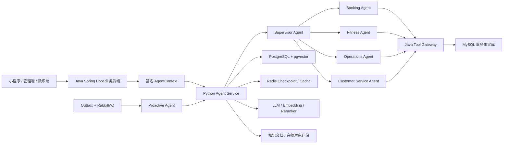

# AI 健身多 Agent 平台开发路线与项目规则

> 文档状态：开发基准（Living Document）
>
> 当前基线日期：2026-08-12
>
> 适用仓库：`ai-fitness-platform`
>
> 核心原则：基于现有健身业务系统改造，直接面向企业级最终形态建设，不以 Demo 作为生产架构基础。

## 1. 文档用途

本文档统一记录本项目后续开发必须遵循的产品范围、架构边界、Agent 设计、数据规划、实施步骤、验收标准和协作规则。

后续每个功能开始前，应先确认它属于本文档定义的健身业务范围；完成后，应同步更新本文档中的实施状态。规划中的能力不能标记为已完成，只有代码、测试、配置、审计和验证证据齐全后才能标记完成。

## 2. 项目目标

将现有 Java Spring Boot 健身管理系统改造为可实际部署的 AI 健身多 Agent 平台，并保留现有系统作为健身业务事实源。

最终系统需要同时服务三类业务身份：

- 管理员：经营分析、门店管理、教练管理、会员运营、合同与课时、异常处理。
- 教练：学员管理、训练计划、训练记录、课程安排、跟进提醒、专业知识辅助。
- 学员：预约课程、查看合同和剩余课时、执行训练计划、记录训练、进度分析、健身问答和主动提醒。

项目最终需要体现以下企业级 AI 能力：

- 多 Agent 编排和明确的 Agent 职责边界。
- 真实 LLM、Embedding 和 Reranker 服务接入。
- RAG 健身知识库及可追溯引用。
- 长短期 Memory 和用户可管理的记忆。
- 基于受控 Tool Calling 的真实业务操作。
- 管理员经营分析与受限 Text-to-SQL。
- 事件驱动的主动提醒和任务调度。
- 权限、租户隔离、审计、幂等、可观测性和评测体系。

## 3. 明确排除的业务范围

现有代码由其他项目改造而来，仍残留赛事、活动运营及相关通用代码。以下内容默认不属于本项目，不参与 Agent、RAG、Memory、工具、数据库视图和简历功能设计：

- 赛事、比赛、赛程、报名、作品征集和评选。
- 活动发布、活动运营、活动营销和活动数据分析。
- 与赛事或活动关联的文章、订单、支付、视频作品和回调流程。
- 无法证明属于健身核心业务的遗留模块。

如果某个遗留模块同时可能服务健身业务，例如订单、支付、消息或文件上传，必须先确认其真实业务用途，再决定保留、改造或隔离；不能仅根据类名直接接入 Agent。

## 4. 现有健身业务基线

### 4.1 当前身份模型

现有系统已经存在以下权限身份：

- `ADMIN`
- `ADMIN_ORGANIZATION`
- `SUPER_ADMIN_ORGANIZATION`
- `COACH`

当前“学员”不是独立的 `Authority`，而是普通 `LoginUser`，通过 `UserAndCoach` 与教练和组织建立关系。后续可以在业务语义层使用 `MEMBER` 或“学员”称呼，但不能在未修改权限模型前假设数据库中已经存在 `STUDENT` 权限。

### 4.2 可复用的健身业务

现有 Java 后端可作为以下业务的基础：

- 组织、门店、管理员、教练和学员关系管理。
- 健身课程管理。
- 合同、合同状态和剩余课时管理。
- 预约、改约、取消、完成课程。
- 教练请假、营业日和可预约时间约束。
- 上课记录、课时统计和教练业绩统计。
- 营收、新客、完课量、课时等门店经营数据。
- 系统消息、通知和部分主动触达基础能力。

### 4.3 必须补齐的健身领域

现有项目缺少完整的训练业务模型，后续需要新增：

- 动作库和动作标准。
- 学员训练档案、目标、偏好、身体限制和风险提示。
- 训练计划、训练日和训练动作明细。
- 训练执行记录、组次、重量、次数和完成情况。
- 身体测量、阶段进展和训练反馈。
- 会员活跃度、续费跟进、教练评价和投诉处理。

建议的核心业务表包括：

- `exercise_catalog`
- `training_profile`
- `training_goal`
- `training_restriction`
- `training_plan`
- `training_plan_day`
- `training_plan_item`
- `training_session`
- `training_set_record`
- `body_measurement`
- `training_feedback`

这些结构化业务数据属于业务事实，应进入 Java 后端管理的 MySQL，而不是由 Agent 直接保存到自己的数据库。

## 5. 最终多 Agent 形态

### 5.1 Supervisor Agent

统一接收用户请求，识别当前用户身份、组织范围、意图和风险等级，决定调用哪个专业 Agent。它负责流程编排，不直接绕过专业 Agent 执行业务写操作。

主要能力：

- 多轮意图识别和任务拆解。
- 身份、角色、组织和上下文注入。
- Agent 路由、并行查询和结果聚合。
- 写操作确认、失败恢复和人工转接。

### 5.2 Booking Agent

服务管理员、教练和学员的课程预约场景。

主要能力：

- 查询合同、剩余课时、课程和教练。
- 查询教练可预约时间、请假和营业日。
- 创建预约、改约、取消预约和查看预约记录。
- 在操作前解释冲突原因、费用或课时影响。
- 所有写操作必须确认、幂等并由 Java 后端事务执行。

### 5.3 Fitness Agent

负责训练专业业务，是项目区别于普通预约系统的核心 Agent。

主要能力：

- 收集训练目标、经验、时间、器械、偏好和限制。
- 结合学员档案、教练要求和知识库生成训练计划。
- 由教练审核、调整和发布训练计划。
- 记录训练组次、重量、次数、RPE 和反馈。
- 根据完成情况和阶段数据建议计划调整。
- 提供动作规范、常见错误、热身、拉伸和恢复知识。
- 识别高风险健康表述并停止给出越界建议，提示咨询专业人员。

### 5.4 Operations Agent

只面向具备组织经营权限的管理员，不向普通教练和学员开放经营数据。

主要能力：

- 营收、新客、完课、课时、课程利用率和教练表现分析。
- 会员活跃度、流失风险和续费机会分析。
- 生成日报、周报、月报和异常解释。
- 在受控只读视图上执行 Text-to-SQL。

### 5.5 Customer Service Agent

负责课程规则、合同规则、预约规则、常见问题、投诉和人工转接。

主要能力：

- 基于 RAG 回答平台和门店规则问题。
- 查询用户自己的合同、预约和课时事实。
- 收集投诉、评价和问题分类。
- 无法可靠回答或涉及纠纷时转人工处理。

### 5.6 Proactive Agent

该 Agent 由事件和定时任务触发，不依赖用户主动发起对话。

主要能力：

- 预约前提醒、预约变更和取消通知。
- 训练计划待执行、连续未训练和阶段复盘提醒。
- 合同课时不足、合同临期和续费跟进提醒。
- 教练待审核计划、待跟进学员和异常任务提醒。
- 管理员经营日报和关键指标异常提醒。

主动提醒必须遵守用户授权、安静时间、频率限制、模板审核、幂等和退订规则。

## 6. 企业级总体架构



### 6.1 Java Spring Boot 的职责

- 登录认证、会话和 RBAC。
- 组织/门店租户隔离和数据范围计算。
- 健身业务实体、事务和状态机。
- Agent Tool Gateway。
- 写操作幂等、确认、审计和风控。
- Outbox 业务事件发布。
- 业务数据只读视图和 SQL 执行网关。

### 6.2 Python Agent Service 的职责

- 对话 API、流式响应和会话编排。
- Supervisor 和专业 Agent 图编排。
- Prompt、模型网关和结构化输出。
- RAG 检索、Embedding、Reranker 和引用生成。
- Memory 提取、使用、过期和删除。
- Text-to-SQL 生成、语法解析和结果解释。
- Tool Calling 参数组织，但不决定最终业务权限。
- Agent 评测、Tracing 和 Token/成本统计。

### 6.3 数据库边界

- MySQL：用户、组织、教练、学员、合同、课程、预约、训练计划和训练记录等业务事实。
- PostgreSQL + pgvector：Agent 会话、Checkpoint、Memory、知识文档、切片、向量和评测记录。
- Redis：短期状态、缓存、限流、分布式锁和任务幂等辅助数据。
- Agent 禁止直接写 MySQL；业务修改只能调用 Java Tool Gateway。
- Operations Agent 禁止连接 MySQL 基础表，只能调用 Java 提供的受控查询工具或只读视图执行器。

## 7. 安全上下文与 Tool Calling 规则

### 7.1 AgentContext

AgentContext 必须由 Java 后端根据已认证用户生成并签名，至少包含：

- `requestId`
- `traceId`
- `userId`
- `organizationId`
- 当前权限和业务身份
- 教练或学员数据范围
- 渠道、语言和时区
- 签发时间、过期时间和签名

模型输出、前端参数和自然语言中的用户 ID、组织 ID、教练 ID都不可信。工具执行时必须从已验证的 AgentContext 获取主体和租户范围。

### 7.2 Tool Gateway

Java 后端统一提供 `/internal/agent-tools/**` 内部接口，并采用服务间认证。工具分为：

- 只读工具：查询课程、预约、合同、课时、教练时间、训练计划和经营指标。
- 写工具：预约、改约、取消、发布计划、记录训练、创建跟进任务等。
- 高风险工具：涉及合同状态、费用、批量通知或管理配置的操作。

每个工具必须定义：

- 可调用角色和组织数据范围。
- 请求和响应 Schema。
- 超时、重试和熔断策略。
- 是否需要用户二次确认。
- 幂等键规则。
- 审计字段和敏感字段脱敏规则。
- 错误码和可恢复方式。

### 7.3 写操作流程

所有写操作遵循固定流程：

1. Agent 查询真实业务状态。
2. Agent 生成待执行动作摘要。
3. Java 后端重新校验身份、数据范围和业务前置条件。
4. 用户确认后生成短时有效的确认凭证。
5. Agent 携带确认凭证和幂等键调用写工具。
6. Java 后端在事务内执行并记录审计日志。
7. Agent 根据工具真实返回值向用户反馈，不得自行宣称成功。

## 8. RAG 规则

知识库优先覆盖：

- 动作标准、目标肌群、常见错误和替代动作。
- 增肌、减脂、体能和基础训练方法。
- 热身、拉伸、恢复和基础营养知识。
- 课程、预约、合同、课时和门店规则。
- 健身安全边界和风险提示。

RAG 流程应采用：文档解析 → 清洗 → 语义切片 → 元数据 → Embedding → 混合召回 → Reranker → 引用生成。

每个知识切片至少记录：

- 文档 ID、版本和来源。
- 文档类型和适用角色。
- 组织范围或全局范围。
- 生效时间和失效时间。
- 切片位置和可展示引用。

规则要求：

- 不允许只有向量召回而没有权限和元数据过滤。
- Reranker 不可用时不能在生产环境中静默切换成假实现。
- 涉及合同、预约、余额等动态事实时必须调用业务工具，不能以 RAG 内容作为事实。
- 回答专业知识时尽可能返回来源；证据不足时明确说明不确定。

## 9. Memory 规则

Memory 用于保存跨会话仍有价值的稳定信息，例如：

- 训练目标和计划周期。
- 常用训练时间和器械条件。
- 动作偏好和不喜欢的训练方式。
- 用户主动提供并同意保存的身体限制。
- 提醒偏好、语言和沟通风格。

以下内容不能作为长期 Memory：

- 当前合同余额、预约状态和课时数量等动态业务事实。
- 密码、Token、AccessKey 和支付凭证。
- 未经用户确认的模型推断。
- 无法说明来源、时间和适用范围的信息。

每条 Memory 应具备用户、组织、类型、来源、置信度、创建时间、更新时间、过期策略和同意状态。用户必须能够查看、纠正和删除自己的 Memory。

## 10. Text-to-SQL 规则

Text-to-SQL 只属于 Operations Agent，只向具备组织经营权限的管理员开放。

允许查询的只读视图建议包括：

- `v_daily_revenue`
- `v_coach_daily_performance`
- `v_booking_statistics`
- `v_course_utilization`
- `v_member_course_balance`
- `v_member_activity`

执行链路必须包含：

1. 用户权限和组织范围验证。
2. 问题改写和 Schema 检索。
3. SQL 生成。
4. AST 解析和白名单校验。
5. 禁止 DDL、DML、多语句、注释绕过和非白名单对象。
6. 强制注入组织范围。
7. 强制行数、执行时间和资源限制。
8. 只读账号执行。
9. SQL、参数、耗时、行数和调用人完整审计。
10. Agent 仅解释真实查询结果。

## 11. 主动提醒与事件规则

Java 业务事务通过 Outbox Pattern 写入事件表，再由消息系统发布给 Proactive Agent。建议使用 RabbitMQ，并配置重试队列和死信队列。

关键事件包括：

- 预约创建、改约、取消和即将开始。
- 课程完成和训练记录提交。
- 训练计划发布、待审核和阶段到期。
- 连续未训练或活跃度下降。
- 合同临期和剩余课时不足。
- 投诉创建、状态变化和人工处理结果。

消费者必须具备幂等键、重试上限、死信处理、可追踪状态和人工补偿入口。模型可以生成表达，但不能自行决定绕过发送频率、用户授权或组织策略。

## 12. 分阶段开发路线

### 阶段 0：现有系统审计与项目基线

状态：已完成主要业务盘点，后续持续补充。

工作内容：

- 识别管理员、教练和学员模型。
- 盘点课程、合同、预约、课时和经营数据。
- 标记赛事与活动运营遗留代码。
- 建立 Git 仓库、远程仓库、忽略规则和安全配置模板。
- 移除 Git 历史中的硬编码凭证。

完成标准：仓库可安全推送，现有健身业务范围和遗留范围有明确清单。

### 阶段 1：Agent 工程与基础设施

状态：阶段 1 核心工程化基线已完成；健身核心 Java 适配层、基础告警和业务测试随阶段 2 建设。

已经完成：

- 新建 `fitness-agent-service`。
- 建立 FastAPI 生命周期和健康检查。
- 建立 PostgreSQL/pgvector、Redis 配置与连接适配器。
- 建立真实 LLM、Embedding、Reranker 网关。
- 建立 Alembic 迁移入口和本地 Docker Compose。
- 使用 `.python-version` 与 `uv.lock` 固定 Python 3.11 和完整依赖图。
- 建立统一 Makefile，覆盖基础设施、依赖同步、格式化、质量检查和服务启动。
- 建立 Python 严格类型检查、Ruff 检查和自动化测试质量门禁。
- 识别历史 Java 源码依赖本地 `target/classes` 残留产物的假编译问题，并用 `clean compile` 在本地与 CI 复现。
- 明确历史 Java 项目是不完整源码快照，不恢复赛事、作品、活动等缺失类型，也不把它纳入 Agent CI 门禁。
- 建立 GitHub Actions，执行 Python 检查、Agent 生产镜像构建和 Git 历史密钥扫描。
- 建立 Dependabot，对 Python、Maven 和 GitHub Actions 依赖执行定期检查。
- 接入 JSON 结构化日志、Request ID、Trace ID、安全校验和跨服务响应头。
- 记录无法从公共制品仓库解析且引用缺失服务的旧阿里云视频上传代码；保留源码供审计，但不进入健身核心适配层。
- 使用 Apache Maven Wrapper `only-script` 模式固定 Maven 3.8.8，供遗留问题诊断和后续适配层使用，避免提交 Wrapper 二进制 JAR。
- 建立 local、test、staging、production 环境配置、Secret 分级和不可变镜像提升规则。
- 接入低基数 Prometheus Metrics，覆盖请求量、耗时、并发数和构建信息。
- 接入可配置 OpenTelemetry SDK、FastAPI/HTTPX 自动埋点和 OTLP/HTTP 批量导出。
- 建立本地 OpenTelemetry Collector 配置，默认仅输出调试 Trace，不连接外部平台。
- 建立锁定依赖、非 root、多阶段 Agent 生产镜像，并把镜像构建加入 CI。
- 完成容器冒烟验证：以 UID/GID `10001:10001` 启动，存活与 Metrics 接口正常。

待完成：

- 随阶段 2 的真实 Tool Gateway 指标建立 Prometheus 告警规则，避免对尚不存在的业务指标伪造告警。

完成标准：开发者可以按文档启动依赖和服务；CI 对每次提交自动执行；服务不依赖本地隐式配置。

### 阶段 2：AgentContext、权限和 Java Tool Gateway

状态：阶段 2 已完成独立 Gateway、签名上下文、首批只读工具和 Python Tool Registry 的基础实现；写工具、真实数据库集成测试和 Agent 调用契约测试待继续建设。

工作内容：

- 已建立独立、可复现构建的 `fitness-core-gateway`，仅纳入用户、机构、教练、学员、课程、合同、课时和预约能力。
- 已实现双层认证：内部服务 Token 与签名 `AgentContext`；上下文包含用户主体、机构范围、角色、有效期和 nonce。
- 已实现首批只读工具：当前用户、机构、课程、合同和预约查询；所有查询都经过组织范围和用户/教练关系校验。
- 已实现 Python `GatewayClient`：复用异步连接池，透传签名上下文，统一 400/401/403/404/5xx 错误，并对暂时性 GET 失败做有限重试。
- 已建立 v1 接口契约文档，固定 Header、Tool 路径、字段视图、列表上限和错误处理语义。
- 已建立 Python 版本化 Tool Registry：固定工具 ID、输入 Schema、角色元数据、只读/确认标记、未知工具拒绝和安全最小审计事件。
- 已将首批健身只读工具装配到 Agent 服务生命周期；后续 Supervisor 只能从 Registry 获取工具 Schema，不得直接使用 HTTP 客户端或数据库连接。
- 后续继续补充真实数据库集成测试，并将写工具纳入 CI 自动测试和安全门禁。
- 将历史 Java Controller、Service 和表结构作为业务规则参考，不恢复赛事、作品、活动代码，也不直接依赖缺失类型。
- 审计健身相关 Controller 和 Service 的资源级权限。
- 修复仅检查 `isAuthenticated()`、但接受任意用户/组织/教练 ID 的接口。
- 建立签名 AgentContext 和服务间认证。
- 建立 Tool 注册表、Schema、统一错误码、超时和审计。
- 首批只读工具：当前用户、组织、课程、合同、剩余课时、教练、预约和可预约时间。
- 首批写工具：创建预约、改约和取消预约。
- 实现确认凭证和幂等键。

完成标准：越权、跨组织、伪造 ID、重复提交和过期确认凭证均有自动化测试；Agent 无法绕过 Java 权限直接操作业务库。

### 阶段 3：Agent Runtime 与 Supervisor

状态：已完成统一非流式对话接口、LangGraph Supervisor 基础图、模型 Tool Calling 协议、工具步数预算、旧业务范围护栏和 PostgreSQL/Redis 会话持久化基础；SSE 流式响应、断线恢复 API、角色意图评测和 Prompt 版本管理待继续建设。

工作内容：

- 已建立统一非流式对话 API 和会话请求协议，要求透传已签名 AgentContext。
- 已使用 LangGraph 构建 Supervisor 状态图，支持模型回合、工具回合和最终回答回合。
- 已建立 DeepSeek OpenAI-compatible Tool Calling 响应规范化、工具步数预算和未配置模型的明确失败语义；配置沿用 `learning-langchain-CN` 的 `DEEPSEEK_*` 变量。
- 已增加赛事、作品和活动运营范围护栏；这些遗留业务不进入当前健身 Agent 路由。
- 已接入 PostgreSQL LangGraph Checkpoint、启动期官方表迁移、Redis 会话锁和按签名身份隔离的匿名 thread_id。
- 已实现同一会话后续请求读取最新 Checkpoint 并恢复历史消息；会话锁包围“读取历史→执行图→写入新 Checkpoint”完整临界区。
- 已增加会话并发冲突返回 409 的协议；SSE 流式响应和断线恢复 API 待基于 Checkpoint 契约接入。
- 建立角色路由、意图分类、任务状态和失败恢复。
- 接入 PostgreSQL/Redis Checkpoint。
- 统一模型超时、重试、限流、Token 预算和结构化输出。
- 建立 Prompt 版本管理和基础 Agent 评测集。

完成标准：管理员、教练和学员请求能稳定路由；会话可恢复；工具失败不会被描述成成功；模型请求可追踪。

### 阶段 4：企业级 RAG

状态：RAG 基础数据模型、pgvector 权限过滤召回、真实 Embedding/Reranker 编排、统一多格式解析、
Markdown/DOCX/PDF/XLSX 清洗切片、checksum 增量索引、父子节点扩展、混合检索、完整引用 API、
OCR 适配器、独立 OCR 服务骨架、离线评测门禁和真实 ClamAV 联调已完成可验证切片；PaddleOCR
模型在 Linux CPU/GPU 节点上的真实文档集压测与评测数据扩充待继续。

工作内容：

- 建立知识文档、版本、切片、向量和权限数据表。
- 已建立 Alembic 迁移：知识文档、版本状态、切片、组织/角色/用户范围、生效时间和 pgvector HNSW 索引。
- 已实现 RAG 领域接口：Embedding 批处理、服务端权限过滤、候选召回、真实 Reranker 和来源证据渲染。
- 已把 Fitness 路由的检索证据接入 Supervisor；Reranker 未配置时不允许静默降级。
- 已实现 Markdown 文档清洗、标题/段落切片、稳定文档/切片 ID、checksum 去重和旧版本归档。
- 已增加 `knowledge_parents` 和 `parent_id`：子节点负责召回，父节点负责补充章节/表格上下文；表格子节点重复表头并记录行范围。
- 已完成本地 PostgreSQL/pgvector 真实集成验证：写入一条临时知识切片后，组织/角色权限过滤通过并清理测试数据。
- 已接入统一文档解析、清洗和增量索引流程：支持 Markdown/TXT、PDF、DOCX、XLSX；解析器保留
  标题层级、PDF 页码、XLSX 工作表、表格序号和行范围；扫描型和混合型 PDF 的缺失页可进入
  HTTP OCR 服务。
- 已将多格式解析结果接入父子节点切片，来源坐标写入结构化引用元数据；增加真实 DOCX/XLSX
  样例、扫描 PDF、大小限制和表格边界测试。
- 已建立管理员知识库闭环：上传暂存、签名管理员校验、组织范围校验、审核/拒绝、数据库原子
  Claim、索引成功/失败状态和有限次数人工重试；任务失败不会伪装成知识发布成功。
- 已建立对象存储适配边界：本地目录与 S3-compatible/MinIO 实现可配置切换；上传前增加文件
  签名、UTF-8、Office ZIP 路径/宏/加密/解压大小和 SHA-256 安全检查；增加有界 Worker 轮询
  入口和超过重试上限后的 FAILED 死信语义；已增加 ClamAV `INSTREAM` 外部杀毒适配器和独立
  malware verdict 审计字段，外部服务不可用时 fail-closed。
- 已增加关键词与向量混合召回：PostgreSQL `tsvector`/`pg_trgm` 与 pgvector 并行执行权限过滤，
  服务层使用 RRF 融合后再调用真实 Reranker；新增带页码、工作表、行范围的引用 API，以及
  Recall@K/MRR 离线评测骨架和健身检索样例。
- 实现关键词与向量混合召回、元数据过滤和 Reranker。
- 建立引用、知识过期、重建索引和质量评测。
- 导入首批健身专业知识和业务规则文档。

完成标准：不同组织和角色无法检索越权文档；答案可引用；检索和重排有离线评测；文档更新可追踪。

#### 阶段 4.1：复杂 PDF 解析质量专项

状态：真实 RAG 基线验证已完成，PDF 解析第一轮已完成并记录在
`docs/pdf-parser-quality-20260812.md`；当前进入“解析质量门禁”阶段。本专项必须在复杂 PDF
重新索引前和 Booking Agent 开发前完成。该专项不与业务 Agent 开发混在同一个提交中，避免
解析缺陷继续污染线上知识版本。

进入条件：

- 已使用真实 PostgreSQL、pgvector、本地 BGE-M3 和 BGE-Reranker 跑通 RAG 检索接口。
- 已使用“高温天气怎么运动”“如何提高肌肉耐力”“运动前需要热身吗”记录优化前基线。
- 已记录候选召回、Reranker 排序、引用来源/页码、签名校验和权限分布结果。
- 已确认网页导航、字体映射异常字符、页脚模板和父节点过长等可复现问题；完整结果见
  `docs/rag-baseline-20260812.md`。

工作内容：

- 已完成第一轮 PDF 解析器改造和真实资料回归；本轮不触发数据库重建。
- 已增加离线解析质量门禁：复用解析器和父子切分，检查噪声率、碎片率、重复率、父节点完整性、
  表格完整性和 PDF 缺失页；首次运行结果及阻断原因记录在 `docs/pdf-parser-quality-20260812.md`。
- 对真实 PDF 资料建立页级解析基线，分别记录文本层质量、空白页、断词、目录和页眉页脚重复率。
- 增加目录/索引页识别和过滤，避免页码点线、目录标题进入语义检索。
- 增加跨页页眉页脚识别与去重，但保留正文中的同名标题。
- 优先使用 PDF 原生表格结构提取；表头与数据行绑定，表格跨页时延续表头并保留页码和行范围。
- 对字符间异常空格、断词和连字符执行保守修复，不能修改数值、单位、医学术语和原始引用。
- 增加父节点上下文完整性、表格行完整性和引用页码准确性的自动化质量门禁。
- 只有通过离线评测的文档才重新进入审核和索引；不合格 PDF 继续保留为人工参考资料。

完成标准：复杂 PDF 不再产生目录/页码噪声，正文断词率和表格断行率达到评测阈值，检索引用能准确回到
原始页码；解析失败时宁可进入人工审核，也不能静默发布低质量 chunk。

### 阶段 5：Booking Agent

工作内容：

- 接入阶段 2 的预约工具。
- 处理无合同、合同冻结、课时不足、教练不属于组织、请假、非营业日和时间冲突。
- 实现预约、改约和取消的多轮确认。
- 建立并发预约、重复请求和失败补偿测试。

完成标准：Booking Agent 与现有 Java 预约规则一致；任何写操作都有确认、幂等和审计；并发场景不产生重复预约。

### 阶段 6：训练领域与 Fitness Agent

工作内容：

- 在 Java/MySQL 中建立训练档案、动作库、计划、记录、测量和反馈模型。
- 建立训练业务 Service、权限、状态机、迁移和 API。
- 建立训练相关 Tool Gateway。
- 实现计划生成、教练审核、学员执行、训练记录和阶段调整。
- 将专业知识 RAG 与结构化训练数据结合。
- 增加安全边界和人工教练介入机制。

完成标准：训练计划不是纯文本，能够结构化保存、审核、执行和复盘；教练与学员的数据范围严格隔离。

### 阶段 7：Operations Agent 与 Text-to-SQL

工作内容：

- 建立经营只读视图和数据字典。
- 建立 SQL 白名单、AST 校验、组织范围注入和只读执行器。
- 实现营收、完课、课时、新客、课程利用率、教练表现、活跃度和续费分析。
- 建立报表导出和结果解释。

完成标准：只读账号无法修改数据；无法访问基础表和非授权组织；所有查询可审计并受资源限制。

### 阶段 8：Memory

工作内容：

- 建立短期会话 Memory 和长期用户 Memory。
- 实现候选记忆提取、去重、确认、更新、过期和删除。
- 区分用户偏好、训练目标、限制和沟通风格。
- 提供用户查看、纠正和删除入口。

完成标准：动态业务事实不进入长期 Memory；敏感信息不被记忆；用户可控制自己的记忆。

### 阶段 9：Proactive Agent

工作内容：

- 在 Java 后端实现 Outbox Pattern。
- 接入 RabbitMQ、重试、死信队列和幂等消费者。
- 实现预约、训练、合同、续费和经营提醒。
- 建立安静时间、发送频率、模板、退订和人工任务规则。

完成标准：消息不重复、不越权、不在禁止时间发送；失败消息可追踪、重试和人工补偿。

### 阶段 10：Customer Service、评价与投诉

工作内容：

- 建立规则问答、问题分类和人工转接。
- 增加教练评价、投诉、处理状态和回访记录。
- 根据权限查询真实合同、预约和课时。
- 对争议、退款、医疗和高风险内容强制人工介入。

完成标准：客服答案可追溯；投诉形成结构化工单；模型不能擅自承诺退款、赔付或合同变更。

### 阶段 11：语音与多端交互

工作内容：

- 接入真实 STT 和可选 TTS。
- 建立音频上传、对象存储、格式校验和生命周期管理。
- 语音识别结果进入与文本一致的权限和确认流程。
- 完成学员端、教练端和管理端 Agent 交互页面。

完成标准：语音不绕过文本安全规则；音频访问受控并可删除；多端会话状态一致。

### 阶段 12：评测、可观测性与上线

工作内容：

- 建立单元、集成、契约、权限、端到端和并发测试。
- 建立 Agent 路由、工具选择、RAG、SQL、Memory 和安全评测集。
- 接入日志、Trace、Metrics、告警、Token 和成本看板。
- 完成压测、故障注入、备份恢复、灰度、回滚和应急手册。
- 对关键 Prompt、模型和知识库版本进行发布管理。

完成标准：权限和租户隔离测试全部通过；核心写流程可审计和回滚；关键指标有告警；上线和恢复步骤经过演练。

## 13. 测试与验收规则

每个阶段至少包含与风险相匹配的测试：

- Java 单元测试和 Service 集成测试。
- Python 单元测试和 Agent 图测试。
- Java Tool Gateway 与 Python Tool Client 契约测试。
- MySQL、PostgreSQL、Redis 和消息队列集成测试。
- 角色、资源所有权和跨组织访问安全测试。
- Prompt、路由、RAG、Text-to-SQL 和 Memory 离线评测。
- 预约并发、幂等、超时、重试和故障恢复测试。
- 关键用户流程端到端测试。

一个功能的 Definition of Done：

- 业务规则和权限边界明确。
- 数据库迁移可执行且可回滚。
- 接口 Schema、错误码和审计字段完整。
- 正常、异常、越权和并发测试通过。
- 日志、Trace 和 Metrics 可定位问题。
- 配置、部署和使用文档已更新。
- 核心类、关键业务分支和安全控制具备解释“为什么这样设计”的详细注释。
- 不包含真实密钥、个人敏感数据和本地环境文件。
- 已完成详细 Git 提交并推送到远端。

## 14. 模型与第三方依赖规则

- 开发对应能力时直接接入真实 LLM、Embedding、Reranker、数据库、缓存或消息系统。
- Mock、Fake 和内存实现仅允许在自动化测试中使用，不能成为生产默认实现。
- 不允许因为外部服务未配置而返回伪造成功结果。
- 所有模型和第三方服务必须通过适配层调用，业务 Agent 不直接散落 SDK 客户端。
- 必须配置超时、有限重试、限流、熔断、日志脱敏和成本统计。
- API Key、数据库密码和服务 Token 只能通过环境变量或 Secret Manager 注入。
- 模型名称、服务地址和 Prompt 版本必须可配置、可审计、可回滚。

## 15. Git、提交和配置规则

### 15.1 提交规则

- 每次提交聚焦一个完整、可验证的阶段或功能，不混入无关改动。
- Commit 标题使用明确的中文动宾结构，说明本次完成的核心功能。
- Commit 正文需要说明背景、实现内容、影响范围、配置或迁移变化，以及验证方式。
- 提交前检查工作区，保留用户已有和无关修改。
- 提交前执行适用的测试、静态检查、`git diff --check` 和密钥扫描。
- 当前单人开发阶段可在验证后推送 `main`；CI 和分支保护建立后，功能开发改用功能分支和 Pull Request。
- 禁止未经明确授权使用 force push、重写已共享历史或删除远端分支。

建议的 Commit 格式：

```text
建立预约 Agent 的受控写工具

本次提交实现……
权限与数据范围……
数据库与配置变化……
验证方式……
```

### 15.2 配置和密钥规则

- `.env`、`application-dev.yml`、`application-local.yml` 和真实生产配置不提交 Git。
- 仓库只提交 `.env.example` 和 `application-*.example.yml`。
- 示例配置不得包含真实凭证。
- 发现硬编码密钥时先移除并轮换密钥，再推送代码；不使用 GitHub 放行链接绕过 Push Protection。
- 日志、异常和 Agent Trace 中不得记录密码、Token、AccessKey、完整手机号或其他敏感数据。

## 16. 开发协作规则

- 新生成或修改的核心代码必须提供详细注释，包括 JavaDoc、Python Docstring 和必要的行内注释。
- 注释重点解释业务意图、数据来源、权限边界、状态变化、异常处理、幂等、事务和设计取舍，不能只把代码逐行翻译成中文。
- Agent 路由、Tool Calling、写操作确认、RAG 检索、Memory、Text-to-SQL、并发控制、事件消费和权限校验属于必须详细注释的核心区域。
- 公共类、公共方法、重要 DTO/Schema 和复杂配置项应说明参数、返回值、失败方式及调用约束。
- 修改核心逻辑时必须同步修改注释；已经失效或与实现不一致的注释按缺陷处理。
- 简单赋值、明显的 getter/setter 和一眼可理解的样板代码不强制堆砌注释，避免注释噪声掩盖真正重要的约束。
- 所有设计和实现基于现有健身项目，不重新复制一套脱离现有业务的后端。
- Java 后端建议使用 IntelliJ IDEA；Python Agent 服务可使用 VS Code，也可以继续在 IDEA 中管理。两者共享同一个 Git 仓库。
- 开发任何 Agent 前先定义业务工具、权限和数据来源，再编写 Prompt 和编排。
- 不以“模型能回答”代替业务功能完成；业务事实必须来自数据库或可信知识来源。
- 不以自然语言约束代替代码权限、SQL 校验、幂等和审计。
- 新增表必须使用迁移脚本；禁止依赖生产环境自动建表。
- 新增接口必须考虑角色、组织、资源所有权、错误码、审计和兼容性。
- 对规划、开发中、已完成三个状态进行明确区分。项目介绍和简历描述应与已实现、已验证的能力一致。
- 每完成一个阶段，更新本文档状态、相关 README、测试证据和部署说明。

## 17. 当前实施状态与下一步

截至 2026-08-12，已经完成：

- 现有健身业务和角色初步盘点。
- Git 初始化、GitHub 绑定、敏感配置忽略和硬编码阿里云密钥移除。
- `fitness-agent-service` 企业级基础骨架。
- FastAPI、PostgreSQL/pgvector、Redis、LLM、Embedding、Reranker 和 Alembic 基础适配。
- Agent 基础设施 Docker Compose 和健康检查。
- Python 3.11 依赖锁、统一 Makefile 和本地质量门禁。
- GitHub Actions 的 Python 检查、Agent 生产镜像构建和密钥扫描。
- JSON 结构化日志以及 Request ID、Trace ID 请求链路。
- 历史 Java 不完整源码与 `target/classes` 假编译问题的边界记录。
- Maven Wrapper 3.8.8，为遗留诊断和阶段 2 健身核心适配层固定构建工具版本。
- local、test、staging、production 配置约定与 Secret 分级规则。
- Prometheus Metrics、OpenTelemetry OTLP Trace 导出和本地 Collector。
- 非 root 多阶段 Agent 生产镜像及容器存活、Metrics 冒烟验证。
- 阶段 4 RAG 首个可验证切片：知识文档/切片/权限元数据迁移、1536 维 pgvector HNSW
  索引、服务端权限过滤、Embedding 批处理、真实 Reranker、来源证据注入 Supervisor，
  以及 Markdown 清洗、切片和 checksum 增量索引。
- 阶段 4 多格式知识索引：统一解析器注册表、PDF/DOCX/XLSX/TXT 支持、表格表头保留、
  页码/工作表/行范围元数据和父子节点切片已接入；扫描型/混合型 PDF 的缺失页进入 HTTP OCR，OCR
  服务失败时不会把空内容写入知识库。
- 索引重建任务：支持按文档、组织或平台范围快照已审核源文件，后台复用完整解析和 Embedding
  流程，记录文档级成功/跳过/失败状态并支持有限重试。
- RAG 评测门禁：增加黄金结果回归集、Recall@K/MRR 最低阈值和越权 ID 零容忍检查，已接入本地
  Make 命令与 GitHub Actions。
- 文件安全与 OCR：增加 ClamAV `INSTREAM`、HTTP OCR、扫描型/混合型 PDF 缺失页处理，以及
  独立 malware verdict 审计字段；已落地独立 `fitness-ocr-service`，默认接入 PaddleOCR
  PP-StructureV3，保留厂商可替换的 `/v1/parse` 契约。
- 知识源治理：已将美国《Physical Activity Guidelines for Americans, 2nd edition》完整版和演示版
  PDF 标记为 `REFERENCE_ONLY`；原始文件继续保留，已从 PostgreSQL 删除完整版的 127 个父节点和
  499 个检索子节点，避免目录、断词、页眉页脚和表格版式噪声进入 RAG。
- 复杂 PDF 解析专项已纳入阶段 4.1，安排在知识源治理完成后、复杂 PDF 重新索引前和 Booking Agent
  开发前；通过目录过滤、页眉页脚去重、表格结构化、断词修复和引用页码评测后，才允许重新索引。

下一步按顺序执行：

1. **解析与检索自动化质量门禁（当前进行中）**：检测噪声率、短碎片率、重复率、父节点完整性、
   表格完整性、缺失页和引用页码准确性，未达阈值不得发布知识版本。
2. **知识库重建与前后对比复测**：保留原始文件，重新解析合格资料并生成父节点、子节点和
   Embedding；与 `docs/rag-baseline-20260812.md` 的 Recall@K、MRR 和引用结果对比。美国指南 PDF
   只有通过评测才能恢复索引。
3. **知识库生产闭环**：接入真实对象存储生命周期，将索引 Worker 部署为独立进程，完善失败重试、
   死信与审计；在 Linux CPU/GPU 节点联调 PaddleOCR，验证页码、表头、置信度和吞吐。
4. **Booking Agent**：实现预约、改约、取消预约，以及确认凭证、幂等、事务、审计和管理员/教练/
   学员权限测试。
5. **训练领域与 Fitness Agent**：建立训练档案、动作库、结构化计划、教练审核、学员执行、训练记录、
   阶段评估和调整流程，并受控结合专业知识 RAG。
6. **后续 Agent 能力**：依次推进 Operations Agent 与受控 Text-to-SQL、Memory、主动提醒、客服与
   评价投诉、语音/多端交互，以及最终全链路评测、可观测性和部署。

上述顺序是当前项目的唯一执行顺序。执行过程中发现的新问题，按以下规则处理：

- 属于当前阶段完成标准的问题，必须在当前阶段解决，不能留下脏数据后直接进入下一阶段。
- 不属于当前阶段且不阻塞验收的问题，记录到对应后续阶段，不临时改变当前开发目标。
- 只有安全、权限、数据不可恢复或架构方向错误等阻塞问题，才允许暂停当前步骤；暂停原因和路线调整
  必须先写入本文档。
- 同一时间只允许一个步骤标记为“当前进行中”；每完成一步，更新状态、README、测试证据和提交记录，
  再开始下一步。
- 每次提交聚焦一个完整、可验证的功能，提交说明必须写明实现内容、数据变化、测试结果和剩余风险。
- 始终忽略赛事、作品和活动运营遗留模块；核心 Agent、权限、RAG、Memory、SQL 和写工具代码使用
  详细中文注释。

后续开发不得跳过 Tool Gateway 和权限层，直接从对话 Prompt 开始拼装业务 Agent；RAG
内容也不能替代预约、合同、课时和训练记录等 Java 业务事实。
