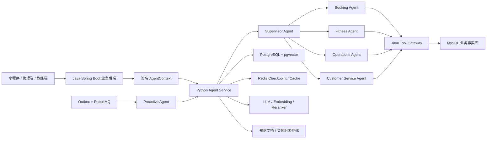

# AI 健身多 Agent 平台开发路线与项目规则

> 文档状态：开发基准（Living Document）
>
> 当前基线日期：2026-08-12
>
> 适用仓库：`ai-fitness-platform`
>
> 核心原则：基于现有健身业务系统改造，直接面向企业级最终形态建设，不以 Demo 作为生产架构基础。

## 1. 文档用途

本文档统一记录本项目后续开发必须遵循的产品范围、架构边界、Agent 设计、数据规划、实施步骤、验收标准和协作规则。

后续每个功能开始前，应先确认它属于本文档定义的健身业务范围；完成后，应同步更新本文档中的实施状态。规划中的能力不能标记为已完成，只有代码、测试、配置、审计和验证证据齐全后才能标记完成。

## 2. 项目目标

将现有 Java Spring Boot 健身管理系统改造为可实际部署的 AI 健身多 Agent 平台，并保留现有系统作为健身业务事实源。

最终系统需要同时服务三类业务身份：

- 管理员：经营分析、门店管理、教练管理、会员运营、合同与课时、异常处理。
- 教练：学员管理、训练计划、训练记录、课程安排、跟进提醒、专业知识辅助。
- 学员：预约课程、查看合同和剩余课时、执行训练计划、记录训练、进度分析、健身问答和主动提醒。

项目最终需要体现以下企业级 AI 能力：

- 多 Agent 编排和明确的 Agent 职责边界。
- 真实 LLM、Embedding 和 Reranker 服务接入。
- RAG 健身知识库及可追溯引用。
- 长短期 Memory 和用户可管理的记忆。
- 基于受控 Tool Calling 的真实业务操作。
- 管理员经营分析与受限 Text-to-SQL。
- 事件驱动的主动提醒和任务调度。
- 权限、租户隔离、审计、幂等、可观测性和评测体系。

## 3. 明确排除的业务范围

现有代码由其他项目改造而来，仍残留赛事、活动运营及相关通用代码。以下内容默认不属于本项目，不参与 Agent、RAG、Memory、工具、数据库视图和简历功能设计：

- 赛事、比赛、赛程、报名、作品征集和评选。
- 活动发布、活动运营、活动营销和活动数据分析。
- 与赛事或活动关联的文章、订单、支付、视频作品和回调流程。
- 无法证明属于健身核心业务的遗留模块。

如果某个遗留模块同时可能服务健身业务，例如订单、支付、消息或文件上传，必须先确认其真实业务用途，再决定保留、改造或隔离；不能仅根据类名直接接入 Agent。

## 4. 现有健身业务基线

### 4.1 当前身份模型

现有系统已经存在以下权限身份：

- `ADMIN`
- `ADMIN_ORGANIZATION`
- `SUPER_ADMIN_ORGANIZATION`
- `COACH`

当前“学员”不是独立的 `Authority`，而是普通 `LoginUser`，通过 `UserAndCoach` 与教练和组织建立关系。后续可以在业务语义层使用 `MEMBER` 或“学员”称呼，但不能在未修改权限模型前假设数据库中已经存在 `STUDENT` 权限。

### 4.2 可复用的健身业务

现有 Java 后端可作为以下业务的基础：

- 组织、门店、管理员、教练和学员关系管理。
- 健身课程管理。
- 合同、合同状态和剩余课时管理。
- 预约、改约、取消、完成课程。
- 教练请假、营业日和可预约时间约束。
- 上课记录、课时统计和教练业绩统计。
- 营收、新客、完课量、课时等门店经营数据。
- 系统消息、通知和部分主动触达基础能力。

### 4.3 必须补齐的健身领域

现有项目缺少完整的训练业务模型。本项目采用聚焦的业务范围，不建设健身 SaaS 的所有可能功能。
后续需要新增或完善：

- 基础动作知识和动作标准；第一阶段由经过治理的 RAG 知识库提供，不提前建设复杂动作主数据平台。
- 生成计划所需的最小学员输入：训练目标、经验、可训练时间、器械条件、偏好和用户主动提供的限制。
- 训练计划、训练日和训练动作明细。
- 训练日级执行结果：完成或跳过、完成时间和可选简短备注。

明确不在当前项目范围内：身体测量、围度/体脂趋势、逐组实际重量和次数、疼痛/疲劳量表、复杂训练
反馈、教练阶段调整、自动调整训练负荷，以及由此衍生的健康画像。需要这些能力时必须重新进行业务和
隐私评审，不能在后续开发中顺手加入。

建议的核心业务表包括：

- `training_plan`
- `training_plan_day`
- `training_plan_item`
- `training_session`

其中 `training_session` 只记录训练日级完成事实，不设计逐组明细表；生成计划需要的输入优先通过受控
请求和后续 Memory 保存，不在当前阶段拆出复杂的训练档案、目标和限制表。

这些结构化业务数据属于业务事实，应进入 Java 后端管理的 MySQL，而不是由 Agent 直接保存到自己的数据库。

## 5. 最终多 Agent 形态

### 5.1 Supervisor Agent

统一接收用户请求，识别当前用户身份、组织范围、意图和风险等级，决定调用哪个专业 Agent。它负责流程编排，不直接绕过专业 Agent 执行业务写操作。

主要能力：

- 多轮意图识别和任务拆解。
- 身份、角色、组织和上下文注入。
- Agent 路由、并行查询和结果聚合。
- 写操作确认、失败恢复和人工转接。

### 5.2 Booking Agent

服务管理员、教练和学员的课程预约场景。

主要能力：

- 查询合同、剩余课时、课程和教练。
- 查询教练可预约时间、请假和营业日。
- 创建预约、改约、取消预约和查看预约记录。
- 在操作前解释冲突原因、费用或课时影响。
- 所有写操作必须确认、幂等并由 Java 后端事务执行。

### 5.3 Fitness Agent

负责训练专业业务，是项目区别于普通预约系统的核心 Agent。

主要能力：

- 收集训练目标、经验、时间、器械、偏好和限制。
- 结合用户本次输入、已确认 Memory、教练要求和知识库生成结构化训练计划。
- 由教练审核、驳回和发布训练计划；计划内容需要修改时生成新版本重新审核，不建设复杂阶段调节引擎。
- 记录训练日是否完成或跳过，以及一条可选的非医疗简短备注。
- 提供动作规范、常见错误、热身、拉伸和恢复知识。
- 识别高风险健康表述并停止给出越界建议，提示咨询专业人员。

目标组数、目标次数、目标重量和目标 RPE 属于计划处方字段，可以继续保留；本项目不要求学员逐组填报
实际重量、次数、RPE、疼痛或疲劳。执行备注只用于普通完成情况说明，不能被 Agent 解析成诊断或自动
调参依据。

### 5.4 Operations Agent

只面向具备组织经营权限的管理员，不向普通教练和学员开放经营数据。

主要能力：

- 营收、新客、完课、课时、课程利用率和教练表现分析。
- 会员活跃度、流失风险和续费机会分析。
- 生成日报、周报、月报和异常解释。
- 在受控只读视图上执行 Text-to-SQL。

### 5.5 Customer Service Agent

负责课程规则、合同规则、预约规则、常见问题、投诉和人工转接。

主要能力：

- 基于 RAG 回答平台和门店规则问题。
- 查询用户自己的合同、预约和课时事实。
- 收集投诉、评价和问题分类。
- 无法可靠回答或涉及纠纷时转人工处理。

### 5.6 Proactive Agent

该 Agent 由事件和定时任务触发，不依赖用户主动发起对话。

主要能力：

- 预约前提醒、预约变更和取消通知。
- 训练计划待执行、连续未训练和阶段复盘提醒。
- 合同课时不足、合同临期和续费跟进提醒。
- 教练待审核计划、待跟进学员和异常任务提醒。
- 管理员经营日报和关键指标异常提醒。

主动提醒必须遵守用户授权、安静时间、频率限制、模板审核、幂等和退订规则。

## 6. 企业级总体架构



### 6.1 Java Spring Boot 的职责

- 登录认证、会话和 RBAC。
- 组织/门店租户隔离和数据范围计算。
- 健身业务实体、事务和状态机。
- Agent Tool Gateway。
- 写操作幂等、确认、审计和风控。
- Outbox 业务事件发布。
- 业务数据只读视图和 SQL 执行网关。

### 6.2 Python Agent Service 的职责

- 对话 API、流式响应和会话编排。
- Supervisor 和专业 Agent 图编排。
- Prompt、模型网关和结构化输出。
- RAG 检索、Embedding、Reranker 和引用生成。
- Memory 提取、使用、过期和删除。
- Text-to-SQL 生成、语法解析和结果解释。
- Tool Calling 参数组织，但不决定最终业务权限。
- Agent 评测、Tracing 和 Token/成本统计。

### 6.3 数据库边界

- MySQL：用户、组织、教练、学员、合同、课程、预约、训练计划和训练日完成记录等业务事实。
- PostgreSQL + pgvector：Agent 会话、Checkpoint、Memory、知识文档、切片、向量和评测记录。
- Redis：短期状态、缓存、限流、分布式锁和任务幂等辅助数据。
- Agent 禁止直接写 MySQL；业务修改只能调用 Java Tool Gateway。
- Operations Agent 禁止连接 MySQL 基础表，只能调用 Java 提供的受控查询工具或只读视图执行器。

## 7. 安全上下文与 Tool Calling 规则

### 7.1 AgentContext

AgentContext 必须由 Java 后端根据已认证用户生成并签名，至少包含：

- `requestId`
- `traceId`
- `userId`
- `organizationId`
- 当前权限和业务身份
- 教练或学员数据范围
- 渠道、语言和时区
- 签发时间、过期时间和签名

模型输出、前端参数和自然语言中的用户 ID、组织 ID、教练 ID都不可信。工具执行时必须从已验证的 AgentContext 获取主体和租户范围。

### 7.2 Tool Gateway

Java 后端统一提供 `/internal/agent-tools/**` 内部接口，并采用服务间认证。工具分为：

- 只读工具：查询课程、预约、合同、课时、教练时间、训练计划和经营指标。
- 写工具：预约、改约、取消、发布计划、记录训练、创建跟进任务等。
- 高风险工具：涉及合同状态、费用、批量通知或管理配置的操作。

每个工具必须定义：

- 可调用角色和组织数据范围。
- 请求和响应 Schema。
- 超时、重试和熔断策略。
- 是否需要用户二次确认。
- 幂等键规则。
- 审计字段和敏感字段脱敏规则。
- 错误码和可恢复方式。

### 7.3 写操作流程

所有写操作遵循固定流程：

1. Agent 查询真实业务状态。
2. Agent 生成待执行动作摘要。
3. Java 后端重新校验身份、数据范围和业务前置条件。
4. 用户确认后生成短时有效的确认凭证。
5. Agent 携带确认凭证和幂等键调用写工具。
6. Java 后端在事务内执行并记录审计日志。
7. Agent 根据工具真实返回值向用户反馈，不得自行宣称成功。

### 7.4 LangGraph 人机确认与恢复协议

当前实现边界（2026-08-13）：训练计划写工具已经具备 `requires_confirmation` 元数据、Python
前置拒绝、Java Gateway 确认凭证验签、请求 ID 幂等、事务和审计，但尚未接入 LangGraph
`interrupt()`、确认单持久化、确认/拒绝 API 与 `Command(resume=...)`。因此当前只能在调用方已经携带
确认凭证时执行；缺少凭证会安全拒绝，不能描述为已经完成用户可交互的 Human-in-the-loop 闭环。

该缺口属于所有写 Agent 的公共安全基础，必须在训练执行记录和 Booking Agent 写操作继续扩展前完成。
最终链路固定为：

1. 模型只能提出已注册写工具及其严格 Schema 参数，不能生成确认凭证或自行宣称用户同意。
2. Agent 使用通过 Schema 校验的参数构造规范化动作信封，包含版本化 `tool_id`、动作、资源、组织、
   业务请求 ID 和规范化参数摘要；展示内容由确定性模板生成，不能只采用模型自由文本。
3. 对规范化参数计算稳定的 `payload_hash`。任何参数修改都必须废弃旧确认单并创建新确认单，不能在
   用户确认后静默修改动作、目标学员、计划内容或资源 ID。
4. Agent 服务中的确定性确认授权模块在 PostgreSQL 持久化 `PENDING` 确认单，并返回不含密钥的
   `confirmation_id`。确认单至少绑定主体、机构、thread、工具版本、动作、资源、`payload_hash`、
   请求 ID、创建时间和过期时间。该模块不暴露为模型工具，也不能接收模型生成的主体或权限。
5. LangGraph 进入独立等待节点并调用 `interrupt()`，Checkpoint 保存暂停位置和脱敏待确认动作；前端
   展示确认卡片，允许确认或拒绝。修改操作等价于拒绝旧确认单并根据新参数重新发起，第一版不允许
   在同一个已确认动作上原地编辑。
6. 用户通过版本化确认 API 提交决定。接口每次都重新验证最新签名 AgentContext；不能只相信
   `conversation_id`、浏览器参数、自然语言“我同意”或 `Command(resume=...)` 中的布尔值。
7. 确认授权模块在同一主体、机构、线程、动作摘要和有效期全部匹配后记录不可变决定。批准后由 Agent
   服务在后端签发短时、窄范围的确认凭证，浏览器和模型都不能接触该 Token。签发器只接受数据库中
   已批准且未消费的确认事实，不能接受“approved=true”之类的客户端直接声明。
8. Agent 使用相同 `thread_id` 通过 `Command(resume=...)` 恢复，重新读取确认事实并把确认凭证作为
   本次运行的临时上下文注入 Tool Registry；确认凭证不得写入 LangGraph State、Checkpoint、消息、
   Prompt、日志或 Trace。
9. Gateway 验证凭证签名及 `sub`、机构、`confirmation_id`、`tool_id/action`、资源、`payload_hash`、
   `request_id`、`exp` 和唯一凭证 ID，再由业务服务重新执行角色、资源、状态机和并发校验。
10. 业务服务在事务内执行并写入请求 ID/确认 ID/操作者审计。HTTP 超时后的重试必须继续使用同一个
    请求 ID；同一批准决定不得生成第二个不同业务动作。
11. 拒绝、过期、身份变化、组织范围变化、资源状态变化或参数摘要不匹配时一律 fail-closed；图恢复后
    向用户说明未执行原因，不调用写工具。

LangGraph Checkpoint 和业务确认单职责不同：Checkpoint 只负责保存“图停在哪里”，Agent PostgreSQL
中的确认表负责保存“谁在何时确认了哪个不可变动作”。二者都需要持久化，不能只依赖 Redis、进程内
对象或前端页面状态。确认记录属于 Agent 执行授权事实，不写入旧 Java 只读 Gateway 数据源；真正的
训练计划、审核与发布事实仍由 Java/MySQL 管理。教练对训练计划的业务审核继续通过 `DRAFT ->
PENDING_REVIEW -> APPROVED/REJECTED ->
PUBLISHED` 状态机长期保存，不使用一个可能等待数天的 LangGraph interrupt 代替业务审批流。

已完成的前置改造：`SupervisorState` 不再保存 `SupervisorRequest`、签名 AgentContext 或请求级 Token；
State 只保存可恢复的业务状态和消息，Gateway 上下文通过 LangGraph 运行期 `context` 注入。恢复前会
先检查原始 Checkpoint，发现旧版 `request` 敏感字段就 fail-closed，不让 LangGraph 静默丢弃后继续执行；
这类历史会话必须重新发起。后续确认单和 interrupt 恢复仍需沿用这一安全边界。

确认交互 API 采用可恢复协议，而不是在原 `/chat` 请求中阻塞等待：

- `/api/v1/agent/chat` 返回 `COMPLETED` 或 `CONFIRMATION_REQUIRED` 判别状态；后者只暴露确认 ID、
  可展示摘要、过期时间和允许的决定，不返回 Token、签名上下文或完整敏感参数。
- 确认决定与图恢复由一个幂等的服务端编排接口完成：先持久化决定，再恢复对应 thread；如果决定已
  成功而恢复过程暂时失败，客户端使用同一请求 ID 重试即可继续，不能重复签发不同动作。
- 提供确认状态查询能力用于页面刷新、断线重连和服务重启恢复；SSE 只用于改善实时体验，不能成为
  唯一恢复通道。
- 同一 thread 的确认/恢复继续使用 Redis 会话锁；锁只控制并发，不保存最终决定。
- 当前 `/chat` 接受浏览器直接传入 `X-Confirmation-Token` 只作为过渡接口；最终闭环完成后，正常产品
  流程必须改为服务端根据已批准确认单注入 Token，并移除或关闭外部 Header 通道，防止前端承担凭证
  生命周期和误入浏览器日志。仅内部自动化测试可通过受控夹具构造测试凭证。

确认领域必须区分“用户授权状态”和“业务执行状态”，不能用一个 `status` 同时表达两类事实：

- 授权状态：`PENDING -> APPROVED | REJECTED | EXPIRED | CANCELLED`，批准或拒绝后不可反向修改。
- 执行状态：`NOT_STARTED -> RUNNING -> SUCCEEDED | FAILED_RETRYABLE | FAILED_FINAL`；批准只表示允许
  尝试执行，不等于业务已经成功。最终成功必须来自 Gateway/业务服务的真实返回。
- 重试恢复只改变执行状态，不修改原始授权决定；参数或资源版本改变时，旧确认单转为不可执行并创建
  新确认单。

PostgreSQL 迁移至少建立以下逻辑结构，具体字段名在实现时固定为版本化契约：

- `agent_action_confirmations`：确认 ID、协议版本、匿名 thread ID、主体 ID、单一组织 ID、工具 ID、
  风险级别、动作、资源类型/ID/期望版本、业务请求 ID、规范化参数 hash、脱敏展示 JSON、受控保存的
  精确执行参数、授权/执行状态、版本号、创建/过期/开始/完成时间和错误码。
- `agent_action_confirmation_events`：仅追加事件，记录创建、批准、拒绝、过期、取消、签发、消费、
  执行成功或失败；保存操作者、决定请求 ID、trace ID、角色/组织授权快照和时间，不保存 Token。
- 唯一约束至少覆盖同一主体下的业务请求 ID、决定请求 ID和一次性凭证 ID；并发更新使用版本号或
  `SELECT ... FOR UPDATE`，保证两个确认请求和两个恢复请求只有一个获得执行权。

精确执行参数可能包含训练目标、备注和用户标识，不能进入普通日志或 LangGraph 消息。生产环境应使用
数据库加密和最小权限账号，并为确认表设置短期参数保留策略：审计元数据长期保留，成功/拒绝/过期后
按合规期限清除或不可逆脱敏精确 Payload。若采用应用层加密，应通过版本化密钥/KMS 边界实现，不能在
代码或 `.env.example` 中放置真实加密密钥。

第一版 API 契约按以下资源设计：

- `POST /api/v1/agent/chat`：可能返回 `COMPLETED` 或 `CONFIRMATION_REQUIRED`；待确认响应包含确认 ID、
  风险、确定性摘要、完整详情查询地址和过期时间。
- `GET /api/v1/agent/confirmations/{confirmation_id}`：页面刷新后读取当前授权和执行状态；仅同一主体及
  组织范围可见。
- `POST /api/v1/agent/confirmations/{confirmation_id}/decisions`：提交 `APPROVE` 或 `REJECT` 与独立的
  `decision_request_id`，幂等记录决定并编排恢复；重复相同决定返回相同事实，冲突决定返回 409。
- 恢复失败时由状态查询和同一决定请求重试继续，不要求浏览器持有 `Command`、thread ID 或确认 Token。
  `Command(resume=...)` 只存在于 Agent 服务内部。

当前仓库没有正式 Web/移动客户端，因此“后端能返回 interrupt”不等于交互已经落地。服务端完成后必须
发布版本化 OpenAPI/JSON 示例和契约测试；实际客户端需要展示可展开的确定性确认卡片，支持批准、拒绝、
过期、执行中、成功、失败和页面重连。客户端不能自行拼接摘要、不能直接提交修改后的执行 Payload，
也不能读取确认 Token。若前端仍位于其他仓库，至少使用该契约完成一次真实端到端联调并保留验收证据。

一个模型回合中的多工具策略必须确定化：只读工具可以按现有顺序执行；遇到第一个写工具立即创建确认
并暂停，后续写工具不预执行。第一版每张确认单只授权一个工具调用；模型提出多个写操作时逐个恢复和
确认。只有未来显式注册的复合业务工具，且 Java 端具备单一事务、统一幂等键和完整摘要时，才允许一张
确认单覆盖多个底层写动作。

训练计划确认摘要不能只显示“是否创建/发布计划”，至少展示并绑定：

- 创建草案：机构、学员、负责教练、目标、计划标题、训练日期，以及全部训练日和动作处方；页面可折叠
  但不能隐藏影响执行的字段。
- 提交审核：计划 ID、标题、当前版本、当前状态、负责教练和提交后的目标状态。
- 审核：计划 ID/版本、批准或驳回决定、驳回理由及目标状态。
- 发布：计划 ID/版本、目标学员、计划周期、当前审核结果和发布后学员可见的范围。

确认凭证和最终数据库更新都绑定计划 `expected_version`。等待确认期间计划、教练关系、机构权限或业务
状态发生变化时，即使用户已经批准，业务服务也必须返回冲突或越权；Agent 不自动套用旧确认，而是重新
读取事实、生成新摘要并要求再次确认。

确认策略按业务风险分级，避免把“所有写操作”机械理解为每个细粒度动作都弹窗：

| 风险级别 | 典型操作 | 确认策略 |
| --- | --- | --- |
| 明确业务变更 | 创建训练计划草案、提交审核、审核、发布、预约、改约、取消 | 每次展示确定性摘要并通过 interrupt 明确确认 |
| 高频可撤销记录 | 训练日完成状态、草稿自动保存 | 采用页面显式提交或短会话范围授权，最终提交时确认；仍需幂等和审计 |
| 高风险或批量操作 | 医疗风险计划发布、批量通知、合同/费用相关动作 | 强确认、缩短有效期，必要时增加管理员或专业人员复核 |

第一批实现范围只覆盖当前四个训练计划写工具：创建草案、提交审核、审核和发布；确认框架必须保持
领域无关，后续 Booking、Memory 写入和其他写 Agent 通过同一协议注册策略，不能复制各自的 Token
和恢复逻辑。

实施拆分必须按以下顺序完成，每一步都独立迁移、测试和提交：

1. **状态与密钥边界改造**：从持久化 `SupervisorState` 删除 `SupervisorRequest`、签名上下文和未来
   Token；定义只含 JSON 安全字段的运行状态与非持久化调用上下文；对旧 Checkpoint 做版本标记，无法
   安全读取的旧状态明确失效并要求用户重新发起，不能尝试反序列化未知敏感对象。
2. **确认领域模型（已完成）**：通过 Alembic 新增 `agent_action_confirmations` 和不可变决定/消费审计；
   授权状态为 `PENDING/APPROVED/REJECTED/EXPIRED/CANCELLED`，执行状态为
   `NOT_STARTED/RUNNING/SUCCEEDED/FAILED_RETRYABLE/FAILED_FINAL`，并增加唯一业务请求、决定请求、
   一次性 JTI、并发版本、TTL、`payload_hash`、加密参数密文和必要索引。可重试失败只重置执行状态并
   清空旧 JTI，不改变原始批准事实；过期只改变授权状态，不删除审计事实。领域模型和 PostgreSQL
   仓储已通过状态、幂等、过期和重试单元测试；下一步是规范化动作和摘要。
3. **规范化动作与摘要（已完成基础实现）**：四个训练计划写工具已注册资源要求、风险级别、目标状态
   和确定性展示模板；`ToolRegistry.normalize_confirmation` 会先严格校验输入，再使用稳定 JSON
   canonicalization 计算 SHA-256，并验证展示字段与实际执行字段一致。资源型动作必须使用可信 Gateway
   快照绑定组织、计划 ID、当前版本、状态和允许展示的计划字段；当前训练 Gateway 尚未把期望版本作为
   写请求参数传入，因此本步骤只把版本固化在确认哈希和领域动作中，下一步创建确认单前必须先读取快照。
   模型生成的解释只能作为辅助说明，不能参与授权范围计算；当前已由确认应用服务持久化确认单，
   参数使用 AES-GCM 加密并以 `payload_hash` 作为关联数据，Checkpoint 不保存原始写入参数。
4. **LangGraph 等待节点（基础实现已完成）**：模型提出写工具后先校验参数、创建或幂等复用确认单，
   再进入独立确认节点并调用 `interrupt()`；只读工具继续直接执行。暂停响应只暴露确认 ID、确定性摘要、
   工具/风险信息和过期时间，Checkpoint 只保留确认 ID和空参数占位。当前项目使用的 LangGraph 0.6.x，
   已在现有锁定版本上增加 AES-GCM、暂停结果和不执行 Gateway 的兼容测试；本步骤暂不把批准决定伪装成
   已完成，实际批准/拒绝与恢复仍由下一步完成。
5. **确认与恢复 API（下一步）**：增加确认详情查询、批准、拒绝和幂等恢复；每次用最新 AgentContext 重新认证，
   使用同一 thread 会话锁并通过 `Command(resume=...)` 恢复；API 返回判别联合状态，前端可以稳定渲染
   完成、待确认、拒绝、过期和执行失败。
6. **凭证 v2 与消费闭环**：确认凭证新增 `confirmation_id/tool_id/organization_id/payload_hash/jti`；
   同时绑定 issuer、audience、签发/过期时间和预期资源版本。生产采用 ES256 等非对称 JWS：Agent
   授权模块只持有私钥，Gateway 只持有按 `kid` 轮换的公钥，避免验证方同时具备任意签发能力。Gateway
   v2 验签后将确认 ID、JTI 和 payload hash 透传到训练服务审计，训练计划创建与状态审计分别增加唯一
   确认 ID/JTI，形成一次性消费闭环。当前 HMAC 且仅绑定 `sub/action/resource/request_id/exp` 的 v1
   凭证属于过渡实现，v2 联调完成后按配置关闭 v1，不能永久兼容弱范围凭证。
7. **训练计划四工具联调**：覆盖创建草案、提交审核、批准/驳回和发布的摘要、角色、资源状态及幂等；
   教练业务审核页面和 Agent 即时确认分别保留，不合并成一个状态。
8. **可观测性与清理**：增加待确认数、确认延迟、拒绝率、过期率、恢复失败和重复消费指标；日志只记
   confirmation ID、tool ID、状态和 trace ID。完成后移除外部 `X-Confirmation-Token` 产品入口，更新
   API 契约、README、运行手册和故障恢复说明。

确认闭环的最低自动化测试矩阵包括：

- 只读工具不暂停；所有声明需要确认的写工具在执行前必定 interrupt，模型不能绕过 Registry。
- 批准、拒绝、过期、撤销、身份/机构变化和业务资源状态变化路径。
- 用户 A 不能恢复用户 B 的确认；跨组织、伪造确认 ID、篡改 tool/resource/payload hash/request ID
  和重放过期凭证全部失败。
- interrupt 前后服务重启、PostgreSQL Checkpoint 恢复、页面刷新、SSE 断线、Redis 锁超时和重复恢复。
- `interrupt()` 所在节点重放时不产生重复外部副作用；创建确认单和最终写操作都有稳定幂等键。
- 两个并发确认、确认成功后工具超时、数据库已经成功但 HTTP 响应丢失等场景只产生一份业务事实。
- Checkpoint、数据库审计、结构化日志和 Trace 中不存在签名上下文、确认 Token 和完整敏感 Payload。
- 前端展示摘要与最终规范化执行参数逐字段一致；任何编辑都会生成新的确认 ID 和 payload hash。

完成标准：用户可以从对话中看到真实待执行动作并确认或拒绝；服务重启和断线后可以恢复；未经确认、
确认过期、身份变化、参数被修改或凭证重放时业务数据均不改变；训练服务仍是最终权限、状态机、事务
和审计边界，LangGraph interrupt 不能被当作后端授权替代品。

## 8. RAG 规则

知识库优先覆盖：

- 动作标准、目标肌群、常见错误和替代动作。
- 增肌、减脂、体能和基础训练方法。
- 热身、拉伸、恢复和基础营养知识。
- 课程、预约、合同、课时和门店规则。
- 健身安全边界和风险提示。

RAG 流程应采用：文档解析 → 清洗 → 语义切片 → 元数据 → Embedding → 混合召回 → Reranker → 引用生成。

每个知识切片至少记录：

- 文档 ID、版本和来源。
- 文档类型和适用角色。
- 组织范围或全局范围。
- 生效时间和失效时间。
- 切片位置和可展示引用。

规则要求：

- 不允许只有向量召回而没有权限和元数据过滤。
- Reranker 不可用时不能在生产环境中静默切换成假实现。
- 涉及合同、预约、余额等动态事实时必须调用业务工具，不能以 RAG 内容作为事实。
- 回答专业知识时尽可能返回来源；证据不足时明确说明不确定。

## 9. Memory 规则

Memory 用于保存跨会话仍有价值的稳定信息，例如：

- 训练目标和计划周期。
- 常用训练时间和器械条件。
- 动作偏好和不喜欢的训练方式。
- 用户主动提供并同意保存的身体限制。
- 提醒偏好、语言和沟通风格。

以下内容不能作为长期 Memory：

- 当前合同余额、预约状态和课时数量等动态业务事实。
- 密码、Token、AccessKey 和支付凭证。
- 未经用户确认的模型推断。
- 无法说明来源、时间和适用范围的信息。

每条 Memory 应具备用户、组织、类型、来源、置信度、创建时间、更新时间、过期策略和同意状态。用户必须能够查看、纠正和删除自己的 Memory。

## 10. Text-to-SQL 规则

Text-to-SQL 只属于 Operations Agent，只向具备组织经营权限的管理员开放。

允许查询的只读视图建议包括：

- `v_daily_revenue`
- `v_coach_daily_performance`
- `v_booking_statistics`
- `v_course_utilization`
- `v_member_course_balance`
- `v_member_activity`

执行链路必须包含：

1. 用户权限和组织范围验证。
2. 问题改写和 Schema 检索。
3. SQL 生成。
4. AST 解析和白名单校验。
5. 禁止 DDL、DML、多语句、注释绕过和非白名单对象。
6. 强制注入组织范围。
7. 强制行数、执行时间和资源限制。
8. 只读账号执行。
9. SQL、参数、耗时、行数和调用人完整审计。
10. Agent 仅解释真实查询结果。

## 11. 主动提醒与事件规则

Java 业务事务通过 Outbox Pattern 写入事件表，再由消息系统发布给 Proactive Agent。建议使用 RabbitMQ，并配置重试队列和死信队列。

关键事件包括：

- 预约创建、改约、取消和即将开始。
- 课程完成和训练日完成状态提交。
- 训练计划发布、待审核和阶段到期。
- 连续未训练或活跃度下降。
- 合同临期和剩余课时不足。
- 投诉创建、状态变化和人工处理结果。

消费者必须具备幂等键、重试上限、死信处理、可追踪状态和人工补偿入口。模型可以生成表达，但不能自行决定绕过发送频率、用户授权或组织策略。

## 12. 分阶段开发路线

### 阶段 0：现有系统审计与项目基线

状态：已完成主要业务盘点，后续持续补充。

工作内容：

- 识别管理员、教练和学员模型。
- 盘点课程、合同、预约、课时和经营数据。
- 标记赛事与活动运营遗留代码。
- 建立 Git 仓库、远程仓库、忽略规则和安全配置模板。
- 移除 Git 历史中的硬编码凭证。

完成标准：仓库可安全推送，现有健身业务范围和遗留范围有明确清单。

### 阶段 1：Agent 工程与基础设施

状态：阶段 1 核心工程化基线已完成；健身核心 Java 适配层、基础告警和业务测试随阶段 2 建设。

已经完成：

- 新建 `fitness-agent-service`。
- 建立 FastAPI 生命周期和健康检查。
- 建立 PostgreSQL/pgvector、Redis 配置与连接适配器。
- 建立真实 LLM、Embedding、Reranker 网关。
- 建立 Alembic 迁移入口和本地 Docker Compose。
- 使用 `.python-version` 与 `uv.lock` 固定 Python 3.11 和完整依赖图。
- 建立统一 Makefile，覆盖基础设施、依赖同步、格式化、质量检查和服务启动。
- 建立 Python 严格类型检查、Ruff 检查和自动化测试质量门禁。
- 识别历史 Java 源码依赖本地 `target/classes` 残留产物的假编译问题，并用 `clean compile` 在本地与 CI 复现。
- 明确历史 Java 项目是不完整源码快照，不恢复赛事、作品、活动等缺失类型，也不把它纳入 Agent CI 门禁。
- 建立 GitHub Actions，执行 Python 检查、Agent 生产镜像构建和 Git 历史密钥扫描。
- 建立 Dependabot，对 Python、Maven 和 GitHub Actions 依赖执行定期检查。
- 接入 JSON 结构化日志、Request ID、Trace ID、安全校验和跨服务响应头。
- 记录无法从公共制品仓库解析且引用缺失服务的旧阿里云视频上传代码；保留源码供审计，但不进入健身核心适配层。
- 使用 Apache Maven Wrapper `only-script` 模式固定 Maven 3.8.8，供遗留问题诊断和后续适配层使用，避免提交 Wrapper 二进制 JAR。
- 建立 local、test、staging、production 环境配置、Secret 分级和不可变镜像提升规则。
- 接入低基数 Prometheus Metrics，覆盖请求量、耗时、并发数和构建信息。
- 接入可配置 OpenTelemetry SDK、FastAPI/HTTPX 自动埋点和 OTLP/HTTP 批量导出。
- 建立本地 OpenTelemetry Collector 配置，默认仅输出调试 Trace，不连接外部平台。
- 建立锁定依赖、非 root、多阶段 Agent 生产镜像，并把镜像构建加入 CI。
- 完成容器冒烟验证：以 UID/GID `10001:10001` 启动，存活与 Metrics 接口正常。

待完成：

- 随阶段 2 的真实 Tool Gateway 指标建立 Prometheus 告警规则，避免对尚不存在的业务指标伪造告警。

完成标准：开发者可以按文档启动依赖和服务；CI 对每次提交自动执行；服务不依赖本地隐式配置。

### 阶段 2：AgentContext、权限和 Java Tool Gateway

状态：阶段 2 已完成独立 Gateway、签名上下文、首批只读工具、训练计划四个写工具和 Python Tool
Registry 的基础实现；训练写工具已有凭证验签、幂等和契约测试，完整 Human-in-the-loop 交互确认按
7.4 节继续；预约写工具和真实数据库全链路集成测试待建设。

工作内容：

- 已建立独立、可复现构建的 `fitness-core-gateway`，仅纳入用户、机构、教练、学员、课程、合同、课时和预约能力。
- 已实现双层认证：内部服务 Token 与签名 `AgentContext`；上下文包含用户主体、机构范围、角色、
  有效期和 nonce，并兼容可选的窄范围业务能力和已核验专业资质 claim；缺省 claim 不授予权限。
- 已实现首批只读工具：当前用户、机构、课程、合同和预约查询；所有查询都经过组织范围和用户/教练关系校验。
- 已实现 Python `GatewayClient`：复用异步连接池，透传签名上下文，统一 400/401/403/404/5xx 错误，并对暂时性 GET 失败做有限重试。
- 已建立 v1 接口契约文档，固定 Header、Tool 路径、字段视图、列表上限和错误处理语义。
- 已建立 Python 版本化 Tool Registry：固定工具 ID、输入 Schema、角色元数据、只读/确认标记、未知工具拒绝和安全最小审计事件。
- 已将首批健身只读工具装配到 Agent 服务生命周期；后续 Supervisor 只能从 Registry 获取工具 Schema，不得直接使用 HTTP 客户端或数据库连接。
- 后续继续补充真实数据库集成测试，并将新增写工具纳入 CI 自动测试和安全门禁。
- 将历史 Java Controller、Service 和表结构作为业务规则参考，不恢复赛事、作品、活动代码，也不直接依赖缺失类型。
- 审计健身相关 Controller 和 Service 的资源级权限。
- 修复仅检查 `isAuthenticated()`、但接受任意用户/组织/教练 ID 的接口。
- 建立签名 AgentContext 和服务间认证。
- 建立 Tool 注册表、Schema、统一错误码、超时和审计。
- 首批只读工具：当前用户、组织、课程、合同、剩余课时、教练、预约和可预约时间。
- 已落地训练计划创建草案、提交审核、审核和发布写工具；创建预约、改约和取消预约在通用确认闭环后接入。
- 已实现训练计划过渡版确认凭证和请求幂等；按 7.4 节升级为 interrupt、凭证 v2 和一次性消费闭环。

完成标准：越权、跨组织、伪造 ID、重复提交和过期确认凭证均有自动化测试；Agent 无法绕过 Java 权限直接操作业务库。

### 阶段 3：Agent Runtime 与 Supervisor

状态：已完成统一非流式对话接口、LangGraph Supervisor 基础图、模型 Tool Calling 协议、工具步数预算、
旧业务范围护栏和 PostgreSQL/Redis 会话持久化基础；写工具目前只有缺少凭证时的安全拒绝和后端验签，
完整 `interrupt()` 人机确认与恢复协议尚未完成，并已提升为当前最高优先级。SSE 流式响应、断线恢复
API、角色意图评测和 Prompt 版本管理待继续建设。

工作内容：

- 已建立统一非流式对话 API 和会话请求协议，要求透传已签名 AgentContext。
- 已使用 LangGraph 构建 Supervisor 状态图，支持模型回合、工具回合和最终回答回合。
- 已建立 DeepSeek OpenAI-compatible Tool Calling 响应规范化、工具步数预算和未配置模型的明确失败语义；配置沿用 `learning-langchain-CN` 的 `DEEPSEEK_*` 变量。
- 已增加赛事、作品和活动运营范围护栏；这些遗留业务不进入当前健身 Agent 路由。
- 已接入 PostgreSQL LangGraph Checkpoint、启动期官方表迁移、Redis 会话锁和按签名身份隔离的匿名 thread_id。
- 已实现同一会话后续请求读取最新 Checkpoint 并恢复历史消息；会话锁包围“读取历史→执行图→写入新 Checkpoint”完整临界区。
- 已增加会话并发冲突返回 409 的协议；SSE 流式响应和断线恢复 API 待基于 Checkpoint 契约接入。
- 已完成 Checkpoint 敏感上下文剥离和旧状态 fail-closed；仍需按 7.4 节完成持久化确认单、LangGraph
  interrupt、确认/拒绝和恢复 API、确认凭证服务端换取、断线恢复及完整安全测试；该项完成前不继续
  增加新的业务写工具。
- 建立角色路由、意图分类、任务状态和失败恢复。
- 接入 PostgreSQL/Redis Checkpoint。
- 统一模型超时、重试、限流、Token 预算和结构化输出。
- 建立 Prompt 版本管理和基础 Agent 评测集。

完成标准：管理员、教练和学员请求能稳定路由；会话可恢复且旧敏感状态 fail-closed；凭证和签名上下文
不进入 Checkpoint；待确认动作、确认决定和恢复能力完成后，工具失败或确认拒绝不会被描述成成功；
模型请求和确认决定可追踪。

### 阶段 4：企业级 RAG

状态：RAG 基础数据模型、pgvector 权限过滤召回、真实 Embedding/Reranker 编排、统一多格式解析、
Markdown/DOCX/PDF/XLSX 清洗切片、checksum 增量索引、父子节点扩展、混合检索、完整引用 API、
OCR 适配器、独立 OCR 服务骨架、离线评测门禁和真实 ClamAV 联调已完成可验证切片；PaddleOCR
模型在 Linux CPU/GPU 节点上的真实文档集压测与评测数据扩充待继续。

工作内容：

- 建立知识文档、版本、切片、向量和权限数据表。
- 已建立 Alembic 迁移：知识文档、版本状态、切片、组织/角色/用户范围、生效时间和 pgvector HNSW 索引。
- 已实现 RAG 领域接口：Embedding 批处理、服务端权限过滤、候选召回、真实 Reranker 和来源证据渲染。
- 已把 Fitness 路由的检索证据接入 Supervisor；Reranker 未配置时不允许静默降级。
- 已实现 Markdown 文档清洗、标题/段落切片、稳定文档/切片 ID、checksum 去重和旧版本归档。
- 已增加 `knowledge_parents` 和 `parent_id`：子节点负责召回，父节点负责补充章节/表格上下文；表格子节点重复表头并记录行范围。
- 已完成本地 PostgreSQL/pgvector 真实集成验证：写入一条临时知识切片后，组织/角色权限过滤通过并清理测试数据。
- 已接入统一文档解析、清洗和增量索引流程：支持 Markdown/TXT、PDF、DOCX、XLSX；解析器保留
  标题层级、PDF 页码、XLSX 工作表、表格序号和行范围；扫描型和混合型 PDF 的缺失页可进入
  HTTP OCR 服务。
- 已将多格式解析结果接入父子节点切片，来源坐标写入结构化引用元数据；增加真实 DOCX/XLSX
  样例、扫描 PDF、大小限制和表格边界测试。
- 已建立管理员知识库闭环：上传暂存、签名管理员校验、组织范围校验、审核/拒绝、数据库原子
  Claim、索引成功/失败状态和有限次数人工重试；任务失败不会伪装成知识发布成功。
- 已建立对象存储适配边界：本地目录与 S3-compatible/MinIO 实现可配置切换；上传前增加文件
  签名、UTF-8、Office ZIP 路径/宏/加密/解压大小和 SHA-256 安全检查；增加有界 Worker 轮询
  入口和超过重试上限后的 FAILED 死信语义；已增加 ClamAV `INSTREAM` 外部杀毒适配器和独立
  malware verdict 审计字段，外部服务不可用时 fail-closed。
- 已增加关键词与向量混合召回：PostgreSQL `tsvector`/`pg_trgm` 与 pgvector 并行执行权限过滤，
  服务层使用 RRF 融合后再调用真实 Reranker；新增带页码、工作表、行范围的引用 API，以及
  Recall@K/MRR 离线评测骨架和健身检索样例。
- 已完成多角色知识审核后端闭环：解析报告推导文档级/精确页级范围；上传者不得自审；教练审核
  需要签名 `KNOWLEDGE_REVIEW_FITNESS`，全局知识另需 `KNOWLEDGE_REVIEW_GLOBAL`；医疗领域同时
  需要 `KNOWLEDGE_REVIEW_CLINICAL` 和 `VERIFIED_HEALTH_PROFESSIONAL`。审核决定保存页码、可选
  归一化区域、结论编码、审核说明和签名身份快照；同一报告领域采用终局决定，拒绝后需修订重传。
- 已完成发布凭证：全部必需领域通过后在同一 PostgreSQL 事务内签发，与任务、报告版本、原文件
  SHA-256、解析/策略版本和决定 ID 绑定；管理员与 Worker 双重校验。凭证只允许解除已审核的纯
  视觉页面，不能绕过 OCR；索引重建也快照原发布视觉页，避免重建丢失审核依据。
- 已提供专业审核案件、不可变原件读取和决定提交 API；审核角色、能力与资质不接受请求体自报。
- **待接入外部认证事实源**：在 Java 用户/人员体系建立知识审核员配置、专业资质核验、有效期与
  撤销事件，再据此签发 AgentContext 能力/资质。当前不会给任何角色默认授权，未接入时安全地
  拒绝专业审核，不能在简历或部署说明中声称资质核验后台已经落地。
- 实现关键词与向量混合召回、元数据过滤和 Reranker。
- 建立引用、知识过期、重建索引和质量评测。
- 导入首批健身专业知识和业务规则文档。

完成标准：不同组织和角色无法检索越权文档；答案可引用；检索和重排有离线评测；文档更新可追踪。

#### 阶段 4.1：复杂 PDF 解析质量专项

状态：真实 RAG 基线验证已完成，PDF 解析第一轮已完成并记录在
`docs/pdf-parser-quality-20260812.md`；当前进入“解析质量门禁”阶段。本专项必须在复杂 PDF
重新索引前和 Booking Agent 开发前完成。该专项不与业务 Agent 开发混在同一个提交中，避免
解析缺陷继续污染线上知识版本。

进入条件：

- 已使用真实 PostgreSQL、pgvector、本地 BGE-M3 和 BGE-Reranker 跑通 RAG 检索接口。
- 已使用“高温天气怎么运动”“如何提高肌肉耐力”“运动前需要热身吗”记录优化前基线。
- 已记录候选召回、Reranker 排序、引用来源/页码、签名校验和权限分布结果。
- 已确认网页导航、字体映射异常字符、页脚模板和父节点过长等可复现问题；完整结果见
  `docs/rag-baseline-20260812.md`。

工作内容：

- 已完成第一轮 PDF 解析器改造和真实资料回归；本轮不触发数据库重建。
- 已增加离线解析质量门禁：复用解析器和父子切分，检查噪声率、碎片率、重复率、父节点完整性、
  表格完整性和 PDF 缺失页；首次运行结果及阻断原因记录在 `docs/pdf-parser-quality-20260812.md`。
- **已完成第一阶段图片密集型 PDF 识别**：逐页统计图片矩形并集面积占比、原生文字字符数、文字块
  面积、表格数和图注数，输出四种组合路由并进入离线报告；纯图片页在没有 OCR 时也保留可审计画像，
  不能因为“存在少量文字”或“暂时没有内容块”就直接判定页面完整或丢失审核证据。
- **待补齐图文内容路由**：普通文字页走 PDF 文本解析，扫描/混合页走 OCR；图片承载动作要领、姿态
  或步骤时，进入视觉描述/动作结构化标注流程，并要求人工审核后才允许用于训练建议。纯 OCR 只能
  识别图片中的文字，不能替代动作视觉理解。
- **待补齐图文关系和区域引用**：保留图片、图注、编号、箭头说明和相邻正文的关联，记录页面区域
  坐标或稳定区域标识；不能把“动作图片”和“动作注意事项”拆成互相无法解释的孤立块。
- **待补齐复杂版式检测**：检测双栏/多栏阅读顺序、跨栏标题、页眉页脚、浮动图注、跨页表格、
  流程图、信息图和图表；无法稳定恢复顺序时阻断自动发布并转人工复核。
- **待补齐 OCR/视觉置信度门禁**：保存页级和块级置信度、引擎版本、模型版本和处理时间；低于
  阈值、关键数字/单位识别不稳定或医学术语疑似错误时，不得静默进入 Embedding。
- **待补齐图片安全和合规检查**：检查图片中的人脸、个人信息、二维码、第三方水印和版权来源；
  原始图片与衍生描述都要继承文档的组织、角色、有效期和审核状态，不能因为图片单独存储而绕过权限。
- **待补齐健身领域人工标注规范**：动作名称、目标肌群、步骤、禁忌、风险提示和适用人群需要结构化；
  视觉模型只能提供候选描述，不能自动下结论“动作标准/存在伤病”或替代教练、医生审核。
- **待补齐派生内容去重和版本追踪**：OCR 文本、原生文本、图片描述和动作标注可能重复；需要记录
  `derived_from`、处理器/模型版本和内容哈希，避免同一知识以多个来源重复召回，也支持模型升级后的
  增量重算和回滚。
- **待补齐图片质量和方向检查**：检测低分辨率、旋转、裁切、模糊、透明背景和异常图片尺寸；低质量
  图片不应被视觉模型强行解释，应进入人工补录或重新获取原文件流程。
- **待补齐 OCR 与原生文本合并规则**：混合型 PDF 不能简单拼接两套结果，需要按页面/区域去重，保留
  原生文本优先级、OCR 补充区域和冲突记录，避免同一句话被 Embedding 两次。
- **待补齐多模态能力边界**：第一阶段以“图片转经审核的结构化文字”接入现有文本 RAG，不直接引入
  多模态向量库；只有当图片本身是检索主体且文字描述不足时，再评估图片 Embedding/多模态检索，
  并同步设计权限过滤、索引成本和删除回收流程。
- **待补齐引用可解释性**：回答涉及图片动作时，引用必须返回原始文件、页码、图表/图片编号和必要
  的区域信息；不能只引用模型生成的描述而让用户无法回看原图。
- **待补齐异步任务和成本控制**：OCR、视觉描述和人工标注应使用独立任务状态、幂等键、重试上限、
  死信和模型调用预算；不能在用户请求链路中同步处理整份图片密集型 PDF。
- **待补齐格式范围一致性**：相同规则需要覆盖 PDF 内嵌图片、DOCX 图片、PPTX 页面和扫描件，不能
  只在 PDF 解析器里实现一套不可复用的特殊逻辑。

#### 图文混合资料的实施时点

这部分不是等 Fitness Agent 开发完成后再补，而是当前“解析质量门禁”阶段的必做项，执行顺序固定为：

1. **先做页面级识别**：在解析质量门禁中加入图片面积、文字密度、文字块面积、图注数量和版式顺序
   统计，产出 `IMAGE_HEAVY`、`OCR_REQUIRED`、`VISUAL_REVIEW_REQUIRED` 等路由结果。
2. **再做内容路由**：普通文字页进入文本/表格解析；扫描页或图片内有文字时进入 OCR；图片承载动作
   知识时进入视觉描述和动作结构化标注，并生成待人工审核任务。
3. **再做质量与权限校验**：校验 OCR/视觉置信度、图文关系、关键数字和单位、动作风险、引用区域、
   权限继承、版本号和内容去重；不合格内容不得生成可发布的 Embedding。
4. **最后才重建知识库**：完成上述门禁、人工审核和真实 PDF/DOCX/PPTX 回归后，才执行父子节点、
   Embedding 和 pgvector 重建；后续文档增量接入也必须复用同一流程。

因此，当前阶段可以先实现“识别和阻断”，再接入真实 OCR/视觉服务；但不能先用未经路由和审核的图片页
重建生产知识库。第一阶段优先把经审核的图片描述转成文本接入现有 RAG，多模态向量检索放到后续专项评估。

#### 无 Linux/OCR 环境下的当前实施切片

本地没有可用 Linux OCR 节点不阻塞质量治理，但必须区分“能识别问题”和“能完成内容识别”。当前按
以下企业级、健身业务安全顺序推进：

1. **页面画像和组合路由（本轮）**：基于 PDF 原生对象逐页计算图片矩形并集占比、原生文字字符数、
   文字块面积、表格数和图注数；路由结果包括 `NORMAL`、`OCR_REQUIRED`、
   `VISUAL_REVIEW_REQUIRED` 和 `OCR_AND_VISUAL_REVIEW_REQUIRED`。OCR 与视觉审核可以同时需要，
   OCR 完成不能自动解除动作图片的专业审核。
2. **发布前 fail-closed 门禁（本轮）**：路由证据进入统一 `ParsedDocument` 和离线质量报告；待 OCR、
   待视觉审核页面在没有不可变审核凭证前不得生成 Embedding。阈值由服务部署配置统一管理，上传者、
   普通业务接口和 LLM 无权覆盖。
3. **审核报告持久化与 API（已完成）**：上传后、批准前生成不可变审核报告，绑定任务、原始文件
   SHA-256、解析器/管线/审核策略版本，保存页面画像、质量指标、阻断结论、来源风险等级、审核领域、
   建议角色和专业资质要求；管理员可通过独立 API 查看证据。报告为 `BLOCKED` 或
   `REVIEW_REQUIRED` 时审批接口 fail-closed，不提供 force 参数；0011 迁移前没有报告的历史任务也
   必须重新解析；审批与 Worker 执行时复核文件哈希和解析/策略版本，避免用旧报告发布新解析结果。
   现有 Java/Gateway 只有管理员、教练和学员角色，因此临床审核先记录
   `VERIFIED_HEALTH_PROFESSIONAL` 资质缺口，不能伪造一个已落地的医生角色。
4. **多角色按页审核决策（下一切片）**：新增追加式审核决定和资质快照；教练审核动作、姿态和一般
   训练安全，具备已验证资质的人员审核疾病、营养和高风险运动建议。决定必须绑定报告版本、审核领域、
   页码/区域、结论、备注和审核人身份；所有必需领域完成后才生成可供索引 Worker 验证的发布凭证。
5. **原生 PDF 复杂版式专项**：在 macOS 可完成多栏顺序、页眉页脚、目录、跨页表格、断词、图注关联
   和区域引用优化，并使用真实健身资料建立解析黄金集与误报/漏报指标。
6. **Linux OCR 联调（环境具备后）**：接入 PaddleOCR，验证组合路由状态只解除 OCR 部分；评测中文、
   数值、单位、表格、页码、吞吐和资源占用。OCR 无法判断动作标准性，也不能替代教练或医疗审核。
7. **审核通过后重建知识库**：只有页面路由、质量阈值、权限继承和审核凭证全部满足时，才重建父子
   节点、Embedding 和 pgvector，并执行 Recall@K、MRR、引用准确性和越权零容忍回归。

本阶段不直接接入 RAGFlow、MinerU、Docling 等外部平台；只借鉴其解析与审核分层思想。是否采用外部
解析器必须基于同一批健身资料的离线评测、部署成本、安全边界和可维护性做正式选型，不能因为项目知名
或用户临时建议就改变架构。

本轮完成证据：页面坐标按矩形并集计算，避免重叠 PDF 对象使图片占比超过 100%；纯扫描页优先进入
`OCR_REQUIRED`，不会仅因整页扫描底图被误判为动作图；少量原生图注与大图并存时保留组合路由。
发布服务在任何 Embedding 调用前 fail-closed。真实 21 份资料回归结果仍为 9 份通过、4 份需人工审核、
3 份仅供参考、5 份阻断；新增路由没有放行原有缺页资料，详细证据见 `docs/pdf-parser-quality-20260812.md`。

- 对真实 PDF 资料建立页级解析基线，分别记录文本层质量、空白页、断词、目录和页眉页脚重复率。
- 增加目录/索引页识别和过滤，避免页码点线、目录标题进入语义检索。
- 增加跨页页眉页脚识别与去重，但保留正文中的同名标题。
- 优先使用 PDF 原生表格结构提取；表头与数据行绑定，表格跨页时延续表头并保留页码和行范围。
- 对字符间异常空格、断词和连字符执行保守修复，不能修改数值、单位、医学术语和原始引用。
- 增加父节点上下文完整性、表格行完整性和引用页码准确性的自动化质量门禁。
- 只有通过离线评测的文档才重新进入审核和索引；不合格 PDF 继续保留为人工参考资料。

完成标准：复杂 PDF 不再产生目录/页码噪声，正文断词率和表格断行率达到评测阈值，检索引用能准确回到
原始页码和必要的页面区域；图片密集型页面不会因存在少量描述文字而被误判为完整，图文关系、OCR/
视觉置信度、权限和审核状态可追踪；解析失败时宁可进入人工审核，也不能静默发布低质量 chunk。

### 阶段 5：Booking Agent

工作内容：

- 接入阶段 2 的预约工具。
- 处理无合同、合同冻结、课时不足、教练不属于组织、请假、非营业日和时间冲突。
- 实现预约、改约和取消的多轮确认。
- 建立并发预约、重复请求和失败补偿测试。

完成标准：Booking Agent 与现有 Java 预约规则一致；任何写操作都有确认、幂等和审计；并发场景不产生重复预约。

### 阶段 6：训练领域与 Fitness Agent

当前状态（2026-08-13）：训练计划第一闭环已完成。复杂 PDF 解析和 OCR 不阻塞训练业务建模，但目录过滤、
页眉页脚去重、表格识别、断词修复、OCR 和人工标注仍保留在阶段 4.1，后续按既定评测阈值继续，
不会从路线中删除。

已完成第一切片：

- 新增独立 `fitness-training-service`，避免依赖不完整的历史 Java 赛事源码，也不污染只读 Gateway。
- 新增训练计划、训练日、动作明细和状态转换审计表，使用版本号防止并发审核覆盖。
- Agent 只能创建 `DRAFT`；计划必须经历提交审核、教练/机构管理员审核、发布后，学员才可读取。
- 写入口要求内部服务 Token、已认证业务主体、机构范围和请求 ID；同一请求 ID 重试保持幂等。
- 已通过 `fitness-core-gateway` 和 Python Tool Registry 暴露查询、创建草案、提交审核、审核和发布；
  写工具没有把确认凭证放进模型 Schema，缺少上游确认时不会发出 HTTP 请求。

当前未完成：训练日级完成/跳过记录，以及基于 RAG、用户本次输入和已确认 Memory 的 Python 结构化
计划生成流程。这些不能用 Prompt 中的一段自由文本或进程内对象替代。

工作内容：

- 在 Java/MySQL 中完善训练计划，并建立最小训练日执行记录；不新增测量、逐组反馈和阶段调整模型。
- 建立训练业务 Service、权限、状态机、迁移和 API。
- 建立训练相关 Tool Gateway。
- 实现计划生成、教练审核/驳回/发布，以及学员按训练日标记完成或跳过。
- 将专业知识 RAG 与结构化训练数据结合。
- 增加安全边界和人工教练介入机制。

完成标准：训练计划不是纯文本，能够结构化保存、审核、发布并记录训练日完成状态；学员只能执行自己的
已发布计划，教练与学员的数据范围严格隔离；系统不采集当前范围外的身体测量和健康反馈数据。

### 阶段 7：Operations Agent 与 Text-to-SQL

工作内容：

- 建立经营只读视图和数据字典。
- 建立 SQL 白名单、AST 校验、组织范围注入和只读执行器。
- 实现营收、完课、课时、新客、课程利用率、教练表现、活跃度和续费分析。
- 建立报表导出和结果解释。

完成标准：只读账号无法修改数据；无法访问基础表和非授权组织；所有查询可审计并受资源限制。

### 阶段 8：Memory

工作内容：

- 建立短期会话 Memory 和长期用户 Memory。
- 实现候选记忆提取、去重、确认、更新、过期和删除。
- 区分用户偏好、训练目标、限制和沟通风格。
- 提供用户查看、纠正和删除入口。

完成标准：动态业务事实不进入长期 Memory；敏感信息不被记忆；用户可控制自己的记忆。

### 阶段 9：Proactive Agent

工作内容：

- 在 Java 后端实现 Outbox Pattern。
- 接入 RabbitMQ、重试、死信队列和幂等消费者。
- 实现预约、训练、合同、续费和经营提醒。
- 建立安静时间、发送频率、模板、退订和人工任务规则。

完成标准：消息不重复、不越权、不在禁止时间发送；失败消息可追踪、重试和人工补偿。

### 阶段 10：Customer Service、评价与投诉

工作内容：

- 建立规则问答、问题分类和人工转接。
- 增加教练评价、投诉、处理状态和回访记录。
- 根据权限查询真实合同、预约和课时。
- 对争议、退款、医疗和高风险内容强制人工介入。

完成标准：客服答案可追溯；投诉形成结构化工单；模型不能擅自承诺退款、赔付或合同变更。

### 阶段 11：语音与多端交互

工作内容：

- 接入真实 STT 和可选 TTS。
- 建立音频上传、对象存储、格式校验和生命周期管理。
- 语音识别结果进入与文本一致的权限和确认流程。
- 完成学员端、教练端和管理端 Agent 交互页面。

完成标准：语音不绕过文本安全规则；音频访问受控并可删除；多端会话状态一致。

### 阶段 12：评测、可观测性与上线

工作内容：

- 建立单元、集成、契约、权限、端到端和并发测试。
- 建立 Agent 路由、工具选择、RAG、SQL、Memory 和安全评测集。
- 接入日志、Trace、Metrics、告警、Token 和成本看板。
- 完成压测、故障注入、备份恢复、灰度、回滚和应急手册。
- 对关键 Prompt、模型和知识库版本进行发布管理。

完成标准：权限和租户隔离测试全部通过；核心写流程可审计和回滚；关键指标有告警；上线和恢复步骤经过演练。

## 13. 测试与验收规则

每个阶段至少包含与风险相匹配的测试：

- Java 单元测试和 Service 集成测试。
- Python 单元测试和 Agent 图测试。
- Java Tool Gateway 与 Python Tool Client 契约测试。
- MySQL、PostgreSQL、Redis 和消息队列集成测试。
- 角色、资源所有权和跨组织访问安全测试。
- Prompt、路由、RAG、Text-to-SQL 和 Memory 离线评测。
- 预约并发、幂等、超时、重试和故障恢复测试。
- 关键用户流程端到端测试。

一个功能的 Definition of Done：

- 业务规则和权限边界明确。
- 数据库迁移可执行且可回滚。
- 接口 Schema、错误码和审计字段完整。
- 正常、异常、越权和并发测试通过。
- 日志、Trace 和 Metrics 可定位问题。
- 配置、部署和使用文档已更新。
- 核心类、关键业务分支和安全控制具备解释“为什么这样设计”的详细注释。
- 不包含真实密钥、个人敏感数据和本地环境文件。
- 已完成详细 Git 提交并推送到远端。

## 14. 模型与第三方依赖规则

- 开发对应能力时直接接入真实 LLM、Embedding、Reranker、数据库、缓存或消息系统。
- Mock、Fake 和内存实现仅允许在自动化测试中使用，不能成为生产默认实现。
- 不允许因为外部服务未配置而返回伪造成功结果。
- 所有模型和第三方服务必须通过适配层调用，业务 Agent 不直接散落 SDK 客户端。
- 必须配置超时、有限重试、限流、熔断、日志脱敏和成本统计。
- API Key、数据库密码和服务 Token 只能通过环境变量或 Secret Manager 注入。
- 模型名称、服务地址和 Prompt 版本必须可配置、可审计、可回滚。

## 15. Git、提交和配置规则

### 15.1 提交规则

- 每次提交聚焦一个完整、可验证的阶段或功能，不混入无关改动。
- Commit 标题使用明确的中文动宾结构，说明本次完成的核心功能。
- Commit 正文需要说明背景、实现内容、影响范围、配置或迁移变化，以及验证方式。
- 提交前检查工作区，保留用户已有和无关修改。
- 提交前执行适用的测试、静态检查、`git diff --check` 和密钥扫描。
- 当前单人开发阶段可在验证后推送 `main`；CI 和分支保护建立后，功能开发改用功能分支和 Pull Request。
- 禁止未经明确授权使用 force push、重写已共享历史或删除远端分支。

建议的 Commit 格式：

```text
建立预约 Agent 的受控写工具

本次提交实现……
权限与数据范围……
数据库与配置变化……
验证方式……
```

### 15.2 配置和密钥规则

- `.env`、`application-dev.yml`、`application-local.yml` 和真实生产配置不提交 Git。
- 仓库只提交 `.env.example` 和 `application-*.example.yml`。
- 示例配置不得包含真实凭证。
- 发现硬编码密钥时先移除并轮换密钥，再推送代码；不使用 GitHub 放行链接绕过 Push Protection。
- 日志、异常和 Agent Trace 中不得记录密码、Token、AccessKey、完整手机号或其他敏感数据。

## 16. 开发协作规则

- 新生成或修改的核心代码必须提供详细注释，包括 JavaDoc、Python Docstring 和必要的行内注释。
- 注释重点解释业务意图、数据来源、权限边界、状态变化、异常处理、幂等、事务和设计取舍，不能只把代码逐行翻译成中文。
- 所有业务状态、枚举、`Literal` 和数据库 `CHECK` 值必须在代码附近注明中文含义；状态字段必须说明进入条件、
  可流转关系、终态和失败边界。完整字典维护在 `docs/status-dictionary.md`，新增状态不得只提交英文值。
- 授权状态、业务状态、执行状态、任务状态、审核状态和路由状态必须分层命名；禁止用一个通用 `status` 混合表达
  “用户是否批准”“任务是否完成”和“业务资源当前状态”。
- Agent 路由、Tool Calling、写操作确认、RAG 检索、Memory、Text-to-SQL、并发控制、事件消费和权限校验属于必须详细注释的核心区域。
- 公共类、公共方法、重要 DTO/Schema 和复杂配置项应说明参数、返回值、失败方式及调用约束。
- 修改核心逻辑时必须同步修改注释；已经失效或与实现不一致的注释按缺陷处理。
- 简单赋值、明显的 getter/setter 和一眼可理解的样板代码不强制堆砌注释，避免注释噪声掩盖真正重要的约束。
- 所有设计和实现基于现有健身项目，不重新复制一套脱离现有业务的后端。
- Java 后端建议使用 IntelliJ IDEA；Python Agent 服务可使用 VS Code，也可以继续在 IDEA 中管理。两者共享同一个 Git 仓库。
- 开发任何 Agent 前先定义业务工具、权限和数据来源，再编写 Prompt 和编排。
- 不以“模型能回答”代替业务功能完成；业务事实必须来自数据库或可信知识来源。
- 不以自然语言约束代替代码权限、SQL 校验、幂等和审计。
- 新增表必须使用迁移脚本；禁止依赖生产环境自动建表。
- 新增接口必须考虑角色、组织、资源所有权、错误码、审计和兼容性。
- 对规划、开发中、已完成三个状态进行明确区分。项目介绍和简历描述应与已实现、已验证的能力一致。
- 每完成一个阶段，更新本文档状态、相关 README、测试证据和部署说明。

## 17. 当前实施状态与下一步

截至 2026-08-12，已经完成：

- 现有健身业务和角色初步盘点。
- Git 初始化、GitHub 绑定、敏感配置忽略和硬编码阿里云密钥移除。
- `fitness-agent-service` 企业级基础骨架。
- FastAPI、PostgreSQL/pgvector、Redis、LLM、Embedding、Reranker 和 Alembic 基础适配。
- Agent 基础设施 Docker Compose 和健康检查。
- Python 3.11 依赖锁、统一 Makefile 和本地质量门禁。
- GitHub Actions 的 Python 检查、Agent 生产镜像构建和密钥扫描。
- JSON 结构化日志以及 Request ID、Trace ID 请求链路。
- 历史 Java 不完整源码与 `target/classes` 假编译问题的边界记录。
- Maven Wrapper 3.8.8，为遗留诊断和阶段 2 健身核心适配层固定构建工具版本。
- local、test、staging、production 配置约定与 Secret 分级规则。
- Prometheus Metrics、OpenTelemetry OTLP Trace 导出和本地 Collector。
- 非 root 多阶段 Agent 生产镜像及容器存活、Metrics 冒烟验证。
- 阶段 4 RAG 首个可验证切片：知识文档/切片/权限元数据迁移、1536 维 pgvector HNSW
  索引、服务端权限过滤、Embedding 批处理、真实 Reranker、来源证据注入 Supervisor，
  以及 Markdown 清洗、切片和 checksum 增量索引。
- 阶段 4 多格式知识索引：统一解析器注册表、PDF/DOCX/XLSX/TXT 支持、表格表头保留、
  页码/工作表/行范围元数据和父子节点切片已接入；扫描型/混合型 PDF 的缺失页进入 HTTP OCR，OCR
  服务失败时不会把空内容写入知识库。
- 索引重建任务：支持按文档、组织或平台范围快照已审核源文件，后台复用完整解析和 Embedding
  流程，记录文档级成功/跳过/失败状态并支持有限重试。
- RAG 评测门禁：增加黄金结果回归集、Recall@K/MRR 最低阈值和越权 ID 零容忍检查，已接入本地
  Make 命令与 GitHub Actions。
- 文件安全与 OCR：增加 ClamAV `INSTREAM`、HTTP OCR、扫描型/混合型 PDF 缺失页处理，以及
  独立 malware verdict 审计字段；已落地独立 `fitness-ocr-service`，默认接入 PaddleOCR
  PP-StructureV3，保留厂商可替换的 `/v1/parse` 契约。
- 知识源治理：已将美国《Physical Activity Guidelines for Americans, 2nd edition》完整版和演示版
  PDF 标记为 `REFERENCE_ONLY`；原始文件继续保留，已从 PostgreSQL 删除完整版的 127 个父节点和
  499 个检索子节点，避免目录、断词、页眉页脚和表格版式噪声进入 RAG。
- 复杂 PDF 解析专项已纳入阶段 4.1，安排在知识源治理完成后、复杂 PDF 重新索引前和 Booking Agent
  开发前；通过目录过滤、页眉页脚去重、表格结构化、断词修复和引用页码评测后，才允许重新索引。
- 审核报告持久化与查询 API：0011 迁移新增不可变审核报告；上传时保存文件哈希、解析/策略版本、
  质量指标、页级画像、来源风险和专业审核要求，审批对 `BLOCKED`、`REVIEW_REQUIRED` 及缺失报告
  的历史任务全部 fail-closed；正式 Gateway 管理员角色已与兼容别名统一识别。
- Agent 写操作确认基础：完成 0013 确认单与不可变事件迁移、确认授权/执行双状态领域模型、数据库
  幂等创建、决定幂等、行锁并发控制、一次性 JTI 消费边界和可重试失败重新签发 JTI；已完成确认动作
  规范化、AES-GCM 参数加密、LangGraph `interrupt()` 基础暂停和 Checkpoint 脱敏；尚未完成确认/拒绝 API、
  服务端恢复、凭证 v2 和一次性消费闭环。

路线调整后的下一步按顺序执行：

1. **训练领域第一切片（已完成）**：通过 `fitness-core-gateway` 增加训练计划查询、提交审核、
   审核和发布写工具；后端已具备确认凭证验签、幂等、资源级权限和 Agent 契约测试。这里的“确认凭证”
   只代表安全执行边界已经完成，不能等同于前端可交互的人机确认闭环。
2. **通用写操作 Human-in-the-loop 闭环（当前进行中）**：确认单、参数加密、Checkpoint 脱敏和
   LangGraph `interrupt()` 基础暂停已完成；下一步接入确认详情、确认/拒绝与 `Command(resume=...)`
   恢复 API、断线/重启恢复和安全测试。第一批覆盖训练计划四个写工具，完成后
   供 Booking、Memory 等复用；Java Gateway 继续负责独立验签和最终业务权限复核。
3. **最小训练执行闭环**：增加训练日级完成或跳过、完成时间和可选简短备注；不建设逐组实绩、身体
   测量、疼痛/疲劳量表、阶段调整和自动调参。最终提交保持权限、幂等和审计。
4. **多角色按页审核决策**：在不可变审核报告之上增加审核决定、身份/资质快照、
   页码/区域范围和发布凭证；教练只解除动作与一般训练安全领域，临床领域必须等待已验证专业资质，
   任何单个全局布尔值都不能解除页面门禁。
5. **原生 PDF 复杂版式与解析评测**：继续检测多栏顺序、图文关系、区域引用、跨页表格和断词；
   未达阈值不得发布知识版本，不把“少量文字的图片页”直接当作合格正文。
6. **知识库重建与前后对比复测**：保留原始文件，重新解析合格资料并生成父节点、子节点和
   Embedding；与 `docs/rag-baseline-20260812.md` 的 Recall@K、MRR 和引用结果对比。美国指南 PDF
   只有通过评测才能恢复索引。
7. **知识库生产闭环**：接入真实对象存储生命周期，将索引 Worker 部署为独立进程，完善失败重试、
   死信与审计；在 Linux CPU/GPU 节点联调 PaddleOCR，验证页码、表头、置信度和吞吐。
8. **Booking Agent**：实现预约、改约、取消预约，复用阶段 2 的 interrupt/确认凭证协议，并完成幂等、
   事务、审计和管理员/教练/
   学员权限测试。
9. **后续 Agent 能力**：依次推进 Operations Agent 与受控 Text-to-SQL、Memory、主动提醒、客服与
   评价投诉、语音/多端交互，以及最终全链路评测、可观测性和部署。

上述顺序是当前项目的唯一执行顺序。执行过程中发现的新问题，按以下规则处理：

- 属于当前阶段完成标准的问题，必须在当前阶段解决，不能留下脏数据后直接进入下一阶段。
- 不属于当前阶段且不阻塞验收的问题，记录到对应后续阶段，不临时改变当前开发目标。
- 只有安全、权限、数据不可恢复或架构方向错误等阻塞问题，才允许暂停当前步骤；暂停原因和路线调整
  必须先写入本文档。
- 同一时间只允许一个步骤标记为“当前进行中”；每完成一步，更新状态、README、测试证据和提交记录，
  再开始下一步。
- 每次提交聚焦一个完整、可验证的功能，提交说明必须写明实现内容、数据变化、测试结果和剩余风险。
- 始终忽略赛事、作品和活动运营遗留模块；核心 Agent、权限、RAG、Memory、SQL 和写工具代码使用
  详细中文注释。

后续开发不得跳过 Tool Gateway 和权限层，直接从对话 Prompt 开始拼装业务 Agent；RAG
内容也不能替代预约、合同、课时和训练日完成状态等 Java 业务事实。
