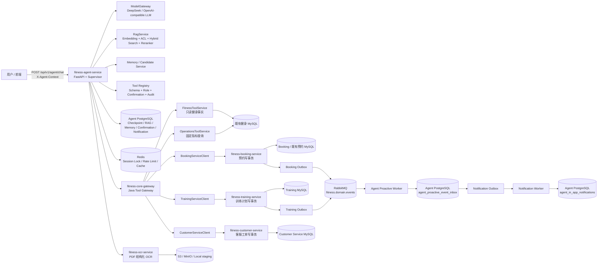
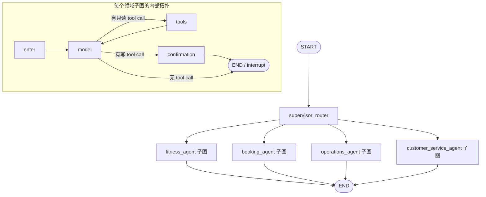
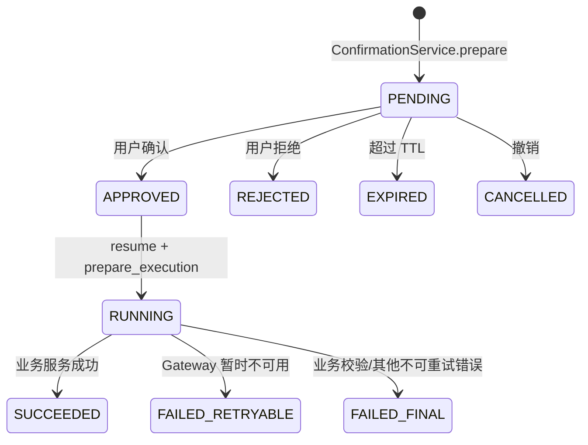

# AI Fitness Platform 当前完整架构、源码映射、Agent 调用链与数据流

> 版本：2026-08-31
>
> 分析口径：以当前工作区真实源码为准，而不是只依据 README 或设计文档。本文把“代码已经实现的边界”“模型可能选择的路径”和“后续可扩展方向”分开描述。

## 0. 先给结论：这个项目现在到底是什么

当前仓库不是一个“把 LLM 接到旧 Java Controller 上”的单体应用，而是一个由 Python Agent 编排层、Java Tool Gateway、多个 Java 业务服务、Agent 专属 PostgreSQL、Redis、RabbitMQ 和知识/OCR 基础设施组成的分层平台。

最重要的边界是：

1. `fitness-agent-service` 负责理解用户意图、调用模型、路由领域 Agent、选择工具、做确认中断、保存 Agent 状态、RAG、Memory 和通知编排。
2. `fitness-core-gateway` 是 Agent 访问健身业务事实的唯一 Java 入口。Agent 不直接查 MySQL，也不直接写预约、训练计划或客服工单。
3. `fitness-booking-service`、`fitness-training-service`、`fitness-customer-service` 分别拥有自己的写事务和业务状态机。
4. 既有健身业务数据仍然在 MySQL；Agent 的 Checkpoint、确认单、Memory、知识索引、通知 Outbox/Inbox 和审计扩展数据在 Agent PostgreSQL。
5. 写操作不是“模型返回了 tool call 就执行”：写工具先生成确认单并 `interrupt()`；用户确认后通过 `Command(resume)` 恢复，重新读取服务端确认记录、签发短期 Confirmation Token，再进入 Java Gateway 和业务服务。
6. Booking/Training 业务写成功后，不同步调用通知服务，而是在同一个 MySQL 事务内写 Outbox；发布器发到 RabbitMQ，Agent 独立 Worker 先落 PostgreSQL Inbox，再生成 Notification Outbox，最后由通知 Worker 写当前已实现的 `IN_APP` 站内通知。

因此，面试时最准确的一句话是：

> 这是一个“Supervisor + LangGraph 领域子图 + 受控 Tool Registry + Java Gateway + 独立业务写服务 + Outbox/Inbox 异步通知”的 AI 健身平台。LLM 负责自然语言和工具意图，权限、参数、业务规则、事务、幂等和最终写入由程序和 Java 服务负责。

---

## 1. 总体架构图

### 1.1 逻辑分层



### 1.2 运行时端口和配置来源

这些默认值来自 `fitness-agent-service/app/core/config.py` 和 `deployment/docker-compose.agent-infra.yml`；生产环境可通过环境变量覆盖。

| 组件 | 默认地址/端口 | 当前职责 | 数据或连接特点 |
|---|---:|---|---|
| Agent API | `0.0.0.0:8090` | 对话、确认、Memory、通知、RAG 和管理 API | FastAPI；`app/main.py` 统一装配依赖 |
| OCR | `:8091` | 扫描 PDF / 混合 PDF 的结构化文本和表格 block | 可由 `HttpPdfOcrProvider` 调用 |
| Agent PostgreSQL | `127.0.0.1:5433` | LangGraph Checkpoint、知识库、Memory、确认、Operations 审计、通知 | `pgvector/pgvector:pg16` |
| Agent Redis | `127.0.0.1:6380` | 会话互斥锁、经营查询限流、缓存/短期协作状态 | Redis 7.4，AOF |
| RabbitMQ | `127.0.0.1:5672` | Booking/Training 领域事件传输 | 本地 compose 用 `messaging` profile 启用 |
| RabbitMQ 管理页 | `127.0.0.1:15672` | 本地观察 Exchange、Queue、死信 | 不是 Agent 业务 API |
| Java Gateway | `http://127.0.0.1:8081` | Agent 的 Java 业务事实/写操作边界 | `AGENT_GATEWAY_BASE_URL` |
| LLM | 配置中的 DeepSeek/OpenAI-compatible URL | 普通对话、Tool Calling、结构化训练草案、Memory 候选 | `ModelGateway` 统一调用 |
| Embedding | 配置的远程或本地模型 | RAG 入库和查询向量 | 切换后必须重建索引 |
| Reranker | 配置的 HTTP 或本地模型 | RAG 候选重排 | 有候选时生产路径必须调用 |
| MinIO/S3 | compose `storage` profile | 知识原文件持久化 | 本地默认是 local storage |
| ClamAV | `:3310` | 可选恶意软件扫描 | 生产配置要求使用 ClamAV |

### 1.3 数据所有权

| 数据 | 权威存储 | 谁能写 | Agent 能做什么 |
|---|---|---|---|
| 用户、机构、教练、课程、合同、既有预约 | 核心健身 MySQL | Java 业务边界 | 通过 Gateway 查询；预约通过 Booking Service 写 |
| 预约创建/改约/取消状态 | Booking Service MySQL | `BookingService` 事务 | 通过确认后的 Java Gateway 请求 |
| 训练计划、训练日、动作、执行记录 | Training Service MySQL | `TrainingPlanService` 事务 | 生成草案、确认后创建/审核/发布/记录 |
| 客服工单 | Customer Service MySQL | `CustomerServiceTicketService` 事务 | 查询；显式请求并确认后创建 |
| Agent 对话状态 | Agent PostgreSQL Checkpoint | LangGraph Checkpointer | 只存非敏感会话状态；敏感确认参数不放进去 |
| 确认单 | Agent PostgreSQL | `ConfirmationService` | AES-GCM 加密保存待执行参数 |
| 长期 Memory | Agent PostgreSQL | `MemoryService` | 只保存低敏、可撤销的偏好/目标等 |
| 知识文档和向量 | Agent PostgreSQL + S3/MinIO | RAG 管理流/Worker | ACL 过滤后召回，动态事实仍必须调业务工具 |
| 跨服务领域事件 | 业务 MySQL Outbox → RabbitMQ | Booking/Training Outbox Publisher | Agent Worker 落 Inbox |
| 通知任务和站内通知 | Agent PostgreSQL | Notification Worker | 当前只实现 `IN_APP` |

---

## 2. 仓库模块与源码对应关系

### 2.1 顶层模块

| 模块 | 源码目录 | 当前定位 | 关键入口 |
|---|---|---|---|
| 历史 Java 工程 | `src/main/java/com/shuyiwa/fitness/backend` | 原始用户/机构/课程/合同/预约参考；包含不完整的历史赛事、作品、活动代码 | 根目录 `pom.xml`；不属于当前新链路的质量门禁 |
| Core Gateway | `fitness-core-gateway/src/main/java/com/shuyiwa/fitness/gateway` | Agent 访问核心健身业务的 Java 安全边界 | `api/AgentToolController.java`、`api/TrainingToolController.java` |
| Booking Service | `fitness-booking-service/src/main/java/com/shuyiwa/fitness/booking` | 预约创建、改约、取消的最终事务边界 | `api/BookingController.java` → `service/BookingService.java` |
| Training Service | `fitness-training-service/src/main/java/com/shuyiwa/fitness/training` | 训练计划草案/审核/发布/执行 | `api/TrainingPlanController.java` → `service/TrainingPlanService.java` |
| Customer Service | `fitness-customer-service/src/main/java/com/shuyiwa/fitness/customer` | 客服工单查询和创建 | `api/CustomerServiceTicketController.java` → `service/CustomerServiceTicketService.java` |
| Agent Service | `fitness-agent-service/app` | Supervisor、领域子图、模型、工具、确认、RAG、Memory、通知 | `main.py`、`agent/supervisor.py` |
| OCR Service | `fitness-ocr-service/app` | PDF 页面结构化、文本/表格 block 输出 | `main.py`、`service.py`、`engine.py` |
| 部署与合同 | `deployment`、`docs/contracts` | 本地基础设施、服务契约和验证脚本 | `docker-compose.agent-infra.yml` |

### 2.2 Agent Service 内部源码地图

| 子模块 | 关键源码 | 作用 |
|---|---|---|
| HTTP/API | `app/api/routes/agent.py` | `/api/v1/agent/chat`，验签、构造 `SupervisorRequest`、输出响应 |
| 生命周期装配 | `app/main.py` | 创建 Database、Checkpoint、Redis、Model、RAG、Gateway、Registry、Confirmation、Supervisor |
| Supervisor | `app/agent/supervisor.py` | 路由、LangGraph 编译、模型节点、工具节点、确认节点、恢复执行 |
| 领域子图 | `app/agent/domain_subgraphs.py` | `FITNESS_COACHING`、`BOOKING`、`OPERATIONS`、`CUSTOMER_SERVICE` 四个子图和工具白名单 |
| Tool Registry | `app/agent/tool_registry.py` | 工具注册、Schema、角色、上下文绑定、写操作确认、审计和 handler 调用 |
| 健身工具 | `app/agent/fitness_tools.py` | 课程/合同/预约/可用性/训练/Memory/客服工具定义和 Gateway handler |
| 经营工具 | `app/agent/operations_tools.py` | 固定指标目录、中文意图解析、组织绑定、限流、审计、最多两次 Gateway 查询 |
| Gateway HTTP Client | `app/infrastructure/gateway_client.py` | 将 Python 工具调用映射为 Java Gateway HTTP 请求，重试和响应模型校验 |
| AgentContext | `app/infrastructure/agent_context.py` | 校验签名身份、subject、机构、角色、过期时间、nonce；生成匿名化 thread id |
| Model Gateway | `app/infrastructure/model_gateway.py` | LLM、Tool Calling、JSON、Embedding、供应商错误和用量统一边界 |
| Confirmation | `app/confirmation/*` | 确认状态机、AES-GCM 参数加密、Confirmation Token、恢复执行 |
| RAG | `app/rag/*` | 文档解析、质量门禁、Embedding、权限过滤、关键词+向量融合、Reranker、引用 |
| Memory | `app/memory/*` | 低敏长期偏好、候选提取、加密候选、用户批准/拒绝、过期/保留清理 |
| Notification | `app/notifications/*` | 通知 Outbox、偏好、静默时间、模板版本、渠道适配器、站内收件箱 |
| Proactive | `app/proactive/*` | RabbitMQ 领域事件消费、Agent Inbox 去重、事件转通知 Outbox |
| Session Summary | `app/session_summary.py` 等 | 长会话摘要；与长期 Memory 分离 |
| 评测/追踪 | `app/evaluation/*`、`app/core/telemetry.py` | OTel/TruLens 语义 span、评测和运维指标 |

---

## 3. Agent 的真实执行模型

### 3.1 请求进入 Agent 的第一段

真实入口是：

```text
前端
  → POST /api/v1/agent/chat
  → app/api/routes/agent.py:chat()
  → X-Agent-Context 验签
  → 构造 SupervisorRequest
  → Supervisor.invoke()
```

`AgentChatRequest` 只接收 `conversation_id`、`message`、`locale` 等有限字段；路由不会接受客户端自带的任意 `user_id`、`organization_id` 或工具参数作为权威权限依据。

`AgentContextVerifier.verify()` 校验：

- `sub`：当前登录主体；
- `orgs`：签名机构范围；
- `roles`：签名角色；
- `iat` / `exp` / `nonce`：签发、过期和重放相关声明；
- HS256/RS256 签名，以及本地密钥环或 JWKS 公钥。

随后 `conversation_thread_id()` 将 subject、机构、角色和 conversation id 做 SHA-256，得到形如 `fitness:<hash>` 的 LangGraph thread id，避免把原始用户 ID 直接放进 Checkpoint key。

### 3.1.1 调用点和实现点要分开看

阅读这段源码时容易产生一个误解：看到文档写了 `AgentContextVerifier.verify()`，就去 `app/api/routes/agent.py` 里寻找 `class AgentContextVerifier` 或完整的 `verify()` 实现。实际上这里采用的是“路由调用基础设施组件”的分层结构：

```text
app/api/routes/agent.py
  ├─ 接收 HTTP Header: X-Agent-Context
  ├─ 检查 Header 是否存在
  ├─ 调用 request.app.state.context_verifier.verify(...)
  ├─ 调用 conversation_thread_id(...)
  ├─ 构造 SupervisorRequest
  └─ 调用 Supervisor.invoke()

app/main.py
  └─ 在 lifespan() 启动阶段创建 AgentContextVerifier
       app.state.context_verifier = AgentContextVerifier(...)

app/infrastructure/agent_context.py
  ├─ 定义 AgentIdentity
  ├─ 定义 AgentContextVerifier
  ├─ 实现 verify()
  └─ 实现 conversation_thread_id()
```

对应真实源码调用点：

| 位置 | 代码职责 |
|---|---|
| `fitness-agent-service/app/api/routes/agent.py:62` | `chat()` HTTP 路由函数开始 |
| `fitness-agent-service/app/api/routes/agent.py:65` | 接收 `x_agent_context`，对应请求头 `X-Agent-Context` |
| `fitness-agent-service/app/api/routes/agent.py:72-76` | Header 缺失时直接返回 `401 Unauthorized` |
| `fitness-agent-service/app/api/routes/agent.py:78-84` | 调用 `request.app.state.context_verifier.verify(x_agent_context)`，验签失败转成 401 |
| `fitness-agent-service/app/api/routes/agent.py:90-103` | 用验签后的 `identity` 构造 `SupervisorRequest` 并调用 `Supervisor.invoke()` |
| `fitness-agent-service/app/main.py:96` 附近 | 启动时将 `AgentContextVerifier` 放入 `app.state`，供路由取用 |
| `fitness-agent-service/app/infrastructure/agent_context.py:43` | `AgentContextVerifier` 类定义 |
| `fitness-agent-service/app/infrastructure/agent_context.py:73` | `verify()` 方法具体实现 |
| `fitness-agent-service/app/infrastructure/agent_context.py:159` | `conversation_thread_id()` 具体实现 |

因此，最准确的源码调用链是：

```text
HTTP 请求
  → app/api/routes/agent.py:chat()
  → request.app.state.context_verifier
  → AgentContextVerifier.verify()
      实现位于 app/infrastructure/agent_context.py
  → AgentIdentity
  → conversation_thread_id()
      实现也位于 app/infrastructure/agent_context.py
  → SupervisorRequest
  → Supervisor.invoke()
```

`verify()` 内部不是简单的 Base64 解码，而是：

```text
token.split(".")
  → Base64URL 解码 payload 和 signature
  → 读取 alg / kid
  → HS256：本地 secret 或 signing_key_ring + HMAC 比较
  → RS256：verification_public_key_ring 或 JWKS 获取公钥并验签
  → 读取 sub / orgs / roles / capabilities / qualifications
  → 读取 iat / exp / nonce
  → 检查 exp > iat、TTL 不超过 max_ttl、没有过期、iat 没有超前太多
  → 返回 AgentIdentity
```

例如，`agent.py` 不会自己写下面这些逻辑：

```python
expected = hmac.new(secret, payload, hashlib.sha256).digest()
if not hmac.compare_digest(expected, signature):
    ...
```

这段签名比较在 `app/infrastructure/agent_context.py:93-105` 的 `verify()` 中完成。`agent.py` 只负责捕获 `AgentContextVerificationError`，并把它转换成对外稳定的 HTTP 401，而不把密钥、签名细节或内部异常返回给用户。

### 3.1.2 一次请求中的两次身份校验

还要区分 Agent API 入口验签和 Java Gateway 验签。它们不是重复写错了，而是两个不同的安全边界：

```text
第一次：Agent API
  → agent.py:chat()
  → AgentContextVerifier.verify()
  → 得到 AgentIdentity
  → 用于 thread 隔离、路由上下文和 SupervisorRequest

第二次：Java Gateway
  → Agent 发起 GatewayClient HTTP 请求
  → X-Agent-Context 随请求继续传递
  → AgentContextInterceptor.preHandle()
  → AgentContextVerifier 再次验证
  → AgentContextArgumentResolver 注入 AgentContext
  → FitnessToolService / OperationsToolService 做最终业务授权
```

例如查询合同时：

```text
agent.py:chat()
  → AgentContextVerifier.verify()
  → Supervisor.invoke()
  → ToolRegistry.invoke(fitness.contract.list.v1)
  → GatewayClient.list_contracts()
  → HTTP GET /internal/agent-tools/v1/contracts
  → Java AgentContextInterceptor
  → Java AgentContextVerifier
  → FitnessToolService.listContracts()
  → 机构范围、角色、主体关系校验
  → JdbcFitnessReadRepository
  → MySQL
```

第一次校验主要保证 Agent 自己不会用无效身份创建会话或继续编排；第二次校验保证即使 Agent 内部代码、网络重试或调用链被错误使用，Java 业务边界仍然不会接受无效或越权的上下文。最终业务权限不能只依赖 Python 路由层，也不能只依赖模型 Prompt。

### 3.2 Supervisor 顶层图

`Supervisor._build_graph()` 编译一个父图：



领域子图实际由 `build_domain_subgraph()` 创建：`enter → model`；`model` 根据 `_after_model()` 的结果进入 `tools`、`confirmation` 或 `END`；只读工具执行完后回到 `model`，写工具进入确认节点。

重要理解：这些“领域 Agent”不是四个独立部署的服务，也不是四个不同模型进程，而是同一个 `fitness-agent-service` 内的四个 LangGraph 子图。它们共享一个父图 Checkpoint，但有不同的工具白名单。

### 3.3 路由规则

`classify_route()` 是确定性的中文关键词路由，不是让模型先自由决定领域：

| 路由 | 典型触发 | 子图 node | RAG/Memory |
|---|---|---|---|
| `FITNESS_COACHING` | 默认健身指导、动作、训练建议、计划 | `fitness_agent` | RAG + Memory candidates |
| `BOOKING` | 预约、改约、取消、可约时间、空闲时段 | `booking_agent` | 不启用 RAG |
| `OPERATIONS` | 营收、预约量、完课量、新客量、剩余课时、报表 | `operations_agent` | 不启用 RAG |
| `CUSTOMER_SERVICE` | 我的预约、合同、课时、规则、客服、工单、训练计划状态 | `customer_service_agent` | RAG |
| `UNSUPPORTED_LEGACY` | 赛事、比赛、作品、活动运营、活动报名 | 不进入新领域子图 | 返回不支持，不调用旧模块 |

这意味着“预约问题一定先进入 Booking Agent”，但“Booking Agent 一定先调用 `contract.list` 再调用 `availability.check`”并不是代码写死的。后者由模型依据当前消息、工具描述和已经返回的工具结果决定；Supervisor 只负责工具白名单、预算、权限、确认和执行安全。

### 3.4 工具名和模型名不是一回事

代码中的内部工具 id 使用版本化点号格式，例如：

```text
fitness.contract.list.v1
fitness.booking.availability.check.v1
fitness.booking.create.v1
```

给模型的函数名会把点替换成下划线，例如 `fitness_booking_create_v1`。`ToolRegistry` 在收到模型工具名后会映射回内部 id，再做精确注册检查、角色交集、Schema 校验、上下文绑定、确认凭证校验和 handler 调用。

### 3.5 Supervisor State 与 Runtime Context 分离

`SupervisorState` 中保存的是可持久化的非敏感状态：

```text
graph_version
active_domain
messages
route
tool_steps
final_answer
input_tokens / output_tokens
model_tool_calls
pending_confirmation_id
```

`SupervisorRuntimeContext` 单独保存本次请求的敏感运行时信息：

```text
GatewayRequestContext(signed_context, request_id, trace_id, confirmation_token)
AgentIdentity
thread_id
user_message
```

所以 Checkpoint 不应该出现签名 AgentContext 原文、原始用户身份令牌、确认单明文参数或最终 Confirmation Token。恢复确认时，系统会用新请求重新注入签名上下文，而不是从旧 Checkpoint 里信任旧 token。

---

## 4. Tool Registry 与确认机制

### 4.1 ToolDefinition 是工具的“合同”

每个注册工具包含：

```text
tool_id
description
input_model
handler
allowed_roles
read_only
requires_confirmation
confirmation_policy
```

启动时 `build_fitness_tool_registry()` 注册固定工具。注册器拒绝：重复工具 id、未版本化 id、写工具不要求确认、没有确认策略的写工具，以及不符合 Schema/角色声明的定义。

### 4.2 当前主要工具清单

| 能力组 | 工具 id |
|---|---|
| 当前用户/组织/课程 | `fitness.user.get_current.v1`、`fitness.organization.get.v1`、`fitness.course.list.v1` |
| 合同/预约读取 | `fitness.contract.list.v1`、`fitness.appointment.list.v1`、`fitness.booking.availability.check.v1` |
| 预约写入 | `fitness.booking.create.v1`、`fitness.booking.reschedule.v1`、`fitness.booking.cancel.v1` |
| 训练读取/生成 | `fitness.training.plan.get.v1`、`fitness.training.plan.generate_draft.v1`、`fitness.training.day.executions.list.v1` |
| 训练写入 | `fitness.training.plan.create_draft.v1`、`submit_review.v1`、`review.v1`、`publish.v1`、`record_execution.v1` |
| Memory | `fitness.memory.list.v1`、`fitness.memory.save.v1`、`fitness.memory.revoke.v1` |
| 客服 | `fitness.support.ticket.list.v1`、`get.v1`、`create.v1` |
| 经营 | `fitness.operations.metric.query.v1` |

### 4.3 写操作的实际状态机



具体实现关系：

```text
模型产生写 tool call
  → Supervisor._model_node()
  → 检查当前 route 的工具白名单
  → _prepare_write_confirmation()
  → ToolRegistry.bind_context_input()
  → ConfirmationService.prepare()
  → confirmation payload 规范化 + payload_hash
  → AES-GCM 加密写入 Agent PostgreSQL
  → interrupt({confirmation_id, summary, expires_at})
```

用户确认后：

```text
POST /api/v1/agent/confirmations/{id}/decisions
  → AgentContextVerifier.verify()
  → ConfirmationService.decide()
  → Supervisor.resume_confirmation()
  → Command(resume={confirmation_id})
  → confirmation node 重新从 PostgreSQL 读取确认单
  → prepare_execution()
  → 解密参数（只在内存短暂出现）
  → ConfirmationTokenIssuer.issue()
  → ToolRegistry.invoke(..., confirmation_token)
  → Gateway / 业务服务验证 token
```

Confirmation Token 包含但不限于：`sub`、`tool_id`、`action`、`resource`、`request_id`、`organization_id`、`payload_hash`、`confirmation_id`、`jti`、`exp`。Token 不返回给浏览器，也不由模型提供；Gateway 和业务服务都能用自己的验证器检查它。

---

## 5. 真实调用链一：用户预约明天下午王教练私教

下面分成两个阶段：先是“查询和确认”，后是“用户确认后的真实写入”。这也是最适合面试时讲解的主链路。

### 5.1 先说明一个真实代码细节

用户说“帮我约明天下午王教练的私教”，通常还缺少具体时间、课程 id、合同 id、时长等字段。真实系统不会凭空创建预约，而可能出现三种情况：

1. 模型先调用当前用户/合同/课程/预约读取工具，再判断可预约时间。
2. 需要用户补充“明天下午 3 点到 4 点”等信息，直接回复澄清问题。
3. 如果上下文里已经有明确的课程、合同、教练和时间，进入创建预约确认卡。

所以用户给出的调用链适合作为“资料已可解析、最终成功”的典型链路，但 `contract.list → availability.check → create` 的顺序不是硬编码死循环，而是模型在 Supervisor 约束下的工具选择结果。

### 5.2 预约成功的完整链路

```text
用户：帮我约明天下午 15:00-16:00 王教练的私教
  → 前端 POST /api/v1/agent/chat
  → agent.py:chat()
  → 校验 X-Agent-Context
  → AgentContextVerifier.verify()
  → 构造 SupervisorRequest
  → Supervisor.invoke()
  → Supervisor._invoke()
  → classify_route(message)
  → BOOKING
  → domain_agent_spec(BOOKING)
  → parent graph: supervisor_router
  → booking_agent 子图: enter
  → booking_agent:model
```

如果模型需要查合同，实际子链为：

```text
booking_agent:model
  → ModelGateway.chat_with_tools()
  → 模型选择 fitness_contract_list_v1
  → Supervisor._after_model() = tools
  → Supervisor._tool_node()
  → ToolRegistry.invoke("fitness.contract.list.v1")
  → ToolRegistry.bind_context_input()
      - organization_id 绑定到签名 AgentContext 的机构
      - 学员主体绑定到 AgentIdentity.subject
      - 禁止模型自选其他机构或用户
  → fitness_tools.list_contracts()
  → GatewayClient.list_contracts()
  → HTTP GET /internal/agent-tools/v1/contracts
  → Java AgentContextInterceptor
      - 校验 X-Internal-Service-Token
      - 校验 X-Agent-Context
      - 写入 request id / AgentContext
  → AgentToolController.contracts()
  → FitnessToolService.listContracts()
  → JdbcFitnessReadRepository
  → 固定 SQL 查询合同、剩余课时、有效期、课程关系
  → 核心 MySQL
  → Java ToolView
  → GatewayClient Pydantic response
  → ToolRegistry 记录成功审计
  → 工具结果追加为 tool message
  → 回到 booking_agent:model
```

如果模型需要查课程或确认王教练对应的 coach id，还可能先调用：

```text
fitness_course_list_v1
  → GET /internal/agent-tools/v1/courses
  → FitnessToolService.listCourses()
  → JdbcFitnessReadRepository
```

也可能读取用户已有预约：

```text
fitness_appointment_list_v1
  → GET /internal/agent-tools/v1/appointments
  → FitnessToolService.listAppointments()
  → JdbcFitnessReadRepository
```

确定 `studentId / contractId / coachId / courseId / startTime / endTime` 后，模型调用可用性工具：

```text
booking_agent:model
  → ModelGateway.chat_with_tools()
  → fitness_booking_availability_check_v1
  → Supervisor._tool_node()
  → ToolRegistry.invoke("fitness.booking.availability.check.v1")
  → BookingAvailabilityToolInput
      - 无时区时间按 Asia/Shanghai 解释
      - 统一归一化为 UTC
      - 起止时间合法
  → GatewayClient.check_booking_availability()
  → GET /internal/agent-tools/v1/booking/availability
  → AgentContextInterceptor
  → AgentToolController.bookingAvailability()
  → FitnessToolService.bookingAvailability()
  → JdbcFitnessReadRepository
      - 教练是否属于机构
      - 学员是否属于机构
      - 预约时间是否已过去
      - 教练已有预约冲突
      - 非营业日
      - 教练休假
  → 核心 MySQL
  → BookingAvailabilityView(available, reasons, conflicts)
  → Agent 返回模型
```

可用性检查只读，不锁、不创建、不扣课时。它的意义是给用户展示预检结果，最终并发安全仍由 Booking Service 的写事务再次检查。

### 5.3 从“创建工具调用”到 interrupt

当模型已经获得足够信息并选择创建预约：

```text
booking_agent:model
  → ModelGateway.chat_with_tools(tools=[当前 Booking 白名单])
  → 模型返回 fitness_booking_create_v1(arguments)
  → Supervisor._model_node()
  → 校验模型工具名映射到 fitness.booking.create.v1
  → 校验该工具属于 BOOKING 白名单
  → 校验当前用户角色允许创建
  → _prepare_write_confirmation()
  → ToolRegistry.normalize_confirmation()
  → BookingCreateToolInput.model_validate()
      - camelCase alias 与 snake_case 兼容
      - 时间归一化为 UTC
      - 时长不得超过 8 小时
  → ConfirmationService.prepare()
  → 规范化 payload
      {organizationId, studentId, contractId, coachId, courseId, startTime, endTime, mark}
  → 计算 payload_hash
  → 使用 AES-GCM 加密 payload
  → ConfirmationRepository.create()
  → Agent PostgreSQL confirmation 表
  → Supervisor._confirmation_node()
  → interrupt({type: CONFIRMATION_REQUIRED, confirmation_id, summary, expires_at})
  → LangGraph Checkpoint 保存“等待确认”状态
  → API 返回 status=CONFIRMATION_REQUIRED
```

确认卡展示的内容来自受控摘要，不是模型自由生成的“已完成”文案，例如：

```text
即将创建预约：
机构：上海 XX 健身中心
学员：当前登录用户
教练：王教练
课程：私教课
时间：2026-09-01 15:00–16:00（Asia/Shanghai）
合同：合同 C-10086
预计扣减：1 课时
操作：创建预约

请确认后执行。
```

此时预约还没有写入 MySQL；可用性检查成功也不等于预约已经占位。

### 5.4 用户确认后的恢复和写入

```text
用户点击确认
  → POST /api/v1/agent/confirmations/{confirmation_id}/decisions
      body: {decision: "APPROVE", decision_request_id: "decision-20260901-0001"}
  → confirmations.py:decide_confirmation()
  → AgentContextVerifier.verify()
  → ConfirmationService.decide()
  → ConfirmationRepository 将 PENDING → APPROVED
  → Supervisor.resume_confirmation()
  → Supervisor._resume_confirmation()
  → config.thread_id = 原确认记录 thread_id
  → Command(resume={"confirmation_id": id})
  → LangGraph 恢复 confirmation node
  → ConfirmationService.get_for_subject()
  → 重新校验当前 subject / organization / tool / route
  → ConfirmationService.prepare_execution()
      - 校验 APPROVED
      - 生成一次性 jti
      - 解密 AES-GCM payload
      - 签发短期 Confirmation Token
      - 将执行状态标为 RUNNING
  → ToolRegistry.invoke("fitness.booking.create.v1", context.confirmation_token)
  → fitness_tools.create_booking()
  → GatewayClient.create_booking()
  → HTTP POST /internal/agent-tools/v1/appointments
```

### 5.5 Gateway 到 Booking Service 的真实写链

```text
Java Gateway AgentToolController.createAppointment()
  → AgentContextInterceptor 已经验证内部 token + AgentContext
  → BookingServiceClient.create()
  → Gateway ConfirmationTokenVerifier.verify()
      - 签名/算法/kid
      - sub
      - tool_id = fitness.booking.create.v1
      - action
      - resource = contractId
      - organization_id
      - request_id
      - payload_hash
      - exp
  → Gateway 只把服务间 token、actor 身份、确认声明传给 Booking Service
  → POST /internal/booking/v1/appointments
  → BookingController.create()
  → BookingSecurityInterceptor
      - 验证 Booking Service 的内部服务 token
      - 解析 BookingActor
      - 校验确认声明完整性
  → BookingService.create()
  → @Transactional
```

`BookingService.create()` 的事务内检查顺序包括：

```text
请求字段校验
  → 机构范围
  → Confirmation claim 与 tool/action/resource/payload_hash 匹配
  → 学员主体访问权
  → 教练是否属于机构
  → 获取请求级/教练日期级锁
  → request_id 幂等检查
  → SELECT contract ... FOR UPDATE
  → 合同有效期和剩余课时
  → 课程存在且属于合同/机构且有效
  → 非营业日校验
  → 教练休假校验
  → 教练时间冲突校验
  → 插入 appointment
  → contract.remaining_class_hours - 1
  → 消费 confirmation jti
  → 写 agent_booking_operation
  → 写 booking audit
  → 写 APPOINTMENT_CREATED Outbox
  → 事务提交
```

对应的代码边界是：

- Controller：`fitness-booking-service/.../api/BookingController.java`
- 服务和事务：`fitness-booking-service/.../service/BookingService.java`
- SQL、锁、幂等、审计、Outbox：`fitness-booking-service/.../repository/BookingRepository.java`
- 表结构：`fitness-booking-service/src/main/resources/db/migration/V20260815_001__create_booking_agent_tables.sql` 和 `V20260815_002__create_booking_operation_tables.sql`

成功响应沿原路返回：

```text
BookingRepository → BookingService → BookingController
  → Gateway BookingServiceClient
  → Agent GatewayClient
  → ToolRegistry
  → ConfirmationService.finish_execution(SUCCEEDED)
  → Supervisor 清除 pending_confirmation_id
  → final_answer = 已完成预约
  → confirmations API 返回最新确认状态
```

### 5.6 预约事件到站内通知

预约写事务提交后，异步链路是：

```text
BookingRepository.insertOutbox(APPOINTMENT_CREATED)
  → BookingOutboxPublisher 定时 claim PENDING
  → RabbitBookingMessagePublisher.publish()
  → RabbitMQ direct exchange: fitness.domain.events
  → routing key: appointment.created
  → Agent ProactiveRabbitConsumer
  → ProactiveEventMessage.from_json()
  → 校验 event_id/source/event_type/aggregate_id/organization_id/payload
  → PostgreSQL agent_proactive_event_inbox
      ON CONFLICT(event_id) DO NOTHING
  → 事务提交后 RabbitMQ message.ack()
  → ProactiveEventWorker.claim_batch()
  → notification_targets()
      - 学员一条
      - 教练一条
  → NotificationOutboxRepository.enqueue_on_connection()
      dedupe_key = proactive:{event_id}:{user_id}
  → 同一事务 mark_processed()
  → NotificationOutboxWorker.claim_batch()
  → NotificationPreferenceRepository.evaluate()
      - enabled
      - quiet hours
      - minimum interval
  → NotificationTemplateRepository.get_published()
  → render_notification_template()
  → InAppNotificationChannelAdapter.deliver()
  → write_in_app_notification()
  → PostgreSQL agent_in_app_notifications
  → 前端 GET /api/v1/agent/notifications
```

当前通知不是直接“发短信/Push”，而是写站内通知收件箱。`NotificationChannelAdapter` 已经抽象出渠道边界，但当前默认只注册 `IN_APP`。

---

## 6. 真实调用链二：改约和取消预约

### 6.1 改约

```text
用户：把我明天 15:00 的王教练课程改到周三 16:00
  → POST /api/v1/agent/chat
  → classify_route() = BOOKING
  → booking_agent:model
  → appointment.list / availability.check（按模型需要）
  → fitness.booking.reschedule.v1
  → ToolRegistry 校验 BookingRescheduleToolInput
  → expectedStartTime、startTime、endTime 统一转 UTC
  → ConfirmationService.prepare()
  → interrupt()
  → 用户 APPROVE
  → Command(resume)
  → 重新读取确认记录并签发 Confirmation Token
  → GatewayClient.reschedule_booking()
  → Gateway AgentToolController.rescheduleAppointment()
  → ConfirmationTokenVerifier
  → BookingServiceClient.reschedule()
  → BookingController /{id}/reschedule
  → BookingService.reschedule() @Transactional
```

改约会重新锁定预约，检查当前状态和 `expected_start_time`。如果确认卡展示后原预约已经被别人修改，旧的 expected time 不匹配，服务拒绝改约，避免把用户确认的旧状态误改到新状态。

写成功后：

```text
更新 appointment
  → 消费 confirmation jti
  → operation 幂等记录
  → audit
  → APPOINTMENT_RESCHEDULED Outbox
  → RabbitMQ routing key appointment.rescheduled
  → Agent Inbox
  → 学员 + 教练通知 Outbox
  → IN_APP 通知
```

### 6.2 取消

```text
用户：取消我明天下午的预约
  → classify_route() = BOOKING
  → appointment.list 识别目标预约
  → fitness.booking.cancel.v1
  → ConfirmationService.prepare()
  → interrupt()
  → 用户确认
  → resume
  → Gateway ConfirmationTokenVerifier
  → BookingService.cancel()
  → 锁预约
  → 再读预约并确认尚未开始
  → 锁合同 FOR UPDATE
  → soft delete / 更新取消状态
  → contract.remaining_class_hours + 1
  → 消费 jti、幂等、audit、Outbox
  → RabbitMQ appointment.cancelled
  → Agent Inbox → Notification Outbox → IN_APP
```

取消只允许未开始预约；成功后退回一个课时。这个业务事实由 Booking Service 决定，Agent 不能在 Prompt 里自行承诺“已经退课时”。

---

## 7. 真实调用链三：生成训练计划草案并创建

训练计划链比预约链多一个“RAG + Memory + 结构化生成”阶段。

### 7.1 只生成草案，不写 MySQL

```text
用户：我每周练 4 天，想增肌，只有哑铃，帮我制定训练计划
  → POST /api/v1/agent/chat
  → classify_route() 默认 FITNESS_COACHING
  → Supervisor._invoke()
  → Fitness route 启用 RAG
  → RagService.search(user_message, RetrievalScope(subject, orgs, roles))
  → MemoryCandidateService.propose()
      - 只有“记住/我习惯/以后”等候选表达才触发提取
      - 非候选记忆不落库
  → fitness_agent:model
  → fitness.training.plan.generate_draft.v1
  → TrainingPlanGenerationService.generate()
```

`TrainingPlanGenerationService.generate()` 的真实内部顺序：

```text
构造检索 query
  → RAG 权限范围 = 当前 subject + 签名机构 + 角色
  → Embedding query
  → PostgreSQL 向量候选 search_candidates()
  → PostgreSQL 关键词候选 search_keyword_candidates()
  → RRF 融合向量/关键词结果
  → Reranker.rerank()
  → 选择 top_k 证据并保留 citation
  → MemoryService.list_active()
  → ModelGateway.chat_json()
      response_format = json_object
  → GeneratedTrainingPlanContent 校验
  → 结构化失败时最多一次修复重试
  → 组装 create draft payload
  → CreateTrainingDraftToolInput.model_validate()
  → 语义规则校验：天数连续、动作数量/字段范围等
  → 返回 DRAFT_PREVIEW
```

结果包含：

```json
{
  "status": "DRAFT_PREVIEW",
  "requires_confirmation": true,
  "requires_coach_review": true,
  "payload": "经过 Pydantic 校验的结构化计划",
  "citations": "知识证据引用",
  "safety_note": "不是诊断或治疗建议"
}
```

这里的 `generate_draft` 定义为 `read_only=True`，因为它只生成预览，不写 Training MySQL。它不能被描述为“训练计划已经创建”。

### 7.2 结构化草案进入创建确认

在 `Supervisor._tool_node()` 中，如果工具结果是 `fitness.training.plan.generate_draft.v1`，代码会提取经过验证的 draft payload，并立即准备：

```text
fitness.training.plan.generate_draft.v1 返回 payload
  → Supervisor 提取 validated draft payload
  → _prepare_write_confirmation("fitness.training.plan.create_draft.v1", payload)
  → ConfirmationService.prepare()
  → interrupt()
  → 用户确认
```

它不会让模型再自由生成第二次写入参数；这可以避免模型在“生成预览”和“创建草案”之间修改计划内容。

### 7.3 创建训练草案的真实写链

```text
用户 APPROVE
  → /api/v1/agent/confirmations/{id}/decisions
  → resume / Command(resume)
  → 解密确认 payload
  → ConfirmationTokenIssuer
  → ToolRegistry.invoke(fitness.training.plan.create_draft.v1)
  → GatewayClient.create_training_draft()
  → POST /internal/agent-tools/v1/training/plans/drafts
  → TrainingToolController.createDraft()
  → Gateway ConfirmationTokenVerifier
  → TrainingServiceClient.createDraft()
  → POST /internal/training/v1/plans/drafts
  → TrainingSecurityInterceptor
  → TrainingPlanController.createDraft()
  → TrainingPlanService.createAgentDraft()
  → requireStudentScope / member / coach assignment
  → structured plan validation
  → requireConfirmation()
  → TrainingPlanRepository.insertDraft()
  → @Transactional MySQL
```

Training Repository 在同一个事务内：

```text
create_request_id 幂等检查
  → insert training_plan
  → insert training_plan_day
  → insert training_plan_item
  → 消费 confirmation jti
  → audit
  → 后续状态事件需要时写 agent_training_outbox
```

训练计划后续状态转换：

```text
submit_review
  → TrainingPlanService.submitReview()
  → DRAFT → PENDING_REVIEW
  → confirmation + optimistic version
  → TRAINING_PLAN_REVIEW_REQUIRED Outbox

review
  → TrainingPlanService.review()
  → PENDING_REVIEW → APPROVED 或 REJECTED
  → confirmation + audit

publish
  → TrainingPlanService.publish()
  → APPROVED → PUBLISHED
  → confirmation + audit
  → TRAINING_PLAN_PUBLISHED Outbox

record execution
  → 只能是对应计划学员
  → 只能执行已发布计划的训练日
  → confirmation + request id 幂等
  → day execution + audit
```

### 7.4 训练事件通知

```text
TrainingPlanRepository 状态变更 + agent_training_outbox
  → TrainingOutboxPublisher.claimPending()
  → RabbitTrainingMessagePublisher
  → Exchange fitness.domain.events
  → training.plan.review_required / training.plan.published
  → ProactiveRabbitConsumer
  → ProactiveEventRepository.accept()
  → agent_proactive_event_inbox
  → ProactiveEventWorker.notification_targets()
      - REVIEW_REQUIRED → coach
      - PUBLISHED → student
  → agent_notification_outbox
  → NotificationOutboxWorker
  → published template + preferences
  → IN_APP inbox
```

---

## 8. 真实调用链四：客服咨询与创建工单

### 8.1 普通客服查询

用户问“我的预约规则是什么”或“我还有多少课时”：

```text
用户消息
  → /api/v1/agent/chat
  → classify_route() = CUSTOMER_SERVICE
  → customer_service_agent 子图
  → 如果是规则类问题：RagService.search()
      - 只召回当前主体/机构/角色可见知识
      - prompt 明确动态合同、预约、课时必须走业务工具
  → 如果是动态事实：fitness.contract.list.v1 / appointment.list.v1
  → Gateway → FitnessToolService → 固定 SQL → MySQL
  → 模型把静态规则证据和动态业务结果合并回答
```

### 8.2 明确要求创建客服工单

```text
用户：帮我提交一个“预约问题”的客服工单，说明王教练临时改了我的时间
  → classify_route() = CUSTOMER_SERVICE
  → customer_service_agent:model
  → fitness.support.ticket.create.v1
  → CustomerServiceTicketCreateToolInput
      - category
      - subject
      - description
      - relatedResource
  → Tool Registry / confirmation policy
  → ConfirmationService.prepare()
  → interrupt()
  → 用户确认
  → resume
  → GatewayClient.create_customer_service_ticket()
  → POST /internal/agent-tools/v1/customer-service/tickets
  → CustomerServiceClient
  → POST /internal/customer-service/v1/tickets
  → CustomerServiceSecurityInterceptor
  → CustomerServiceTicketController.create()
  → CustomerServiceTicketService.create()
      - 非管理员 subject 强制为当前 actor
      - 分类、标题、描述长度校验
      - confirmation declaration 校验
  → CustomerServiceTicketRepository.insert()
  → @Transactional MySQL
      - create_request_id 幂等
      - ticket status = OPEN
      - 消费 confirmation JTI
      - audit
  → 返回工单编号
```

客服工单不是 Booking/Training 领域事件的当前通知来源；现有主动事件契约的 source 只允许 `booking` 和 `training`。

---

## 9. 真实调用链五：经营分析

经营分析是一个非常适合面试讲“Agent 不等于 Text-to-SQL”的例子。

### 9.1 用户问本月预约量

```text
用户：帮我看一下本月预约量，按天趋势
  → /api/v1/agent/chat
  → classify_route() = OPERATIONS
  → operations_agent 子图
  → Supervisor 注入 operations_prompt_hint()
  → 模型表达要调用 fitness_operations_metric_query_v1
  → Supervisor._tool_node()
  → build_authorized_operations_tool_input(original_user_message, signed_orgs)
```

关键点是，Operations 不信任模型自己填 `organization_id`、日期、指标和时间桶。`build_authorized_operations_tool_input()` 根据原始用户问题再次解析：

```text
“预约量” → APPOINTMENT_COUNT
“本月” → from/to
“按天趋势” → bucket=DAY
签名 AgentContext → 唯一 organization_id
```

然后：

```text
OperationsMetricToolInput.model_validate()
  → 指标目录能力校验
  → 当前用户原文与模型参数逐项比对
  → Redis 按机构限流
  → 最多 2 次 Gateway 调用
  → GatewayClient.query_operations_metric()
  → GET /internal/agent-tools/v1/operations/metrics
  → AgentContextInterceptor
  → OperationsToolService.query()
      - 只允许 SYSTEM_ADMIN / ORGANIZATION_ADMIN
      - 组织范围校验
      - 指标白名单
      - 时间范围最多 92 天
      - limit 最多 100
  → JdbcOperationsReadRepository
  → 固定 SQL 聚合 MySQL
  → GatewayOperationsMetric
  → Operations tool 程序计算 report
      - 补齐空时间桶为 0
      - 计算总量、Top 维度、占比
      - 只有足够时间桶才判断趋势
  → PostgreSQL operations audit
  → 返回模型
  → 模型只负责把真实聚合结果解释成中文
```

### 9.2 环比/同比

如果用户问“本月预约量和上月比”：

```text
第一次 Gateway 查询：当前周期
  → 计算上一等长周期
第二次 Gateway 查询：previous period
  → build_operations_comparison_report()
  → 返回 current / previous / comparison
  → 最多两次 Gateway，第三次直接拒绝
```

如果用户问“营收同比”，代码使用相同月日映射上一自然年；2 月 29 日映射到非闰年的 2 月 28 日，而不是简单减 365 天。

### 9.3 不能做什么

当前实现明确不支持：

- 模型生成任意 SQL；
- 用户指定表名或列名；
- 通过工具参数切换到签名范围外的机构；
- 通过扩大日期范围绕过 92 天限制；
- 把预约明细、合同明细、学员明细直接暴露给经营报表；
- 经营查询失败但没有写审计仍把结果返回。

---

## 10. RAG 数据流：从文档上传到回答引用

### 10.1 入库链

```text
管理员上传 PDF / DOCX / XLSX / Markdown 等来源
  → admin_knowledge API
  → 安全扫描
      - StructuralDocumentScanner
      - 可选 ClamAvScanner
  → DocumentParserRegistry.parse()
  → PDF 页面路由策略
      - 文字页直接解析
      - 图片密集/低文字页需要 OCR 或视觉审核
  → fitness-ocr-service（如果启用 HTTP OCR）
  → 返回带 source_page / table_index / row_start / row_end 的 block
  → 清洗 clean_markdown()
  → chunk_markdown() / chunk_parsed_blocks()
  → 每个 chunk 关联 parent_content
  → 计算 normalized content checksum
  → 检查同 source_uri 的版本和增量复用
  → ModelGateway.embed(batch)
  → KnowledgeRepository.replace_document()
  → PostgreSQL knowledge_document / parent / chunk / embedding
```

入库不是“把文件丢给向量数据库”这么简单：版本、checksum、来源坐标、角色、机构可见范围、父节点上下文和质量门禁都会进入流程。

### 10.2 查询链

```text
Fitness / Customer Service 请求
  → Supervisor._invoke()
  → RagService.search(query, RetrievalScope)
  → ModelGateway.embed([query])
  → KnowledgeRepository.search_candidates(vector, scope)
      - 先做服务端 ACL/机构/角色过滤
  → KnowledgeRepository.search_keyword_candidates(query, scope)
  → _fuse_candidates()
      - weighted RRF
  → RerankerClient.rerank(query, candidate contents)
  → _select_ranked_chunks()
  → RagSearchResult.citations()
  → as_prompt_context()
  → 加入 Supervisor system/user prompt
  → 模型回答并可附引用
```

RAG 的证据只能支持静态知识，例如课程规则、使用说明、训练方法文档；当前合同、课时、预约状态、可预约时间等动态事实必须通过 Tool Registry 走 Gateway。

---

## 11. Memory 数据流：长期 Memory 与候选 Memory 的区别

### 11.1 对话中发现候选

用户说：

```text
我以后通常只能在晚上训练，请记住这个习惯。
```

真实链路：

```text
Supervisor Fitness route
  → MemoryCandidateService.propose()
  → 检测“请记住/以后/通常”等触发词
  → MemoryCandidateExtractionService
  → ModelGateway.chat_json()
  → MemoryCandidateEnvelope 校验
  → 白名单类型/敏感词/重复 key 清洗
  → 单机构时加密保存 PENDING candidate
  → Agent PostgreSQL
  → 主模型收到“这是候选，不是已保存事实”的上下文
```

候选保存后不等于 Memory 生效。用户可在候选接口中批准/拒绝：

```text
POST /api/v1/agent/memory-candidates/{id}/decisions
  → MemoryCandidateService.decide()
  → APPROVE
  → MemoryService.save()
  → ACTIVE Memory
  → 候选状态 APPROVED
  → 事件审计
```

### 11.2 对话式显式保存

如果用户明确说“把晚上训练偏好保存下来”，也可以走：

```text
fitness.memory.save.v1
  → confirmation policy
  → interrupt()
  → 用户确认
  → resume
  → MemoryService.save()
  → Agent PostgreSQL
```

### 11.3 Memory 的安全边界

当前允许的类型是：

- `TRAINING_GOAL`
- `TRAINING_PREFERENCE`
- `EQUIPMENT_AVAILABILITY`
- `SCHEDULE_PREFERENCE`
- `COMMUNICATION_PREFERENCE`

代码明确拒绝诊断、疾病、药物、治疗、疼痛、血压、心率、受伤、手术等内容。Memory 不是医疗档案，也不是动态业务事实；撤销后不再进入计划生成 Prompt，但保留有限生命周期审计。

---

## 12. Outbox / Inbox / Notification 的完整异步数据流

### 12.1 为什么要三层状态

这套代码不是“业务成功后直接发 RabbitMQ，然后顺便通知”，而是把可靠性拆成三层：

```text
业务事务内 Outbox
  解决：业务写成功但消息没生成

RabbitMQ
  解决：服务之间的异步传输和解耦

Agent PostgreSQL Inbox
  解决：消息确认前后的幂等、消费租约、重试和死信

Agent Notification Outbox
  解决：事件已消费但通知投递失败，以及同一事件/用户去重

站内通知表
  解决：用户可查询、可读/未读的最终收件箱事实
```

### 12.2 Booking 事件的生命周期

```text
BookingService 事务：
  appointment insert/update
  + confirmation consumption
  + audit
  + booking outbox insert
  → COMMIT

BookingOutboxPublisher：
  claim pending
  → RabbitTemplate publisher confirm
  → ACK 才标记 PUBLISHED
  → NACK/timeout 进入重试，超过次数 DEAD

Agent ProactiveRabbitConsumer：
  declare exchange/queue/DLX
  → 解析 ProactiveEventMessage
  → 非法契约 reject(requeue=false)
  → 合法事件 Agent PostgreSQL Inbox accept
  → Inbox 事务提交后 ACK

ProactiveEventWorker：
  FOR UPDATE SKIP LOCKED claim
  → 计算学生/教练通知目标
  → Notification Outbox 去重入队
  → Inbox 标记 PROCESSED

NotificationOutboxWorker：
  claim
  → preference DEFER/SUPPRESS/PUBLISH
  → 取已发布模板
  → 渲染 title/body
  → IN_APP adapter
  → agent_in_app_notifications
  → Outbox PUBLISHED
```

### 12.3 去重键

关键幂等键包括：

```text
业务写操作：request_id / create_request_id
确认消费：confirmation jti
Rabbit 事件：event_id
事件到通知：proactive:{event_id}:{subject_user_id}
站内通知：Notification Outbox dedupe_key
```

因此，RabbitMQ 重投、Worker 崩溃、通知 Worker 重启都不会天然产生重复预约、重复确认消费或重复站内通知。

---

## 13. API 路由总览

### 13.1 Agent 用户侧

| 路径 | 源码 | 作用 |
|---|---|---|
| `POST /api/v1/agent/chat` | `app/api/routes/agent.py` | 对话入口 |
| `GET /api/v1/agent/capabilities` | `app/api/routes/capabilities.py` | 前端能力目录 |
| `GET /api/v1/agent/confirmations/{id}` | `app/api/routes/confirmations.py` | 查看确认单安全视图 |
| `POST .../{id}/decisions` | `app/api/routes/confirmations.py` | 确认/拒绝并恢复图 |
| `POST .../{id}/revocations` | `app/api/routes/confirmations.py` | 撤销确认 |
| `GET/PUT /api/v1/agent/memories` | `app/api/routes/memories.py` | Memory 查询/纠正/撤销 |
| `GET/POST /api/v1/agent/memory-candidates` | `app/api/routes/memory_candidates.py` | 候选查询/批准/拒绝 |
| `GET/POST /api/v1/agent/notifications` | `app/api/routes/notifications.py` | 站内通知查询/已读/偏好 |
| `POST /api/v1/agent/knowledge/search` | `app/api/routes/rag.py` | 授权知识搜索 |

### 13.2 管理和运维侧

| 路径前缀 | 源码 | 作用 |
|---|---|---|
| `/api/v1/admin/knowledge` | `admin_knowledge.py` | 文档上传、任务、审批、重试、重建索引 |
| `/api/v1/knowledge-review` | `knowledge_review.py` | 需要人工视觉/质量审核的知识文档 |
| `/api/v1/admin/notifications` | `admin_notifications.py` | 模板草稿、审批、发布、投递查看 |
| `/api/v1/admin/operations` | `admin_operations.py` | 指标目录、查询审计和管理视图 |
| `/health/*` | `health.py` | live/version/ready/config |
| `/metrics` | `app/main.py` | Prometheus 指标 |

---

## 14. 当前代码中最值得注意的“真实边界”和面试表达

### 14.1 可以这样描述 Agent 的职责

```text
自然语言理解
  → 领域路由
  → RAG/Memory 上下文准备
  → 受限 Tool Calling
  → 参数结构化
  → 身份和组织上下文绑定
  → 高风险写操作确认
  → Gateway 调用
  → 结果解释
```

不要描述成“LLM 直接操作数据库”。源码恰恰在阻止这件事：Python Tool handler 调的是 `GatewayClient`，Java Gateway 再访问只读核心库或调用独立业务服务。

### 14.2 可用性预检不是分布式锁

`fitness.booking.availability.check.v1` 只是查询：它不创建预约、不扣课时、不占位。真正的锁和最终冲突检查在 `BookingService.create()` 的事务里。这是面试时解释“为什么预检查后仍要再校验”的关键点。

### 14.3 Checkpoint 不是确认单

Checkpoint 记录 LangGraph 如何恢复；Confirmation Repository 记录待执行的真实参数、状态、哈希、JTI 和审计。二者分离后，恢复时可以重新验签、重新读取确认单，不信任客户端或旧上下文。

### 14.4 RAG 不是业务事实库

知识库可以告诉模型“取消预约规则是什么”，但不能直接决定“用户当前这条预约能不能取消”。当前预约、合同、剩余课时、教练冲突必须来自 Java Gateway/业务 MySQL。

### 14.5 多 Agent 是代码隔离，不是多进程

当前四个领域 Agent 是同一 Python 服务中的 LangGraph 子图：

```text
同一 FastAPI 进程
  → 同一 Supervisor
  → 四个子图
  → 不同工具白名单
  → 共享父 Checkpoint
```

这使得路由和安全边界已经落地，但还没有形成四个可独立扩缩容的微服务。

### 14.6 当前通知能力是站内信

代码有渠道适配器抽象，但实际 `NotificationOutboxWorker` 默认只注入 `InAppNotificationChannelAdapter`。因此项目材料里应说“已实现可靠站内通知链路，短信/Push 是适配器扩展点”，不要说已经接通短信或 Push 供应商。

### 14.7 根目录旧 Java 工程不是当前新链路

README 已明确说明历史 Java 8 工程是缺失赛事/作品/活动代码的不完整快照，干净构建会暴露缺失依赖；当前可复现边界是 `fitness-core-gateway` 以及几个独立 Java 服务。面试中应把根目录源码描述为“历史业务参考和迁移来源”，不要把它描述为当前平台唯一可运行后端。

---

## 15. 推荐源码阅读顺序

如果目标是自己真正读懂仓库，建议按下面顺序，而不是从旧 Java 工程的海量 Controller 开始：

1. `README.md`：先理解新旧边界。
2. `fitness-agent-service/app/main.py`：看所有运行时依赖如何装配。
3. `fitness-agent-service/app/api/routes/agent.py`：看 HTTP 如何进入 Supervisor。
4. `fitness-agent-service/app/agent/supervisor.py`：重点看 `_invoke`、`_model_node`、`_tool_node`、`_confirmation_node`、`resume_confirmation`、`classify_route`。
5. `fitness-agent-service/app/agent/domain_subgraphs.py`：看四个领域子图和白名单。
6. `fitness-agent-service/app/agent/tool_registry.py`：看工具安全边界。
7. `fitness-agent-service/app/agent/fitness_tools.py`：看内部 tool id 如何映射到 Gateway handler。
8. `fitness-agent-service/app/infrastructure/gateway_client.py`：看 Python 到 Java 的 HTTP 契约、header 和重试。
9. `fitness-core-gateway/.../AgentToolController.java`、`FitnessToolService.java`、`ConfirmationTokenVerifier.java`：看 Gateway 的最终权限和 token 校验。
10. `fitness-booking-service/.../BookingService.java`、`BookingRepository.java`：完整跟一遍预约事务。
11. `fitness-training-service/.../TrainingPlanService.java`、`TrainingPlanRepository.java`：跟一遍结构化计划状态机。
12. `fitness-agent-service/app/proactive/*`、`notifications/*`：理解 Outbox/Inbox/站内通知。
13. 最后读 `rag/*`、`memory/*`、`operations_tools.py`：理解平台增强能力和治理边界。

---

## 16. 一页版总链路

```text
用户消息
  → FastAPI /api/v1/agent/chat
  → AgentContext 验签
  → Supervisor.invoke
  → classify_route
  → FITNESS / BOOKING / OPERATIONS / CUSTOMER_SERVICE
  → LangGraph 领域子图
  → ModelGateway.chat_with_tools
  → Tool Registry
      - 工具白名单
      - Pydantic Schema
      - 角色
      - subject/org 上下文绑定
      - 只读/写入属性
      - 审计
  → 只读：Gateway → Java 查询服务 → MySQL → 返回模型
  → 写入：ConfirmationService.prepare → AES-GCM PostgreSQL → interrupt
  → 用户确认
  → Command(resume)
  → 重新读取确认记录 → 签发 Confirmation Token
  → Tool Registry → Java Gateway
  → Booking / Training / Customer Service
  → 业务事务 MySQL
  → confirmation consumption + audit + Outbox
  → RabbitMQ
  → Agent Proactive Worker
  → PostgreSQL Inbox
  → Notification Outbox
  → Notification Worker
  → 模板 + 偏好 + IN_APP
  → Agent PostgreSQL 站内通知
```

这条链就是当前仓库最核心的架构主线：

> 模型决定“可能需要什么工具”，程序决定“能不能调用”，Gateway 决定“这个身份能不能访问这个业务范围”，业务服务决定“最终事务能不能提交”，Outbox/Inbox 决定“异步事件和通知是否可靠”。

---

## 17. 详细案例演练：把源码链路代入真实业务

下面的 ID、时间和返回内容是为了帮助理解源码而构造的示例值，不代表仓库里存在这些真实用户或业务记录。工具名称、字段名、状态名和调用方向按照当前代码中的实际契约书写。

### 案例 A：完整预约成功

#### A.1 用户请求和已签名上下文

用户在前端输入：

```text
帮我约明天 2026-09-01 15:00 到 16:00 的王教练私教，使用我当前有效合同。
```

上游认证服务随请求发送 `X-Agent-Context`。Agent 解码后得到的身份语义可以抽象为：

```json
{
  "sub": "student-1001",
  "orgs": ["org-shanghai-01"],
  "roles": ["STUDENT"],
  "iat": "2026-08-31T10:00:00Z",
  "exp": "2026-08-31T10:05:00Z",
  "nonce": "nonce-abc"
}
```

注意：这个 JSON 只是验签后的身份语义示意；前端不能自己构造一个 `student-1001` 来替代签名上下文。

#### A.2 Agent 第一次处理

```text
POST /api/v1/agent/chat
Headers:
  X-Agent-Context: <signed AgentContext>
  X-Request-ID: req-chat-0001
Body:
{
  "conversation_id": "conversation-9001",
  "message": "帮我约明天 2026-09-01 15:00 到 16:00 的王教练私教，使用我当前有效合同。",
  "locale": "zh-CN"
}
```

源码顺序：

```text
agent.py:chat()
  → context_verifier.verify()
  → conversation_thread_id()
      fitness:<sha256(subject + orgs + roles + conversation_id)>
  → Supervisor.invoke()
  → classify_route()
      命中“约” → BOOKING
  → domain_agent_spec("BOOKING")
  → booking_agent 子图
```

由于消息中“王教练”可能还没有内部 `coachId`，“私教”可能还没有 `courseId`，模型通常需要先查业务数据。一个合理的成功路径是：

#### A.3 查询当前有效合同

模型生成的函数调用名是模型安全名：

```json
{
  "name": "fitness_contract_list_v1",
  "arguments": {
    "organization_id": "org-shanghai-01",
    "limit": 20
  }
}
```

在真正进入 Gateway 前，Python 会把它还原成内部工具：

```text
fitness_contract_list_v1
  → fitness.contract.list.v1
  → ToolRegistry.resolve()
  → ContractListToolInput.model_validate()
  → bind_context_input()
```

即使模型填了别的用户或机构，绑定逻辑也不会接受模型的权限选择。示例返回：

```json
{
  "items": [
    {
      "contractId": "contract-2026-0007",
      "studentId": "student-1001",
      "courseId": "course-private-training",
      "courseName": "一对一私教",
      "remainingClassHours": 12,
      "status": "ACTIVE",
      "validTo": "2026-12-31"
    }
  ]
}
```

对应 HTTP/Java/SQL 链：

```text
fitness_tools.list_contracts()
  → GatewayClient.list_contracts()
  → GET /internal/agent-tools/v1/contracts?organizationId=org-shanghai-01
  → AgentContextInterceptor
  → AgentToolController.contracts()
  → FitnessToolService.listContracts()
  → JdbcFitnessReadRepository.findContracts()
  → MySQL
```

#### A.4 查询王教练和课程后的可用性预检

假设 `course.list` 或已有业务结果把“王教练”解析为 `coach-王-001`，课程解析为 `course-private-training`。模型可能调用：

```json
{
  "name": "fitness_booking_availability_check_v1",
  "arguments": {
    "organization_id": "org-shanghai-01",
    "student_id": "student-1001",
    "coach_id": "coach-王-001",
    "course_id": "course-private-training",
    "start_time": "2026-09-01T15:00:00+08:00",
    "end_time": "2026-09-01T16:00:00+08:00"
  }
}
```

Python Schema 归一化后，Gateway 接收到的时间是 UTC instant：

```json
{
  "organizationId": "org-shanghai-01",
  "studentId": "student-1001",
  "coachId": "coach-王-001",
  "courseId": "course-private-training",
  "startTime": "2026-09-01T07:00:00Z",
  "endTime": "2026-09-01T08:00:00Z"
}
```

可用性结果示意：

```json
{
  "available": true,
  "reasons": [],
  "conflicts": []
}
```

这里的 `available=true` 只表示预检时刻满足规则。它没有扣课时，也没有写预约，更没有持有直到用户确认的锁。

#### A.5 创建确认单，不写 Booking MySQL

模型随后生成创建工具：

```json
{
  "name": "fitness_booking_create_v1",
  "arguments": {
    "organization_id": "org-shanghai-01",
    "student_id": "student-1001",
    "contract_id": "contract-2026-0007",
    "coach_id": "coach-王-001",
    "course_id": "course-private-training",
    "start_time": "2026-09-01T15:00:00+08:00",
    "end_time": "2026-09-01T16:00:00+08:00"
  }
}
```

此时 `Supervisor._model_node()` 发现：

```text
fitness.booking.create.v1
  → read_only=False
  → requires_confirmation=True
  → 不能直接进入工具 handler
  → _prepare_write_confirmation()
```

Agent PostgreSQL 中保存的是加密后的精确 payload 和可审计元数据；给前端的只是脱敏确认视图，例如：

```json
{
  "status": "CONFIRMATION_REQUIRED",
  "confirmation_id": "confirmation-7001",
  "confirmation_summary": {
    "action": "CREATE_APPOINTMENT",
    "coach": "王教练",
    "course": "一对一私教",
    "start_time": "2026-09-01T15:00:00+08:00",
    "end_time": "2026-09-01T16:00:00+08:00",
    "contract": "contract-2026-0007",
    "estimated_deduction": "1 课时"
  },
  "confirmation_expires_at": "2026-08-31T10:10:00Z"
}
```

对应状态：

```text
Confirmation.authorization_status = PENDING
Confirmation.execution_status = NOT_STARTED
Booking MySQL = 没有新增预约
合同剩余课时 = 仍然是 12
```

#### A.6 用户确认后的真正写入

前端提交的不是 payload，而是决定 id：

```text
POST /api/v1/agent/confirmations/confirmation-7001/decisions
Headers:
  X-Agent-Context: <fresh signed AgentContext>
  X-Trace-ID: trace-confirm-0001
Body:
{
  "decision": "APPROVE",
  "decision_request_id": "decision-20260901-0001"
}
```

服务端执行：

```text
ConfirmationService.decide()
  → PENDING → APPROVED
  → Supervisor.resume_confirmation()
  → Command(resume={"confirmation_id": "confirmation-7001"})
  → confirmation node 重新读取 confirmation-7001
  → 解密 payload
  → ConfirmationTokenIssuer.issue()
  → token 只在 Agent/Gateway/业务服务之间流转
  → ToolRegistry.invoke(fitness.booking.create.v1)
```

最终 Booking 事务内可能得到：

```text
appointment.id = appointment-88001
appointment.status = CREATED/有效初始状态
contract.remaining_class_hours = 11
agent_booking_confirmation_consumption.jti = 已消费
agent_booking_operation.request_id = decision-20260901-0001
agent_booking_outbox.event_type = APPOINTMENT_CREATED
```

所有这些变更在 Booking Service 的一个 `@Transactional` 事务中提交。若合同锁定后发现课时已经被别人扣完，事务整体失败，不会出现“预约没创建但课时已经扣掉”的半成功状态。

### 案例 B：确认卡展示后，预约被并发占用

场景：

1. 15:00–16:00 检查时，王教练空闲。
2. 系统生成确认卡，用户过了 2 分钟才点击确认。
3. 另一名学员已经抢先创建了同一时段预约。

真实结果不是让 Agent 相信旧的 `available=true`，而是：

```text
用户 APPROVE
  → resume
  → Confirmation Token 校验通过
  → BookingService.create()
  → 获取 coach-day lock
  → 重新查询冲突预约
  → 发现时间冲突
  → 事务回滚
  → 不扣课时
  → 不插入 APPOINTMENT_CREATED Outbox
  → Confirmation execution = FAILED_FINAL 或业务冲突响应
  → Agent 对用户说“确认时该时间段已被占用，请重新选择时间”
```

这个案例可以用来回答面试问题：

> 为什么已经有 availability check 还要在 create 中再查一次？

因为 availability check 是用户体验预检，不是预约锁；真正的并发正确性只能由写事务在最终提交前保证。

### 案例 C：训练计划从生成到教练审核

#### C.1 用户目标

```text
我每周训练 4 天，每次 45 分钟，目标是增肌，只有一对哑铃，帮我生成一个计划。
```

一个结构化生成输入可能是：

```json
{
  "organization_id": "org-shanghai-01",
  "student_id": "student-1001",
  "coach_id": "coach-王-001",
  "goal_type": "MUSCLE_GAIN",
  "training_days": 4,
  "level": "BEGINNER",
  "session_minutes": 45,
  "equipment": ["哑铃"]
}
```

调用顺序：

```text
classify_route() = FITNESS_COACHING
  → Supervisor 准备 RAG context
  → RagService.search()
  → MemoryService.list_active()
  → fitness.training.plan.generate_draft.v1
  → TrainingPlanGenerationService.generate()
```

RAG 可能返回：

```text
[证据1] 增肌训练原则（来源：knowledge://training/hypertrophy.md，版本：3）
  - 建议每个动作使用可控负荷和适当组数

[证据2] 哑铃训练动作库（来源：knowledge://training/dumbbell.md，版本：5）
  - 深蹲、划船、肩推等动作的执行说明
```

然后 `ModelGateway.chat_json()` 只允许返回结构化 JSON。示例结果：

```json
{
  "title": "4 天哑铃增肌入门计划",
  "goal_type": "MUSCLE_GAIN",
  "days": [
    {
      "day_number": 1,
      "title": "下肢与核心",
      "scheduled_date": null,
      "items": [
        {
          "exercise_name": "哑铃高脚杯深蹲",
          "sort_order": 1,
          "sets": 3,
          "reps": "8-12",
          "rest_seconds": 90,
          "target_weight_kg": null,
          "target_rpe": 7,
          "notes": "保持躯干稳定，动作全程可控"
        }
      ]
    }
  ]
}
```

程序会继续用 `CreateTrainingDraftToolInput` 校验，而不是因为 JSON 格式正确就直接落库。生成结果只标识：

```text
status = DRAFT_PREVIEW
requires_confirmation = true
requires_coach_review = true
```

#### C.2 用户确认创建草案

```text
generate_draft 返回 validated payload
  → Supervisor._tool_node()
  → 直接准备 create_draft confirmation
  → 用户确认
  → Gateway TrainingToolController
  → TrainingServiceClient
  → TrainingPlanService.createAgentDraft()
  → TrainingPlanRepository.insertDraft()
  → training_plan + days + items
  → consume JTI + audit
  → COMMIT
```

此时计划是 `DRAFT`，还不能被学员当作已发布计划执行。后续业务状态为：

```text
DRAFT
  → submit_review
  → PENDING_REVIEW
  → coach review
  → APPROVED / REJECTED
  → publish
  → PUBLISHED
```

如果教练提交审核，Training MySQL 在状态变更同一事务内写 `TRAINING_PLAN_REVIEW_REQUIRED` Outbox；教练收到主动通知。审核发布后写 `TRAINING_PLAN_PUBLISHED`，学员收到站内通知。

### 案例 D：Memory 候选不是已经保存的 Memory

用户说：

```text
我以后通常只能晚上 8 点以后训练，请记住这个习惯。
```

链路：

```text
Fitness route
  → MemoryCandidateService.propose()
  → 触发词命中“以后/通常/请记住”
  → MemoryCandidateExtractionService
  → ModelGateway.chat_json()
  → 解析为：
      SCHEDULE_PREFERENCE / preferred_training_time / 20:00以后
  → 敏感词和字段白名单过滤
  → 加密写入 candidate，status=PENDING
  → 主模型上下文明确写“这不是已保存事实”
```

前端候选收件箱看到：

```json
{
  "id": "candidate-5001",
  "organization_id": "org-shanghai-01",
  "memory_type": "SCHEDULE_PREFERENCE",
  "memory_key": "preferred_training_time",
  "value": "20:00以后",
  "status": "PENDING"
}
```

用户批准：

```text
POST /api/v1/agent/memory-candidates/candidate-5001/decisions
Body:
{
  "decision": "APPROVE",
  "decision_request_id": "candidate-decision-0001"
}

→ MemoryCandidateService.decide()
→ MemoryService.save()
→ ACTIVE Memory
→ candidate PENDING → APPROVED
```

用户不批准或候选过期，都不会进入训练计划生成上下文。这个例子可以说明“Memory 提取”和“Memory 生效”是两个不同的状态机。

### 案例 E：经营查询不是 Text-to-SQL

用户问：

```text
请看上海一号店本月每天的预约量，并和上月比。
```

假设签名上下文只有一个机构 `org-shanghai-01`，代码将原话解析为：

```json
{
  "organization_id": "org-shanghai-01",
  "metric": "APPOINTMENT_COUNT",
  "from": "2026-08-01",
  "to": "2026-08-31",
  "bucket": "DAY",
  "comparison": "PREVIOUS_PERIOD",
  "limit": 20
}
```

模型不能通过 arguments 改成：

```json
{
  "organization_id": "another-org",
  "metric": "REVENUE_AMOUNT",
  "from": "2020-01-01",
  "to": "2026-12-31"
}
```

因为 `build_authorized_operations_tool_input()` 和 `validate_operations_query_policy()` 会把原始问题、签名机构、固定指标、日期、时间桶和对比方式逐项比对。最终最多两次 Gateway 查询：一次当前周期，一次上一等长周期。Java `JdbcOperationsReadRepository` 只执行固定 SQL 聚合，返回后 Python 计算趋势、差值和百分比，模型只负责解释。

### 案例 F：RabbitMQ 重复投递不会重复通知

假设 Booking 已经成功写入并产生事件 `event-abc-001`，但 Agent Consumer 在 PostgreSQL 提交后、RabbitMQ ACK 前进程崩溃。

下一次 RabbitMQ 会重新投递同一消息：

```text
第一次：
  event-abc-001
  → agent_proactive_event_inbox INSERT 成功
  → 事务提交
  → 进程在 ACK 前崩溃

第二次：
  event-abc-001
  → ON CONFLICT(event_id) DO NOTHING
  → accepted=False
  → 安全 ACK
```

之后 Inbox Worker 使用：

```text
dedupe_key = proactive:event-abc-001:student-1001
dedupe_key = proactive:event-abc-001:coach-王-001
```

Notification Outbox 和 `agent_in_app_notifications` 都有去重约束，因此即使 Worker 重启，也不会因为同一个预约事件给学员或教练写两条站内通知。

---

## 18. 主要源码索引

```text
Agent 入口：
  fitness-agent-service/app/main.py
  fitness-agent-service/app/api/routes/agent.py

Supervisor / 子图：
  fitness-agent-service/app/agent/supervisor.py
  fitness-agent-service/app/agent/domain_subgraphs.py

工具：
  fitness-agent-service/app/agent/tool_registry.py
  fitness-agent-service/app/agent/fitness_tools.py
  fitness-agent-service/app/agent/operations_tools.py

身份、模型和 Gateway Client：
  fitness-agent-service/app/infrastructure/agent_context.py
  fitness-agent-service/app/infrastructure/model_gateway.py
  fitness-agent-service/app/infrastructure/gateway_client.py

确认：
  fitness-agent-service/app/confirmation/service.py
  fitness-agent-service/app/confirmation/repository.py
  fitness-agent-service/app/confirmation/cipher.py
  fitness-agent-service/app/confirmation/token.py
  fitness-agent-service/app/api/routes/confirmations.py

Java Gateway：
  fitness-core-gateway/src/main/java/com/shuyiwa/fitness/gateway/api/AgentToolController.java
  fitness-core-gateway/src/main/java/com/shuyiwa/fitness/gateway/api/TrainingToolController.java
  fitness-core-gateway/src/main/java/com/shuyiwa/fitness/gateway/service/FitnessToolService.java
  fitness-core-gateway/src/main/java/com/shuyiwa/fitness/gateway/service/OperationsToolService.java
  fitness-core-gateway/src/main/java/com/shuyiwa/fitness/gateway/config/BookingServiceClient.java
  fitness-core-gateway/src/main/java/com/shuyiwa/fitness/gateway/config/TrainingServiceClient.java
  fitness-core-gateway/src/main/java/com/shuyiwa/fitness/gateway/config/CustomerServiceClient.java
  fitness-core-gateway/src/main/java/com/shuyiwa/fitness/gateway/security/AgentContextInterceptor.java
  fitness-core-gateway/src/main/java/com/shuyiwa/fitness/gateway/security/ConfirmationTokenVerifier.java

Booking：
  fitness-booking-service/src/main/java/com/shuyiwa/fitness/booking/api/BookingController.java
  fitness-booking-service/src/main/java/com/shuyiwa/fitness/booking/service/BookingService.java
  fitness-booking-service/src/main/java/com/shuyiwa/fitness/booking/repository/BookingRepository.java
  fitness-booking-service/src/main/java/com/shuyiwa/fitness/booking/outbox/BookingOutboxPublisher.java
  fitness-booking-service/src/main/java/com/shuyiwa/fitness/booking/outbox/RabbitBookingMessagePublisher.java

Training：
  fitness-training-service/src/main/java/com/shuyiwa/fitness/training/api/TrainingPlanController.java
  fitness-training-service/src/main/java/com/shuyiwa/fitness/training/service/TrainingPlanService.java
  fitness-training-service/src/main/java/com/shuyiwa/fitness/training/repository/TrainingPlanRepository.java
  fitness-training-service/src/main/java/com/shuyiwa/fitness/training/outbox/TrainingOutboxPublisher.java
  fitness-training-service/src/main/java/com/shuyiwa/fitness/training/outbox/RabbitTrainingMessagePublisher.java

Customer Service：
  fitness-customer-service/src/main/java/com/shuyiwa/fitness/customer/api/CustomerServiceTicketController.java
  fitness-customer-service/src/main/java/com/shuyiwa/fitness/customer/service/CustomerServiceTicketService.java
  fitness-customer-service/src/main/java/com/shuyiwa/fitness/customer/repository/CustomerServiceTicketRepository.java

RAG / Memory / Notification：
  fitness-agent-service/app/rag/service.py
  fitness-agent-service/app/rag/ingestion.py
  fitness-agent-service/app/agent/training_plan_generation.py
  fitness-agent-service/app/memory/service.py
  fitness-agent-service/app/memory/candidate.py
  fitness-agent-service/app/memory/candidate_service.py
  fitness-agent-service/app/proactive/rabbit_consumer.py
  fitness-agent-service/app/proactive/worker.py
  fitness-agent-service/app/notifications/outbox.py
  fitness-agent-service/app/notifications/worker.py
  fitness-agent-service/app/notifications/channels.py
```
