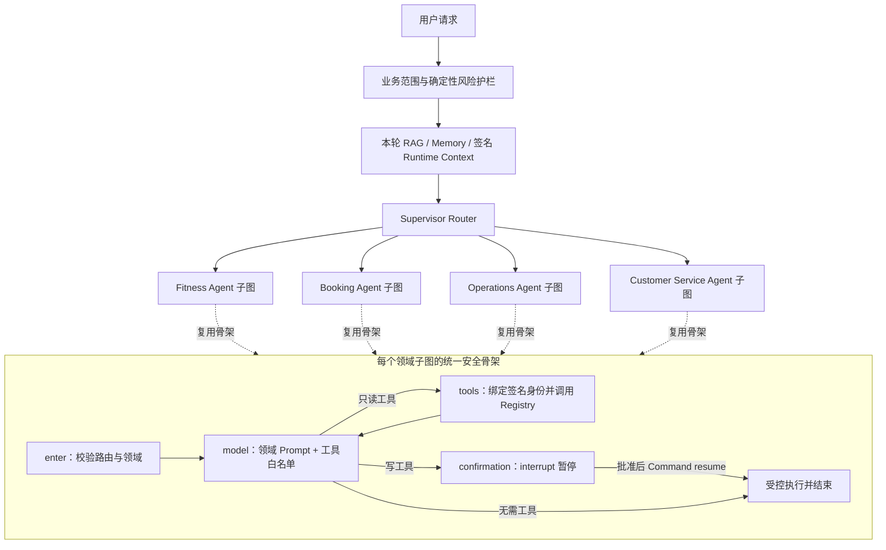

# Supervisor + LangGraph 领域子图架构

## 1. 架构结论

当前 Agent Runtime 是一个顶层 Supervisor 和四个真正编译的 LangGraph 领域子图，不是只在
Prompt 中声明多个 Agent，也不是把所有工具一次性暴露给同一个模型节点。

四个领域子图分别是：

- `fitness_agent`：训练知识、结构化训练计划、训练执行和已确认 Memory；
- `booking_agent`：课程、合同、可约时间以及预约创建、改约、取消；
- `operations_agent`：机构管理员固定指标查询；
- `customer_service_agent`：健身规则问答、本人业务事实查询和客服工单。

Proactive Agent 是事件驱动 Worker，不属于一次用户对话内的同步领域子图。它继续通过
Outbox、RabbitMQ、Inbox 和通知 Outbox 独立运行，避免把定时任务塞进对话 Checkpoint。

## 2. 运行拓扑

顶层 Supervisor 只做路由和调度，不执行领域工具。子图共享安全节点实现，但各自拥有独立
LangGraph namespace、领域提示和不可变工具白名单；共享实现是为了避免四份确认、审计和错误
处理逻辑逐渐漂移，不代表它们仍是一个无边界 Agent。

## 3. 领域能力隔离

| 领域子图 | 可见能力 | 明确不可见能力 |
| --- | --- | --- |
| Fitness | 用户/机构/课程/合同/预约只读，训练计划生成、创建、审核发布、训练执行、Memory | 预约写入、经营指标、客服工单写入 |
| Booking | 用户/机构/课程/合同/预约只读，可约时间，创建/改约/取消 | 训练计划写入、Memory、经营指标、客服工单 |
| Operations | 固定经营指标工具 | 任意用户明细工具、训练/预约/客服写入、自由 SQL |
| Customer Service | 本人课程/合同/预约/训练状态只读，规则 RAG，工单查询/创建 | Memory、训练计划变更、预约变更、经营指标 |

工具隔离执行两次：模型调用后、工具真正执行前都会重新检查当前领域白名单。即使模型供应商
返回了一个跨领域函数名，也会 fail-closed，不会因为模型“不听 Prompt”而越过边界。Tool Registry
和 Java Gateway 继续负责角色、组织、资源归属、确认凭证、幂等和事务校验；子图白名单不能替代
这些后端授权。

## 4. State、Checkpoint 与确认恢复

- 父图和所有子图共用一个 PostgreSQL Checkpointer，子图不创建第二套 Checkpointer；
- `SupervisorState.graph_version=2` 标识新子图拓扑，`active_domain` 记录当前领域节点；
- 签名 AgentContext、Gateway Token、确认 Token 和明文写入参数只通过 LangGraph Runtime Context
  或加密确认单传递，不能进入 State；
- 写操作在领域子图的 `confirmation` 节点调用 `interrupt()`，Checkpoint 会保存父图和子图 namespace；
- 用户批准后，服务端使用同一个 `thread_id` 执行 `Command(resume=...)`，再次读取确认单和签名身份，
  再调用 Java Gateway；客户端不能在恢复时重新注入执行参数；
- 父图暂时保留旧名称的 `model/tools/confirmation` 节点，只用于恢复升级前已经暂停的 v1 Checkpoint；
  新请求永远不会进入这条兼容分支。确认旧会话已经自然过期或迁移完成后，才能通过单独迁移版本删除。

## 5. 多轮会话与跨领域切换

同一个 `thread_id` 可以从训练问答切换到预约查询。历史 user/assistant/tool 消息会继续保留，但
system Prompt、RAG 引用和未确认 Memory 候选属于本轮临时上下文，每轮都会移除旧值并按新领域
重新生成。这样既保留对话连续性，也防止 Fitness 的规则或知识引用泄漏到 Booking 子图。

## 6. 故障与扩展边界

- 某个子图的模型或工具失败时，统一转换为可追踪的受控错误，不允许生成伪成功回答；
- 子图工具步数沿用统一预算，避免模型在局部循环中无限调用；
- 当前四个子图部署在同一 Python Agent Service，减少网络跳数并共享模型、RAG、Checkpoint 和审计基础设施；
- 只有某领域出现独立团队所有权、明显不同的容量/延迟要求或需要独立故障域时，才考虑拆成独立服务；
- 新增领域时必须先定义 `DomainAgentSpec`、最小工具白名单、路由评测、跨域拒绝测试和权限测试，不能只新增 Prompt。

## 7. 验收要求

每次修改 Supervisor 或领域子图至少验证：

1. 四个子图拓扑真实存在，并包含 `enter/model/tools/confirmation`；
2. 每个领域只看到自己的工具集合；
3. 模型主动请求跨领域工具时被拒绝；
4. 同一会话跨领域切换后不复用旧 system/RAG/Memory 临时上下文；
5. 写操作 `interrupt()`、批准和 `Command(resume=...)` 可在父子 Checkpoint 中恢复；
6. 旧版敏感 Checkpoint 继续 fail-closed，旧版已暂停节点保留兼容入口；
7. 全量 Agent、Gateway、训练、预约、客服和发布质量门禁无回归。
